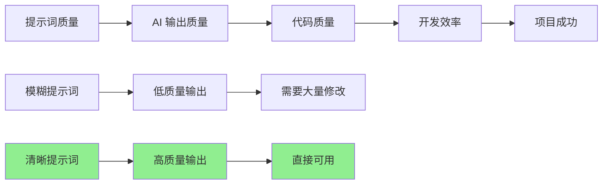
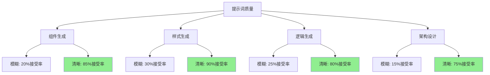
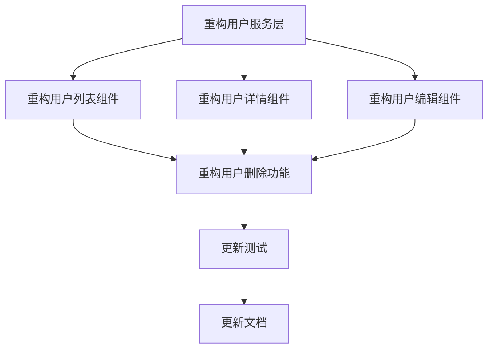
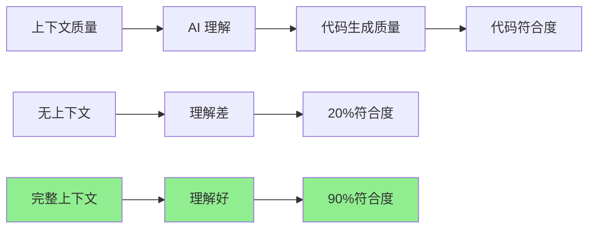

# 第四章：提示词工程 - 与 AI 高效协作的核心

提示词工程（Prompt Engineering）是与 AI 高效协作的核心技能。一个好的提示词，可以让 AI 生成高质量的代码；一个差的提示词，可能得到完全不符合需求的代码。本章将教你如何编写高质量的前端提示词。

## 提示词工程的重要性

### 为什么提示词工程很重要？



**数据对比**：

| 提示词质量 | AI 输出接受率 | 修改时间 | 效率提升 |
|------------|---------------|----------|----------|
| **差** | 20-30% | 30-60 分钟 | 1.2x |
| **中** | 50-60% | 10-20 分钟 | 2x |
| **好** | 80-90% | 2-5 分钟 | 5-10x |

**结论**：提示词质量直接影响开发效率，**好的提示词可以提升 5-10 倍效率**。

### 提示词工程的核心原则

#### 原则一：清晰明确（Clarity）

**❌ 不好的提示词**：
```
创建一个组件
```

**✅ 好的提示词**：
```
创建一个 React 用户列表组件，要求：
- 使用 TypeScript
- 支持分页（每页 20 条）
- 支持搜索（按姓名、邮箱）
- 包含加载状态和空状态
- 响应式设计（移动端适配）
```

#### 原则二：提供上下文（Context）

**❌ 不好的提示词**：
```
优化这个函数
```

**✅ 好的提示词**：
```
优化这个用户数据获取函数，要求：
- 添加错误处理
- 添加缓存机制（5分钟）
- 使用 async/await 替代 Promise 链
- 添加 TypeScript 类型定义
```

#### 原则三：结构化（Structure）

**❌ 不好的提示词**：
```
创建一个表单，有用户名、邮箱、密码字段，需要验证，提交到 /api/register
```

**✅ 好的提示词**：
```
创建一个用户注册表单组件，要求：

**字段**：
- 用户名（必填，3-20字符）
- 邮箱（必填，邮箱格式验证）
- 密码（必填，至少8位，包含字母和数字）

**验证**：
- 实时验证
- 显示错误信息
- 提交前统一验证

**提交**：
- POST /api/register
- 显示加载状态
- 处理成功/失败

**技术栈**：React + TypeScript + React Hook Form
```

#### 原则四：迭代优化（Iteration）

**流程**：
```
初始提示词 → AI 生成 → 审查 → 优化提示词 → 重新生成 → 满意
```

---

## 4.1 前端专属提示词模式：组件、样式、逻辑、架构

前端开发有独特的模式和场景，这一节我们将介绍前端专属的提示词模式，帮助你高效生成前端代码。

### 模式一：组件生成

#### 基础组件生成

**提示词模板**：
```
创建一个 [组件类型] 组件，要求：

**功能**：
- [功能1]
- [功能2]
- [功能3]

**技术栈**：
- React + TypeScript
- [其他依赖]

**样式**：
- 使用 [CSS框架/方案]
- [样式要求]

**交互**：
- [交互要求]

**状态管理**：
- [状态管理方案]
```

**实际案例**：

**提示词**：
```
创建一个用户卡片组件，要求：

**功能**：
- 显示用户头像、姓名、邮箱
- 支持点击查看详情
- 支持编辑和删除操作

**技术栈**：
- React + TypeScript
- 使用项目的设计系统（参考 Button 组件）

**样式**：
- 使用 Tailwind CSS
- 卡片样式，带阴影和圆角
- 响应式设计

**交互**：
- 点击卡片：跳转到用户详情页
- 悬停效果：阴影加深
- 按钮组：编辑、删除（带确认）

**状态管理**：
- 使用 React Hooks
- 编辑和删除通过 props 回调传递
```

**AI 生成代码**：
```typescript
import React from 'react';
import { Button } from './Button';

interface User {
  id: string;
  name: string;
  email: string;
  avatar: string;
}

interface UserCardProps {
  user: User;
  onView?: (id: string) => void;
  onEdit?: (id: string) => void;
  onDelete?: (id: string) => void;
}

export const UserCard: React.FC<UserCardProps> = ({
  user,
  onView,
  onEdit,
  onDelete,
}) => {
  const handleDelete = () => {
    if (window.confirm(`确定要删除用户 ${user.name} 吗？`)) {
      onDelete?.(user.id);
    }
  };

  return (
    <div
      className="bg-white rounded-lg shadow-md hover:shadow-lg transition-shadow p-6 cursor-pointer"
      onClick={() => onView?.(user.id)}
    >
      <div className="flex items-center space-x-4">
        
        <div className="flex-1">
          <h3 className="text-lg font-semibold">{user.name}</h3>
          <p className="text-gray-600">{user.email}</p>
        </div>
        <div className="flex space-x-2">
          <Button onClick={(e) => { e.stopPropagation(); onEdit?.(user.id); }}>
            编辑
          </Button>
          <Button
            variant="danger"
            onClick={(e) => { e.stopPropagation(); handleDelete(); }}
          >
            删除
          </Button>
        </div>
      </div>
    </div>
  );
};
```

#### 表单组件生成

**提示词模板**：
```
创建一个 [表单名称] 表单组件，要求：

**字段**：
- [字段1]：[类型，验证规则]
- [字段2]：[类型，验证规则]

**验证**：
- [验证规则]
- [错误提示]

**提交**：
- API：[接口地址]
- 方法：[GET/POST/PUT/DELETE]
- 数据处理：[处理方式]

**技术栈**：
- React Hook Form（或 Formik）
- Yup（或 Zod）验证
- TypeScript
```

**实际案例**：

**提示词**：
```
创建一个用户注册表单组件，要求：

**字段**：
- 用户名：文本，必填，3-20字符，只能包含字母、数字、下划线
- 邮箱：邮箱，必填，邮箱格式验证
- 密码：密码，必填，至少8位，包含字母和数字
- 确认密码：密码，必填，与密码一致

**验证**：
- 实时验证
- 显示错误信息（字段下方）
- 提交前统一验证

**提交**：
- API：POST /api/auth/register
- 显示加载状态
- 成功：显示成功消息，跳转到登录页
- 失败：显示错误消息

**技术栈**：
- React Hook Form
- Yup 验证
- TypeScript
- Tailwind CSS
```

### 模式二：样式生成

#### CSS/Tailwind 样式生成

**提示词模板**：
```
为 [元素] 生成样式，要求：

**视觉效果**：
- [颜色、大小、间距等]

**布局**：
- [布局方式]

**响应式**：
- [断点要求]

**动画**：
- [动画效果]

**技术栈**：
- [Tailwind CSS / CSS Modules / styled-components]
```

**实际案例**：

**提示词**：
```
为导航栏生成样式，要求：

**视觉效果**：
- 背景：白色，带阴影
- 高度：64px
- 内边距：左右 24px

**布局**：
- Flexbox 布局
- Logo 在左，导航链接居中，用户菜单在右
- 导航链接间距：32px

**响应式**：
- 移动端：汉堡菜单
- 平板：保持横向布局
- 桌面：完整布局

**动画**：
- 悬停：链接颜色变化（过渡 0.2s）
- 移动端菜单：滑入动画

**技术栈**：
- Tailwind CSS
```

**AI 生成代码**：
```tsx
<nav className="bg-white shadow-md h-16 px-6 flex items-center justify-between">
  {/* Logo */}
  <div className="flex-shrink-0">
    
  </div>

  {/* Desktop Navigation */}
  <div className="hidden md:flex items-center space-x-8">
    <a href="/" className="text-gray-700 hover:text-blue-600 transition-colors duration-200">
      首页
    </a>
    <a href="/about" className="text-gray-700 hover:text-blue-600 transition-colors duration-200">
      关于
    </a>
    <a href="/contact" className="text-gray-700 hover:text-blue-600 transition-colors duration-200">
      联系
    </a>
  </div>

  {/* User Menu */}
  <div className="flex items-center space-x-4">
    <button className="px-4 py-2 bg-blue-600 text-white rounded hover:bg-blue-700">
      登录
    </button>
  </div>

  {/* Mobile Menu Button */}
  <button className="md:hidden">
    <svg className="w-6 h-6" fill="none" stroke="currentColor" viewBox="0 0 24 24">
      <path strokeLinecap="round" strokeLinejoin="round" strokeWidth={2} d="M4 6h16M4 12h16M4 18h16" />
    </svg>
  </button>
</nav>
```

### 模式三：逻辑生成

#### API 调用逻辑

**提示词模板**：
```
创建一个 [功能] API 调用函数，要求：

**接口**：
- URL：[接口地址]
- 方法：[GET/POST/PUT/DELETE]
- 参数：[参数说明]

**数据处理**：
- 请求：[数据处理方式]
- 响应：[数据处理方式]

**错误处理**：
- [错误处理方式]

**其他**：
- [缓存、重试、取消等]
```

**实际案例**：

**提示词**：
```
创建一个用户数据获取函数，要求：

**接口**：
- URL：GET /api/users
- 参数：page（页码），limit（每页数量），search（搜索关键词）

**数据处理**：
- 请求：将参数转换为查询字符串
- 响应：解析 JSON，提取 data 字段

**错误处理**：
- 网络错误：抛出 NetworkError
- HTTP 错误：抛出 HttpError（包含状态码和消息）
- 解析错误：抛出 ParseError

**其他**：
- 添加请求缓存（5分钟）
- 支持请求取消（AbortController）
- 添加 TypeScript 类型定义

**技术栈**：
- fetch API
- TypeScript
```

**AI 生成代码**：
```typescript
interface FetchUsersParams {
  page?: number;
  limit?: number;
  search?: string;
}

interface User {
  id: string;
  name: string;
  email: string;
}

interface FetchUsersResponse {
  data: User[];
  total: number;
  page: number;
  limit: number;
}

class NetworkError extends Error {
  constructor(message: string) {
    super(message);
    this.name = 'NetworkError';
  }
}

class HttpError extends Error {
  constructor(public status: number, message: string) {
    super(message);
    this.name = 'HttpError';
  }
}

class ParseError extends Error {
  constructor(message: string) {
    super(message);
    this.name = 'ParseError';
  }
}

// 简单的内存缓存
const cache = new Map<string, { data: FetchUsersResponse; timestamp: number }>();
const CACHE_DURATION = 5 * 60 * 1000; // 5分钟

export async function fetchUsers(
  params: FetchUsersParams = {},
  signal?: AbortSignal
): Promise<FetchUsersResponse> {
  const { page = 1, limit = 20, search = '' } = params;
  
  // 构建查询字符串
  const queryParams = new URLSearchParams({
    page: page.toString(),
    limit: limit.toString(),
    ...(search && { search }),
  });
  
  const url = `/api/users?${queryParams.toString()}`;
  
  // 检查缓存
  const cacheKey = url;
  const cached = cache.get(cacheKey);
  if (cached && Date.now() - cached.timestamp < CACHE_DURATION) {
    return cached.data;
  }
  
  try {
    const response = await fetch(url, { signal });
    
    if (!response.ok) {
      throw new HttpError(response.status, `HTTP error! status: ${response.status}`);
    }
    
    const data: FetchUsersResponse = await response.json();
    
    // 更新缓存
    cache.set(cacheKey, { data, timestamp: Date.now() });
    
    return data;
  } catch (error) {
    if (error instanceof HttpError || error instanceof ParseError) {
      throw error;
    }
    if (error instanceof TypeError) {
      throw new NetworkError('Network error occurred');
    }
    throw error;
  }
}
```

#### 状态管理逻辑

**提示词模板**：
```
创建一个 [功能] 状态管理逻辑，要求：

**状态**：
- [状态1]：[类型，初始值]
- [状态2]：[类型，初始值]

**操作**：
- [操作1]：[说明]
- [操作2]：[说明]

**副作用**：
- [副作用说明]

**技术栈**：
- [useState / useReducer / Zustand / Redux]
```

### 模式四：架构设计

#### 模块架构设计

**提示词模板**：
```
设计一个 [模块名称] 的架构，要求：

**功能模块**：
- [模块1]：[职责]
- [模块2]：[职责]

**文件结构**：
```
[模块名称]/
  ├── components/     # 组件
  ├── hooks/          # 自定义 Hooks
  ├── services/       # API 服务
  ├── types/          # 类型定义
  ├── utils/          # 工具函数
  └── index.ts        # 导出
```

**技术栈**：
- [技术栈说明]

**设计原则**：
- [设计原则]
```

**实际案例**：

**提示词**：
```
设计一个用户管理模块的架构，要求：

**功能模块**：
- 用户列表：显示、搜索、分页
- 用户详情：查看、编辑
- 用户创建：表单创建
- 用户删除：确认删除

**文件结构**：
```
user-management/
  ├── components/
  │   ├── UserList.tsx
  │   ├── UserCard.tsx
  │   ├── UserForm.tsx
  │   └── UserDetail.tsx
  ├── hooks/
  │   ├── useUsers.ts
  │   └── useUser.ts
  ├── services/
  │   └── userService.ts
  ├── types/
  │   └── user.ts
  ├── utils/
  │   └── userHelpers.ts
  └── index.ts
```

**技术栈**：
- React + TypeScript
- React Query（数据获取和缓存）
- React Hook Form（表单管理）
- Tailwind CSS（样式）

**设计原则**：
- 单一职责：每个组件只负责一个功能
- 可复用：组件可以在其他模块复用
- 类型安全：完整的 TypeScript 类型定义
- 错误处理：统一的错误处理机制
```

### 提示词质量对比



### 最佳实践总结

1. **明确技术栈**：明确告诉 AI 使用的框架、库、工具
2. **结构化描述**：使用列表、分段，让提示词清晰易读
3. **提供示例**：如果可能，提供参考代码或设计
4. **明确约束**：明确说明必须遵循的规范和限制
5. **迭代优化**：根据生成结果，不断优化提示词

**下一节，我们将学习如何将复杂任务分解，让 AI 帮你完成大型重构任务。**

## 4.2 复杂任务分解：如何让 AI 帮你重构一个模块

大型任务（如重构整个模块）不能一次性完成，需要分解为多个小任务。这一节将教你如何分解复杂任务，让 AI 逐步完成。

### 任务分解的原则

#### 原则一：单一职责

**❌ 不好的分解**：
```
重构用户管理模块（包含列表、详情、编辑、删除等功能）
```

**✅ 好的分解**：
```
1. 重构用户列表组件
2. 重构用户详情组件
3. 重构用户编辑组件
4. 重构用户删除功能
5. 重构用户服务层
```

#### 原则二：依赖关系清晰

**依赖关系图**：


#### 原则三：可验证

每个子任务都应该有明确的验收标准：
- ✅ 功能正常
- ✅ 代码质量提升
- ✅ 测试通过
- ✅ 文档更新

### 实际案例：重构用户管理模块

#### 步骤一：分析现状

**提示词**：
```
分析这个用户管理模块的代码，找出以下问题：
1. 代码质量问题（重复代码、命名不规范等）
2. 架构问题（职责不清、耦合度高）
3. 性能问题（不必要的渲染、缺少优化）
4. 类型安全问题（缺少类型定义、类型不准确）
5. 测试问题（缺少测试、测试不完整）

模块文件：
- src/modules/user/UserList.tsx
- src/modules/user/UserDetail.tsx
- src/modules/user/UserForm.tsx
- src/modules/user/userService.ts
```

**AI 分析结果**：
```
发现的问题：

1. **代码质量问题**：
   - UserList 和 UserDetail 有重复的用户数据获取逻辑
   - 命名不一致（getUser vs fetchUser）
   - 缺少错误处理

2. **架构问题**：
   - 组件直接调用 API，没有服务层抽象
   - 状态管理分散，没有统一管理
   - 业务逻辑和 UI 逻辑混合

3. **性能问题**：
   - UserList 没有使用虚拟滚动（数据量大时性能差）
   - 缺少请求缓存
   - 不必要的重新渲染

4. **类型安全问题**：
   - userService.ts 缺少类型定义
   - 组件 props 类型不完整

5. **测试问题**：
   - 只有 UserList 有测试
   - 测试覆盖率低（30%）
```

#### 步骤二：制定重构计划

**提示词**：
```
基于分析结果，制定一个详细的重构计划，要求：

**阶段一：基础重构**
1. 创建统一的用户服务层（userService.ts）
   - 统一 API 调用
   - 添加类型定义
   - 添加错误处理
   - 添加请求缓存

2. 创建自定义 Hooks（useUsers.ts, useUser.ts）
   - 封装数据获取逻辑
   - 统一状态管理
   - 使用 React Query

**阶段二：组件重构**
3. 重构 UserList 组件
   - 使用新的 useUsers Hook
   - 添加虚拟滚动
   - 优化性能

4. 重构 UserDetail 组件
   - 使用新的 useUser Hook
   - 改进 UI

5. 重构 UserForm 组件
   - 使用 React Hook Form
   - 改进验证逻辑

**阶段三：测试和文档**
6. 补充测试
   - 为所有组件添加测试
   - 目标覆盖率：80%+

7. 更新文档
   - 更新组件文档
   - 更新 API 文档

**技术栈**：
- React Query（数据获取）
- React Hook Form（表单）
- React Window（虚拟滚动）
- TypeScript
- Vitest（测试）
```

#### 步骤三：逐步执行重构

**任务 1：创建用户服务层**

**提示词**：
```
创建统一的用户服务层（userService.ts），要求：

**功能**：
- getUserList(params): 获取用户列表（支持分页、搜索）
- getUser(id): 获取单个用户
- createUser(data): 创建用户
- updateUser(id, data): 更新用户
- deleteUser(id): 删除用户

**技术实现**：
- 使用 fetch API
- 完整的 TypeScript 类型定义
- 统一的错误处理
- 请求缓存（5分钟）
- 支持请求取消（AbortController）

**参考现有代码**：
- 查看 src/modules/user/userService.ts（旧版本）
- 保持 API 接口不变
```

**任务 2：创建自定义 Hooks**

**提示词**：
```
创建两个自定义 Hooks：

1. useUsers Hook：
   - 使用 React Query
   - 封装用户列表数据获取
   - 支持分页、搜索
   - 自动缓存和重新获取

2. useUser Hook：
   - 使用 React Query
   - 封装单个用户数据获取
   - 支持更新和删除操作
   - 自动缓存和重新获取

**技术栈**：
- React Query
- 使用上面创建的 userService
- TypeScript
```

**任务 3：重构组件**

**提示词**：
```
重构 UserList 组件，要求：

**使用新的架构**：
- 使用 useUsers Hook（替代直接调用 API）
- 使用 React Window 实现虚拟滚动（如果数据 > 100 条）
- 优化性能（使用 React.memo、useMemo、useCallback）

**保持功能不变**：
- 显示用户列表
- 支持搜索
- 支持分页
- 支持点击查看详情

**改进**：
- 更好的加载状态
- 更好的错误处理
- 更好的空状态

**参考**：
- 查看 src/modules/user/UserList.tsx（旧版本）
- 使用项目的设计系统组件
```

#### 步骤四：验证和优化

**提示词**：
```
检查重构后的代码，确保：
1. 所有功能正常工作
2. 代码质量提升（无重复代码、命名规范）
3. 性能提升（减少不必要的渲染）
4. 类型安全（完整的类型定义）
5. 测试通过（运行所有测试）

如果发现问题，提供修复建议。
```

### 任务分解的最佳实践

#### 实践一：使用任务清单

**模板**：
```
重构任务：[模块名称]

**任务清单**：
- [ ] 任务1：[描述]
- [ ] 任务2：[描述]
- [ ] 任务3：[描述]

**依赖关系**：
- 任务2 依赖 任务1
- 任务3 依赖 任务1 和 任务2

**验收标准**：
- [ ] 功能正常
- [ ] 代码质量提升
- [ ] 测试通过
- [ ] 文档更新
```

#### 实践二：逐步验证

**流程**：
```
完成子任务 → 验证功能 → 提交代码 → 继续下一个任务
```

**验证提示词**：
```
验证这个重构任务是否完成：

**任务**：[任务描述]

**检查项**：
1. 功能是否正常？
2. 代码是否符合规范？
3. 是否有测试？
4. 是否有文档？

如果发现问题，列出问题并提供修复建议。
```

#### 实践三：保持上下文

**提示词**：
```
在重构过程中，保持以下上下文：

**项目规范**：
- 代码风格：[ESLint 配置]
- 命名规范：[camelCase for variables, PascalCase for components]
- 文件结构：[参考项目结构]

**技术栈**：
- React + TypeScript
- React Query
- Tailwind CSS

**设计系统**：
- 使用项目的 Button、Input、Card 等组件
- 参考现有组件的样式

**API 规范**：
- 基础 URL：[API_BASE_URL]
- 认证方式：[Bearer Token]
- 错误格式：[统一错误格式]
```

### 总结

复杂任务分解的关键：
1. **单一职责**：每个子任务只做一件事
2. **依赖清晰**：明确任务之间的依赖关系
3. **可验证**：每个任务都有明确的验收标准
4. **逐步执行**：完成一个，验证一个，再继续下一个
5. **保持上下文**：在整个过程中保持项目规范和技术栈的一致性

---

## 4.3 上下文管理：利用项目知识库提升生成质量

AI 生成代码的质量很大程度上取决于它理解的上下文。这一节将教你如何管理上下文，让 AI 生成更符合项目需求的代码。

### 上下文的重要性



### 上下文类型

#### 类型一：项目级上下文

**包含内容**：
- 项目结构
- 技术栈
- 代码规范
- 设计系统
- API 规范

**提供方式**：

**方式一：项目说明文件**

创建 `.cursorrules` 或 `.copilot-instructions.md`：

```markdown
# 项目规范

## 技术栈
- React 18 + TypeScript
- React Query（数据获取）
- React Hook Form（表单）
- Tailwind CSS（样式）
- Vitest（测试）

## 代码规范
- 使用 ESLint + Prettier
- 组件使用 PascalCase
- 函数使用 camelCase
- 文件使用 kebab-case

## 项目结构
```
src/
  ├── components/     # 共享组件
  ├── modules/        # 功能模块
  ├── hooks/          # 自定义 Hooks
  ├── services/       # API 服务
  ├── types/          # 类型定义
  └── utils/          # 工具函数
```

## 设计系统
- 使用项目的 Button、Input、Card 等组件
- 颜色：primary (#3B82F6), secondary (#6B7280)
- 间距：使用 Tailwind 的间距系统

## API 规范
- 基础 URL：process.env.REACT_APP_API_URL
- 认证：Bearer Token
- 错误格式：{ code: string, message: string }
```

**方式二：在提示词中引用**

```
@.cursorrules 参考项目规范，创建一个用户列表组件
```

#### 类型二：文件级上下文

**包含内容**：
- 当前文件的结构
- 相关文件的引用
- 依赖关系

**提供方式**：

**方式一：引用相关文件**

```
@UserService.ts 参考这个服务，创建一个类似的 ProductService.ts
```

**方式二：提供文件内容**

```
参考以下代码结构，创建一个类似的组件：

[粘贴相关代码]
```

#### 类型三：代码块上下文

**包含内容**：
- 当前编辑的代码
- 相关的代码片段
- 调用关系

**提供方式**：

**方式一：选中代码后提问**

```
选中代码 → 右键 → "Ask AI" → "如何优化这段代码？"
```

**方式二：在提示词中引用**

```
@getUserById 这个函数有什么问题？如何优化？
```

### 上下文管理最佳实践

#### 实践一：建立项目知识库

**创建项目说明文件**：

**`.cursorrules`**（Cursor 专用）：
```
# 项目规范

## 技术栈
- React 18 + TypeScript
- React Query
- Tailwind CSS

## 代码规范
- 组件使用 PascalCase
- 函数使用 camelCase
- 使用 ESLint + Prettier

## 项目结构
[项目结构说明]

## 设计系统
[设计系统说明]

## API 规范
[API 规范说明]
```

**`.copilot-instructions.md`**（Copilot 专用）：
```
[类似内容]
```

#### 实践二：使用代码引用

**Cursor 中的引用语法**：

```
@filename.ts        # 引用整个文件
@functionName       # 引用函数
@#section           # 引用代码块
```

**实际案例**：

```
@UserService.ts 参考这个服务，创建一个 ProductService.ts，要求：
- 类似的 API 结构
- 类似的错误处理
- 类似的缓存机制
```

#### 实践三：提供示例代码

**提示词模板**：
```
参考以下代码风格和结构，创建一个类似的 [组件/函数]：

[粘贴示例代码]

要求：
- 保持相同的代码风格
- 保持相同的结构
- 保持相同的命名规范
```

#### 实践四：迭代优化上下文

**流程**：
```
提供初始上下文 → AI 生成代码 → 审查 → 发现不符合 → 优化上下文 → 重新生成
```

**优化提示词**：
```
生成的代码不符合项目规范，请参考以下规范重新生成：

**项目规范**：
[更新的规范]

**参考代码**：
[参考代码]

**要求**：
[具体要求]
```

### 实际案例：利用上下文生成高质量代码

#### 案例一：生成符合项目规范的组件

**步骤一：提供项目上下文**

```
@.cursorrules 参考项目规范
```

**步骤二：提供参考组件**

```
@Button.tsx 参考这个组件的代码风格和结构
```

**步骤三：生成新组件**

```
创建一个 Input 组件，要求：
- 参考 Button 组件的代码风格
- 使用项目的设计系统
- 遵循项目规范

**功能**：
- 支持文本输入
- 支持验证
- 支持错误提示
- 支持禁用状态
```

**结果**：生成的代码符合项目规范，风格一致。

#### 案例二：重构时保持上下文

**步骤一：分析现有代码**

```
@UserList.tsx 分析这个组件的代码质量和问题
```

**步骤二：提供重构规范**

```
@.cursorrules 参考项目规范
@useUsers.ts 参考这个 Hook 的模式
```

**步骤三：执行重构**

```
重构 UserList 组件，要求：
- 使用 useUsers Hook（参考 useUsers.ts）
- 遵循项目规范（参考 .cursorrules）
- 保持功能不变
- 提升代码质量
```

**结果**：重构后的代码符合项目规范，质量提升。

### 上下文管理工具

#### 工具一：Cursor Rules

**创建 `.cursorrules` 文件**：
- Cursor 会自动读取
- 作为项目级上下文
- 所有对话都会参考

#### 工具二：Copilot Instructions

**创建 `.copilot-instructions.md`**：
- Copilot 会自动读取
- 作为项目级上下文
- 影响代码补全和生成

#### 工具三：代码注释

**在代码中添加注释**：
```typescript
/**
 * 用户服务
 * 
 * @module userService
 * @description 提供用户相关的 API 调用
 * @example
 * ```typescript
 * const users = await userService.getUserList({ page: 1 });
 * ```
 */
```

### 总结

上下文管理的关键：
1. **建立项目知识库**：创建项目规范文件
2. **使用代码引用**：引用相关文件和代码
3. **提供示例代码**：让 AI 理解代码风格
4. **迭代优化**：根据生成结果优化上下文
5. **保持一致性**：在整个项目中保持上下文的一致性

**好的上下文管理可以让 AI 生成代码的符合度从 20% 提升到 90%**。

---

## 【实战库】：可复用的提示词模板集合

这一节提供一系列可复用的提示词模板，你可以直接使用或根据项目需求调整。

### 组件生成模板

#### 模板 1：基础组件

```
创建一个 [组件名称] 组件，要求：

**功能**：
- [功能描述]

**技术栈**：
- React + TypeScript
- [其他依赖]

**样式**：
- 使用 [CSS 方案]
- [样式要求]

**Props**：
- [props 定义]

**状态**：
- [状态说明]

**交互**：
- [交互说明]
```

#### 模板 2：表单组件

```
创建一个 [表单名称] 表单组件，要求：

**字段**：
- [字段1]：[类型，验证规则]
- [字段2]：[类型，验证规则]

**验证**：
- [验证规则]
- [错误提示方式]

**提交**：
- API：[接口地址]
- 方法：[HTTP 方法]
- 数据处理：[处理方式]

**技术栈**：
- React Hook Form
- Yup（或 Zod）
- TypeScript
```

#### 模板 3：列表组件

```
创建一个 [列表名称] 列表组件，要求：

**功能**：
- 显示列表数据
- 支持分页（每页 [数量] 条）
- 支持搜索（[搜索字段]）
- 支持排序（[排序字段]）

**数据获取**：
- Hook：[自定义 Hook]
- API：[接口地址]

**交互**：
- 点击项：[操作]
- 操作按钮：[操作]

**技术栈**：
- React Query
- React Window（如果数据量大）
- TypeScript
```

### 逻辑生成模板

#### 模板 4：API 服务函数

```
创建一个 [功能] API 调用函数，要求：

**接口**：
- URL：[接口地址]
- 方法：[HTTP 方法]
- 参数：[参数说明]

**数据处理**：
- 请求：[处理方式]
- 响应：[处理方式]

**错误处理**：
- [错误处理方式]

**其他**：
- [缓存、重试、取消等]

**技术栈**：
- fetch API（或 axios）
- TypeScript
```

#### 模板 5：自定义 Hook

```
创建一个 [功能] 自定义 Hook，要求：

**功能**：
- [功能描述]

**状态**：
- [状态说明]

**副作用**：
- [副作用说明]

**返回值**：
- [返回值说明]

**技术栈**：
- React Hooks
- [其他依赖]
- TypeScript
```

### 重构模板

#### 模板 6：组件重构

```
重构 [组件名称] 组件，要求：

**改进点**：
- [改进点1]
- [改进点2]

**技术栈**：
- [新的技术栈]

**保持功能**：
- [保持不变的功能]

**参考**：
- @[参考文件]
- @[参考组件]
```

#### 模板 7：代码优化

```
优化以下代码，要求：

**代码**：
[代码]

**优化方向**：
- [优化方向1]
- [优化方向2]

**技术栈**：
- [技术栈]

**保持功能**：
- [保持不变的功能]
```

### 测试生成模板

#### 模板 8：组件测试

```
为 [组件名称] 组件生成测试，要求：

**测试内容**：
- [测试用例1]
- [测试用例2]

**技术栈**：
- Vitest（或 Jest）
- React Testing Library
- TypeScript

**覆盖率**：
- 目标：[覆盖率]%
```

#### 模板 9：函数测试

```
为 [函数名称] 函数生成测试，要求：

**测试内容**：
- [测试用例1]
- [测试用例2]

**技术栈**：
- Vitest（或 Jest）
- TypeScript

**覆盖率**：
- 目标：[覆盖率]%
```

### 文档生成模板

#### 模板 10：组件文档

```
为 [组件名称] 组件生成文档，要求：

**内容**：
- Props 说明
- 使用示例
- 注意事项

**格式**：
- Markdown
- 包含代码示例
```

### 快速使用指南

#### 如何使用模板

1. **复制模板**
2. **替换占位符**（用 `[]` 标记的部分）
3. **根据项目调整**
4. **发送给 AI**

#### 模板定制

**根据项目调整**：
- 修改技术栈
- 添加项目规范
- 添加设计系统要求
- 添加 API 规范

**示例**：
```
[基础组件模板]

**项目规范**：
- 参考 @.cursorrules
- 使用项目的设计系统组件

**参考代码**：
- @Button.tsx（参考代码风格）
```

### 模板库维护

#### 建立团队模板库

**建议结构**：
```
prompts/
  ├── components/      # 组件模板
  ├── hooks/          # Hook 模板
  ├── services/       # 服务模板
  ├── tests/          # 测试模板
  └── docs/           # 文档模板
```

#### 持续优化

**流程**：
```
使用模板 → 生成代码 → 审查 → 优化模板 → 更新模板库
```

### 总结

提示词模板的价值：
1. **提高效率**：快速生成提示词
2. **保持一致性**：团队使用相同模板
3. **持续改进**：根据使用反馈优化模板
4. **知识沉淀**：将最佳实践沉淀为模板

**建议**：建立自己的提示词模板库，持续优化和更新。
