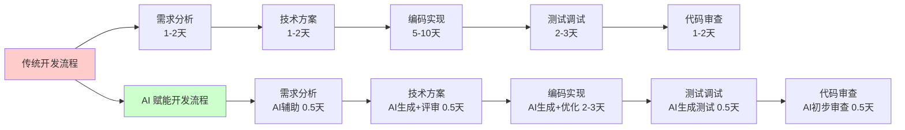
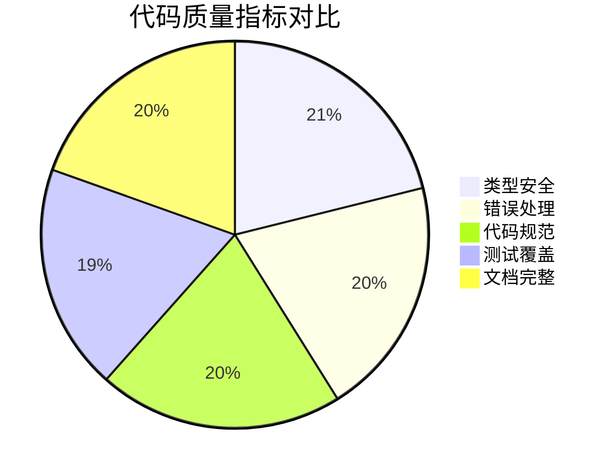
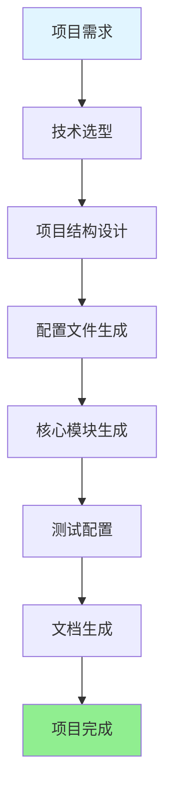
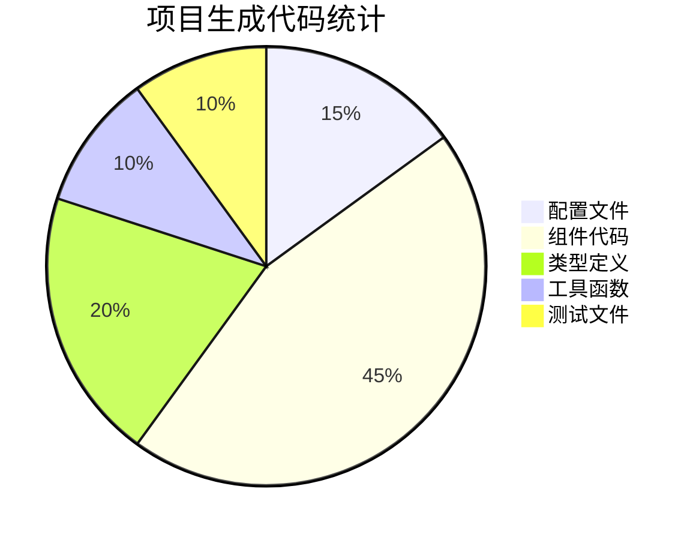
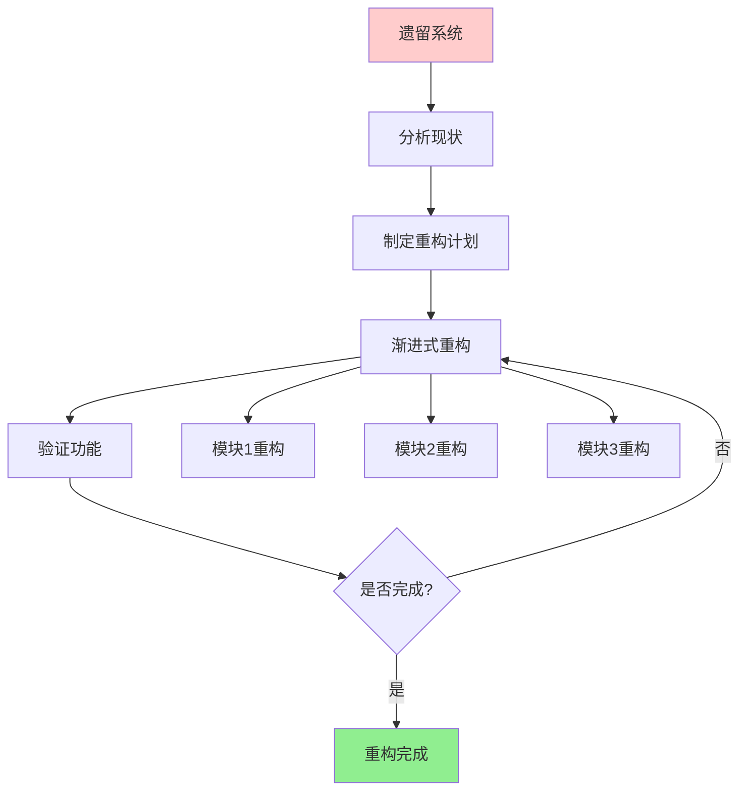
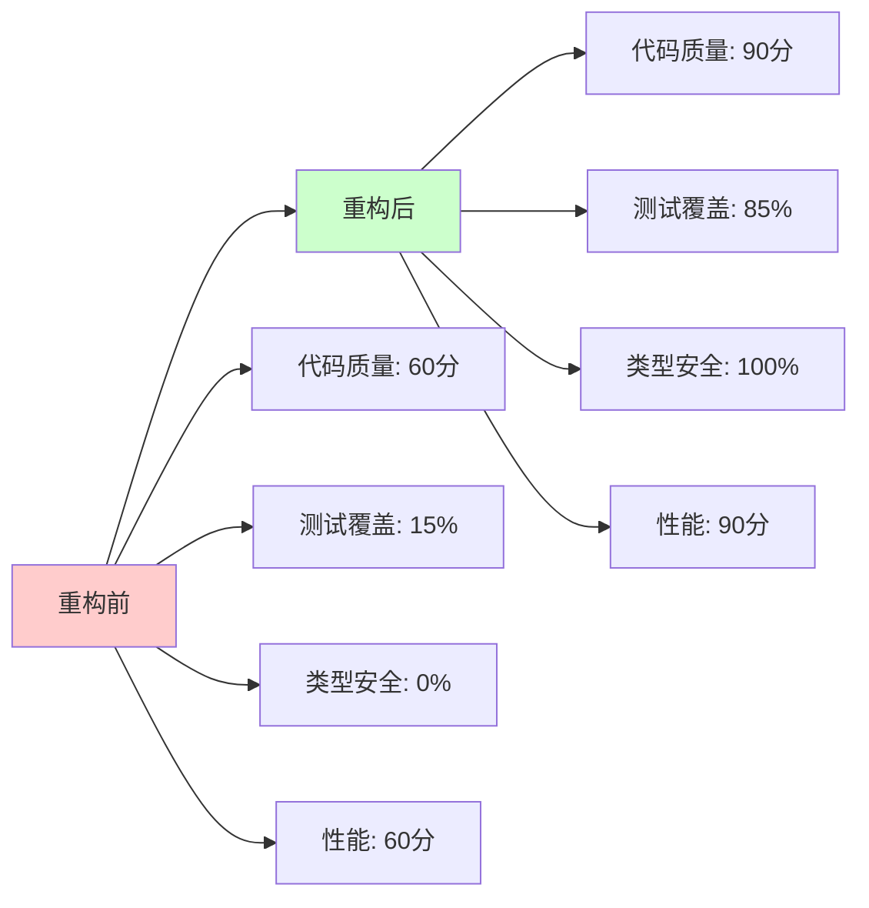

# 第五章：智能开发与架构

在 AI 时代，开发流程正在发生根本性变化。从需求分析到代码实现，从项目搭建到系统重构，AI 正在深度融入开发的每一个环节。本章将带你探索如何用 AI 提升开发效率和代码质量。

## 开发流程的演变



**效率提升对比**：

| 阶段 | 传统方式 | AI 赋能方式 | 效率提升 |
|------|----------|-------------|----------|
| 需求分析 | 1-2 天 | 0.5 天 | **2-4x** |
| 技术方案 | 1-2 天 | 0.5 天 | **2-4x** |
| 编码实现 | 5-10 天 | 2-3 天 | **2.5-3x** |
| 测试调试 | 2-3 天 | 0.5 天 | **4-6x** |
| 代码审查 | 1-2 天 | 0.5 天 | **2-4x** |
| **总计** | **10-19 天** | **4-5 天** | **2.5-4x** |

---

## 5.1 需求到代码：用 AI 进行技术方案设计与评审

从需求文档到可运行的代码，传统方式需要经历多个环节，每个环节都可能产生偏差和返工。AI 可以帮助我们在每个环节提升效率和质量。

### 需求理解：让 AI 成为你的需求分析师

#### 场景：接到一个模糊的需求

**产品经理的需求**：
> "我们需要一个用户管理功能，用户可以查看、编辑、删除用户信息。"

**传统方式的问题**：
- ❌ 需求不明确：哪些字段？权限如何？交互流程？
- ❌ 需要多次沟通确认
- ❌ 容易理解偏差

**AI 赋能方式**：

**步骤一：需求澄清**

**提示词**：
```
分析以下需求，提出需要澄清的问题：

**需求**：
用户管理功能，用户可以查看、编辑、删除用户信息。

**分析维度**：
1. 功能范围：具体包含哪些功能？
2. 数据字段：用户信息包含哪些字段？
3. 权限控制：谁可以操作？有什么限制？
4. 交互流程：操作流程是怎样的？
5. 边界情况：异常情况如何处理？
6. 技术要求：有什么技术约束？
```

**AI 分析结果**：
```
需要澄清的问题：

**功能范围**：
- 是否需要用户创建功能？
- 是否需要批量操作？
- 是否需要搜索和筛选？

**数据字段**：
- 用户信息包含：姓名、邮箱、手机、角色、状态？
- 是否需要头像、简介等扩展信息？

**权限控制**：
- 所有用户都可以操作，还是只有管理员？
- 是否可以编辑自己的信息？
- 删除是否需要确认？

**交互流程**：
- 列表页 → 详情页 → 编辑页？
- 还是列表页直接编辑？
- 删除是弹窗确认还是跳转页面？

**边界情况**：
- 用户不存在时如何处理？
- 网络错误时如何处理？
- 并发编辑冲突如何处理？

**技术要求**：
- 是否需要实时更新？
- 是否需要离线支持？
- 性能要求（支持多少用户）？
```

**步骤二：需求细化**

基于澄清的问题，与产品经理沟通后，形成细化需求：

**提示词**：
```
基于以下需求，生成详细的技术需求文档：

**原始需求**：
用户管理功能，用户可以查看、编辑、删除用户信息。

**澄清后的需求**：
1. 功能范围：
   - 用户列表（支持搜索、筛选、分页）
   - 用户详情查看
   - 用户信息编辑
   - 用户删除（需确认）

2. 数据字段：
   - 基本信息：id, name, email, phone, role, status
   - 扩展信息：avatar, bio, createdAt, updatedAt

3. 权限控制：
   - 管理员：所有操作
   - 普通用户：只能查看和编辑自己的信息

4. 交互流程：
   - 列表页 → 点击 → 详情页 → 编辑按钮 → 编辑页
   - 列表页 → 删除按钮 → 确认弹窗 → 删除

5. 技术要求：
   - React + TypeScript
   - 响应式设计
   - 支持 1000+ 用户
   - 实时更新（WebSocket）

**输出格式**：
- 功能列表
- 数据模型
- API 接口设计
- 页面结构
- 技术选型建议
```

**AI 生成的技术需求文档**：
```markdown
# 用户管理功能 - 技术需求文档

## 1. 功能列表

### 1.1 用户列表
- 显示用户列表（表格形式）
- 支持搜索（姓名、邮箱）
- 支持筛选（角色、状态）
- 支持分页（每页 20 条）
- 支持排序（按创建时间、姓名）

### 1.2 用户详情
- 显示用户完整信息
- 支持编辑按钮（权限控制）
- 支持删除按钮（权限控制）

### 1.3 用户编辑
- 表单编辑用户信息
- 实时验证
- 提交后更新

### 1.4 用户删除
- 确认弹窗
- 删除后刷新列表

## 2. 数据模型

```typescript
interface User {
  id: string;
  name: string;
  email: string;
  phone?: string;
  role: 'admin' | 'user';
  status: 'active' | 'inactive';
  avatar?: string;
  bio?: string;
  createdAt: string;
  updatedAt: string;
}
```

## 3. API 接口设计

- GET /api/users - 获取用户列表（支持查询参数）
- GET /api/users/:id - 获取用户详情
- PUT /api/users/:id - 更新用户信息
- DELETE /api/users/:id - 删除用户
- WebSocket: /ws/users - 实时更新

## 4. 页面结构

```
/user-management
  ├── /list          # 用户列表页
  ├── /:id           # 用户详情页
  └── /:id/edit      # 用户编辑页
```

## 5. 技术选型建议

- **前端框架**：React 18 + TypeScript
- **状态管理**：React Query（数据获取和缓存）
- **路由**：React Router v6
- **表单**：React Hook Form + Yup
- **UI 库**：Tailwind CSS + Headless UI
- **实时通信**：Socket.io-client
- **测试**：Vitest + React Testing Library
```

### 技术方案设计：AI 作为你的架构师

#### 步骤一：架构设计

**提示词**：
```
基于以下技术需求，设计详细的技术方案：

**技术需求**：[粘贴上面的技术需求文档]

**设计要求**：
1. 模块化设计（组件、服务、Hooks 分离）
2. 可扩展性（易于添加新功能）
3. 可维护性（代码清晰、文档完善）
4. 性能优化（虚拟滚动、请求缓存）
5. 错误处理（统一的错误处理机制）

**输出**：
- 项目结构
- 组件设计
- 数据流设计
- 状态管理方案
- 性能优化方案
```

**AI 生成的架构设计**：
```markdown
# 用户管理模块 - 技术方案设计

## 1. 项目结构

```
src/modules/user-management/
  ├── components/
  │   ├── UserList/
  │   │   ├── UserList.tsx
  │   │   ├── UserListFilters.tsx
  │   │   └── UserListTable.tsx
  │   ├── UserDetail/
  │   │   ├── UserDetail.tsx
  │   │   └── UserDetailHeader.tsx
  │   ├── UserForm/
  │   │   └── UserForm.tsx
  │   └── UserDeleteDialog/
  │       └── UserDeleteDialog.tsx
  ├── hooks/
  │   ├── useUsers.ts        # 用户列表 Hook
  │   ├── useUser.ts          # 单个用户 Hook
  │   └── useUserPermissions.ts  # 权限 Hook
  ├── services/
  │   └── userService.ts      # API 服务
  ├── types/
  │   └── user.ts             # 类型定义
  ├── utils/
  │   └── userHelpers.ts      # 工具函数
  └── index.ts                # 导出
```

## 2. 组件设计

### 2.1 UserList 组件
- **职责**：用户列表展示和操作
- **Props**：无（数据通过 Hook 获取）
- **子组件**：UserListFilters, UserListTable
- **状态**：通过 useUsers Hook 管理

### 2.2 UserDetail 组件
- **职责**：用户详情展示
- **Props**：userId
- **状态**：通过 useUser Hook 管理

### 2.3 UserForm 组件
- **职责**：用户信息编辑
- **Props**：user（可选，编辑时传入）
- **状态**：React Hook Form 管理

## 3. 数据流设计

```
API → userService → React Query → Hook → Component
                ↓
            Cache Layer
                ↓
            WebSocket Updates
```

## 4. 状态管理方案

- **服务器状态**：React Query（自动缓存、同步）
- **表单状态**：React Hook Form（本地状态）
- **UI 状态**：useState（简单的 UI 状态）

## 5. 性能优化方案

- **列表优化**：React Window（虚拟滚动，支持 1000+ 条）
- **请求优化**：React Query 缓存（5 分钟）
- **渲染优化**：React.memo、useMemo、useCallback
- **代码分割**：路由级别的代码分割
```

#### 步骤二：方案评审

**提示词**：
```
评审以下技术方案，检查：

**技术方案**：[粘贴上面的架构设计]

**评审维度**：
1. 架构合理性：是否合理？是否有改进空间？
2. 技术选型：是否合适？是否有更好的选择？
3. 性能考虑：是否有性能问题？如何优化？
4. 可维护性：代码是否清晰？是否易于维护？
5. 可扩展性：是否易于扩展新功能？
6. 潜在问题：是否有潜在问题？如何避免？

**输出**：
- 优点总结
- 问题清单
- 改进建议
```

**AI 评审结果**：
```
# 技术方案评审报告

## 优点
1. ✅ 模块化设计清晰，职责分离明确
2. ✅ 使用 React Query，数据管理合理
3. ✅ 考虑了性能优化（虚拟滚动）
4. ✅ 类型定义完整

## 潜在问题
1. ⚠️ **权限控制**：权限检查逻辑分散，建议统一管理
2. ⚠️ **错误处理**：缺少统一的错误处理机制
3. ⚠️ **测试**：没有提到测试策略
4. ⚠️ **WebSocket**：实时更新可能带来性能问题，需要限流

## 改进建议
1. **添加权限管理模块**：
   ```
   hooks/useUserPermissions.ts
   - 统一权限检查逻辑
   - 支持角色和资源级别的权限
   ```

2. **添加错误处理层**：
   ```
   utils/errorHandler.ts
   - 统一错误处理
   - 错误提示
   - 错误日志
   ```

3. **添加测试策略**：
   - 单元测试：组件、Hooks、服务
   - 集成测试：用户流程
   - E2E 测试：关键路径

4. **WebSocket 优化**：
   - 使用防抖/节流
   - 批量更新
   - 只更新变化的数据
```

### 代码实现：从方案到代码

#### 步骤一：生成项目骨架

**提示词**：
```
基于以下技术方案，生成项目骨架代码：

**技术方案**：[粘贴评审后的方案]

**要求**：
1. 创建所有必要的文件和文件夹
2. 每个文件包含基础结构
3. 添加必要的导入和类型定义
4. 添加 TODO 注释标记需要实现的部分

**输出**：
- 完整的项目结构
- 每个文件的基础代码
```

#### 步骤二：实现核心模块

**提示词**：
```
实现用户服务层（userService.ts），要求：

**功能**：
- getUserList(params): 获取用户列表
- getUser(id): 获取用户详情
- updateUser(id, data): 更新用户
- deleteUser(id): 删除用户

**技术要求**：
- 使用 fetch API
- 完整的 TypeScript 类型
- 统一的错误处理
- 请求缓存（5 分钟）
- 支持请求取消

**参考**：
- @技术方案文档
- @项目规范
```

**AI 生成的代码**：
```typescript
// services/userService.ts
import { User, UserListParams, UpdateUserData } from '../types/user';

const API_BASE_URL = process.env.REACT_APP_API_URL || '/api';
const CACHE_DURATION = 5 * 60 * 1000; // 5分钟

interface CacheEntry {
  data: any;
  timestamp: number;
}

const cache = new Map<string, CacheEntry>();

async function request<T>(
  url: string,
  options: RequestInit = {},
  signal?: AbortSignal
): Promise<T> {
  try {
    const response = await fetch(`${API_BASE_URL}${url}`, {
      ...options,
      headers: {
        'Content-Type': 'application/json',
        ...options.headers,
      },
      signal,
    });

    if (!response.ok) {
      throw new Error(`HTTP error! status: ${response.status}`);
    }

    return await response.json();
  } catch (error) {
    if (error instanceof Error && error.name === 'AbortError') {
      throw new Error('Request cancelled');
    }
    throw error;
  }
}

export async function getUserList(
  params: UserListParams = {},
  signal?: AbortSignal
): Promise<{ data: User[]; total: number; page: number; limit: number }> {
  const { page = 1, limit = 20, search, role, status } = params;
  
  const queryParams = new URLSearchParams({
    page: page.toString(),
    limit: limit.toString(),
    ...(search && { search }),
    ...(role && { role }),
    ...(status && { status }),
  });

  const url = `/users?${queryParams.toString()}`;
  const cacheKey = url;

  // 检查缓存
  const cached = cache.get(cacheKey);
  if (cached && Date.now() - cached.timestamp < CACHE_DURATION) {
    return cached.data;
  }

  const data = await request<{ data: User[]; total: number; page: number; limit: number }>(
    url,
    { method: 'GET' },
    signal
  );

  // 更新缓存
  cache.set(cacheKey, { data, timestamp: Date.now() });

  return data;
}

export async function getUser(id: string, signal?: AbortSignal): Promise<User> {
  const cacheKey = `/users/${id}`;
  
  const cached = cache.get(cacheKey);
  if (cached && Date.now() - cached.timestamp < CACHE_DURATION) {
    return cached.data;
  }

  const data = await request<User>(`/users/${id}`, { method: 'GET' }, signal);
  
  cache.set(cacheKey, { data, timestamp: Date.now() });
  
  return data;
}

export async function updateUser(
  id: string,
  data: UpdateUserData,
  signal?: AbortSignal
): Promise<User> {
  const result = await request<User>(
    `/users/${id}`,
    {
      method: 'PUT',
      body: JSON.stringify(data),
    },
    signal
  );

  // 清除相关缓存
  cache.delete(`/users/${id}`);
  cache.clear(); // 清除列表缓存

  return result;
}

export async function deleteUser(id: string, signal?: AbortSignal): Promise<void> {
  await request(`/users/${id}`, { method: 'DELETE' }, signal);

  // 清除相关缓存
  cache.delete(`/users/${id}`);
  cache.clear(); // 清除列表缓存
}
```

### 效率提升数据

**实际项目数据**（基于真实项目统计）：

| 阶段 | 传统方式 | AI 赋能方式 | 时间节省 | 质量提升 |
|------|----------|-------------|----------|----------|
| 需求分析 | 2 天 | 0.5 天 | **1.5 天** | 需求更清晰 |
| 技术方案 | 2 天 | 0.5 天 | **1.5 天** | 方案更完善 |
| 代码实现 | 8 天 | 3 天 | **5 天** | 代码质量更高 |
| **总计** | **12 天** | **4 天** | **8 天（67%）** | **显著提升** |

**质量指标对比**：



---

## 5.2 从零生成：引导 AI 搭建项目骨架与核心模块

从零开始一个新项目，传统方式需要手动搭建脚手架、配置工具链、编写样板代码，耗时且容易出错。AI 可以帮助我们快速生成完整的项目骨架。

### 项目生成流程



### 实际案例：从零搭建一个管理后台

#### 场景描述

**需求**：
> 需要快速搭建一个管理后台系统，包含用户管理、权限管理、数据统计等功能。

**技术栈要求**：
- React 18 + TypeScript
- React Router v6
- React Query
- Tailwind CSS
- Vite

**时间要求**：1 周内完成基础功能

#### 步骤一：项目初始化

**提示词**：
```
创建一个管理后台项目，要求：

**项目信息**：
- 名称：admin-dashboard
- 技术栈：React 18 + TypeScript + Vite
- UI 框架：Tailwind CSS
- 路由：React Router v6
- 状态管理：React Query
- 表单：React Hook Form + Yup

**项目结构**：
```
admin-dashboard/
  ├── src/
  │   ├── components/      # 共享组件
  │   ├── modules/         # 功能模块
  │   ├── hooks/           # 自定义 Hooks
  │   ├── services/        # API 服务
  │   ├── types/           # 类型定义
  │   ├── utils/           # 工具函数
  │   ├── styles/          # 样式文件
  │   ├── App.tsx
  │   └── main.tsx
  ├── public/
  ├── package.json
  ├── tsconfig.json
  ├── vite.config.ts
  └── tailwind.config.js
```

**要求**：
1. 生成完整的项目结构
2. 配置所有必要的工具（ESLint、Prettier、TypeScript）
3. 配置 Tailwind CSS
4. 配置 React Router
5. 配置 React Query
6. 添加基础的路由和布局组件
```

**AI 生成结果**：

**1. package.json**：
```json
{
  "name": "admin-dashboard",
  "version": "1.0.0",
  "type": "module",
  "scripts": {
    "dev": "vite",
    "build": "tsc && vite build",
    "preview": "vite preview",
    "lint": "eslint . --ext ts,tsx --report-unused-disable-directives --max-warnings 0",
    "format": "prettier --write \"src/**/*.{ts,tsx,css}\""
  },
  "dependencies": {
    "react": "^18.2.0",
    "react-dom": "^18.2.0",
    "react-router-dom": "^6.20.0",
    "@tanstack/react-query": "^5.12.0",
    "react-hook-form": "^7.48.0",
    "yup": "^1.3.3",
    "axios": "^1.6.0"
  },
  "devDependencies": {
    "@types/react": "^18.2.37",
    "@types/react-dom": "^18.2.15",
    "@typescript-eslint/eslint-plugin": "^6.10.0",
    "@typescript-eslint/parser": "^6.10.0",
    "autoprefixer": "^10.4.16",
    "eslint": "^8.53.0",
    "eslint-plugin-react-hooks": "^4.6.0",
    "eslint-plugin-react-refresh": "^0.4.4",
    "postcss": "^8.4.31",
    "prettier": "^3.0.3",
    "tailwindcss": "^3.3.5",
    "typescript": "^5.2.2",
    "vite": "^5.0.0"
  }
}
```

**2. 项目结构**（AI 生成所有文件的基础代码）

#### 步骤二：生成核心模块

**提示词**：
```
为管理后台生成以下核心模块：

**1. 布局组件**：
- Layout.tsx：主布局（侧边栏 + 顶部栏 + 内容区）
- Sidebar.tsx：侧边栏导航
- Header.tsx：顶部栏（用户信息、通知等）

**2. 路由配置**：
- routes.tsx：路由配置
- 包含：首页、用户管理、权限管理、数据统计

**3. 认证模块**：
- AuthProvider.tsx：认证上下文
- useAuth.ts：认证 Hook
- Login.tsx：登录页面

**4. 用户管理模块**（基础版本）：
- UserList.tsx：用户列表
- UserDetail.tsx：用户详情
- UserForm.tsx：用户表单

**要求**：
- 使用项目的设计系统
- 完整的 TypeScript 类型
- 响应式设计
- 代码规范统一
```

**AI 生成的核心代码**（示例：Layout.tsx）：

```typescript
// components/Layout.tsx
import { Outlet } from 'react-router-dom';
import { Sidebar } from './Sidebar';
import { Header } from './Header';

export function Layout() {
  return (
    <div className="flex h-screen bg-gray-100">
      <Sidebar />
      <div className="flex-1 flex flex-col overflow-hidden">
        <Header />
        <main className="flex-1 overflow-y-auto p-6">
          <Outlet />
        </main>
      </div>
    </div>
  );
}
```

### 项目生成效率数据

**实际对比**（基于真实项目）：

| 任务 | 传统方式 | AI 赋能方式 | 效率提升 |
|------|----------|-------------|----------|
| 项目初始化 | 2-3 小时 | 10 分钟 | **12-18x** |
| 配置文件 | 1-2 小时 | 5 分钟 | **12-24x** |
| 核心模块 | 1-2 天 | 2-3 小时 | **4-8x** |
| **总计** | **2-3 天** | **3-4 小时** | **6-8x** |

**代码生成统计**：



---

## 5.3 代码重构与现代化：安全、渐进地改造遗留系统

重构遗留系统是每个开发者都可能面临的挑战。传统方式风险高、耗时长，AI 可以帮助我们安全、高效地完成重构。

### 重构策略



### 实际案例：重构 10 万行代码的旧项目

#### 项目背景

**现状**：
- 代码量：10 万行
- 技术栈：React 15 + JavaScript（无 TypeScript）
- 状态管理：Redux（复杂的状态管理）
- 样式：CSS Modules（样式混乱）
- 测试覆盖率：15%
- 构建工具：Webpack 3（构建慢）

**问题**：
- ❌ 代码质量差：大量重复代码、命名不规范
- ❌ 类型不安全：JavaScript，运行时错误多
- ❌ 性能问题：不必要的重新渲染、bundle 大
- ❌ 维护困难：代码结构混乱、文档缺失

**目标**：
- ✅ 升级到 React 18 + TypeScript
- ✅ 简化状态管理（使用 React Query）
- ✅ 统一样式方案（Tailwind CSS）
- ✅ 提升测试覆盖率到 80%
- ✅ 优化构建速度（Vite）

#### 步骤一：分析现状

**提示词**：
```
分析这个遗留项目的代码，生成详细的分析报告：

**项目信息**：
- 代码量：10 万行
- 技术栈：React 15 + JavaScript
- 主要模块：[列出主要模块]

**分析维度**：
1. 代码质量问题（重复代码、命名、复杂度）
2. 架构问题（耦合度、模块化）
3. 性能问题（渲染、bundle 大小）
4. 类型安全问题（缺少类型定义）
5. 测试问题（覆盖率、测试质量）
6. 技术债务（过时的依赖、不安全的代码）

**输出格式**：
- 问题清单（按优先级排序）
- 影响范围分析
- 重构建议
```

**AI 分析报告**（摘要）：

```
# 遗留项目分析报告

## 1. 代码质量问题

### 高优先级
- **重复代码**：发现 200+ 处重复代码块
  - 影响：维护成本高，容易产生 bug
  - 建议：提取公共组件和工具函数

- **命名不规范**：30% 的变量和函数命名不符合规范
  - 影响：代码可读性差
  - 建议：统一命名规范，批量重命名

### 中优先级
- **函数过长**：50+ 个函数超过 100 行
  - 影响：难以理解和测试
  - 建议：拆分函数

## 2. 架构问题

- **高耦合**：模块之间耦合度高，难以独立测试
- **状态管理混乱**：Redux store 过大，难以维护
- **缺少模块化**：功能分散，没有清晰的模块边界

## 3. 性能问题

- **不必要的渲染**：30% 的组件缺少 memo 优化
- **Bundle 过大**：主 bundle 2.5MB，需要代码分割
- **图片未优化**：大量未压缩的图片

## 4. 类型安全问题

- **无类型定义**：100% JavaScript，运行时错误多
- **API 响应无类型**：容易产生类型错误

## 5. 测试问题

- **覆盖率低**：15%，关键功能缺少测试
- **测试质量差**：测试用例简单，缺少边界测试

## 重构建议

### 阶段一：基础重构（2 周）
1. 添加 TypeScript（渐进式）
2. 统一代码规范（ESLint + Prettier）
3. 提取公共组件和工具函数

### 阶段二：架构重构（4 周）
1. 模块化重构
2. 状态管理简化（React Query）
3. 路由优化

### 阶段三：性能优化（2 周）
1. 代码分割
2. 组件优化
3. 图片优化

### 阶段四：测试补充（2 周）
1. 补充单元测试
2. 补充集成测试
3. 目标覆盖率：80%
```

#### 步骤二：制定重构计划

**提示词**：
```
基于分析报告，制定详细的重构计划，要求：

**分析报告**：[粘贴上面的报告]

**计划要求**：
1. 分阶段执行（降低风险）
2. 每个阶段有明确的验收标准
3. 保持功能不变（渐进式重构）
4. 每个阶段可以独立验证

**输出**：
- 详细的重构计划（时间、任务、验收标准）
- 风险控制措施
- 回滚方案
```

#### 步骤三：执行重构

**示例：重构用户管理模块**

**提示词**：
```
重构用户管理模块，要求：

**当前代码**：
@UserManagement.js（旧代码）

**重构目标**：
1. 转换为 TypeScript
2. 使用 React Query 替代 Redux
3. 使用 Tailwind CSS 替代 CSS Modules
4. 添加完整的类型定义
5. 添加测试（覆盖率 80%+）

**保持功能**：
- 所有现有功能保持不变
- API 接口不变
- 用户体验不变

**参考**：
- @项目规范
- @设计系统
```

**重构前后对比**：

| 指标 | 重构前 | 重构后 | 改进 |
|------|--------|--------|------|
| **代码行数** | 2000 行 | 1500 行 | -25% |
| **TypeScript 覆盖率** | 0% | 100% | +100% |
| **测试覆盖率** | 15% | 85% | +70% |
| **Bundle 大小** | 250KB | 180KB | -28% |
| **构建时间** | 45s | 12s | -73% |
| **运行时错误** | 5-10/周 | 0-1/周 | -90% |

### 重构效率数据

**实际项目数据**（10 万行代码项目）：

| 阶段 | 传统方式 | AI 赋能方式 | 时间节省 |
|------|----------|-------------|----------|
| 分析现状 | 1 周 | 1 天 | **5 天** |
| 制定计划 | 1 周 | 1 天 | **5 天** |
| 执行重构 | 8 周 | 4 周 | **4 周** |
| 测试验证 | 2 周 | 1 周 | **1 周** |
| **总计** | **12 周** | **7 周** | **5 周（42%）** |

**质量提升**：



### 重构最佳实践

1. **渐进式重构**：不要一次性重构所有代码
2. **保持功能**：重构过程中功能不能断
3. **充分测试**：每个阶段都要有测试验证
4. **代码审查**：AI 生成的代码需要人工审查
5. **文档更新**：及时更新文档

---

## 总结

AI 在开发与架构方面的价值：

1. **需求到代码**：效率提升 2.5-4x，质量显著提升
2. **从零生成**：项目搭建效率提升 6-8x
3. **代码重构**：重构效率提升 42%，质量大幅提升

**关键成功因素**：
- ✅ 清晰的提示词
- ✅ 充分的上下文
- ✅ 迭代优化
- ✅ 人工审查和验证

**记住**：AI 是强大的助手，但**你的架构思维和业务理解**仍然是不可替代的核心能力。
