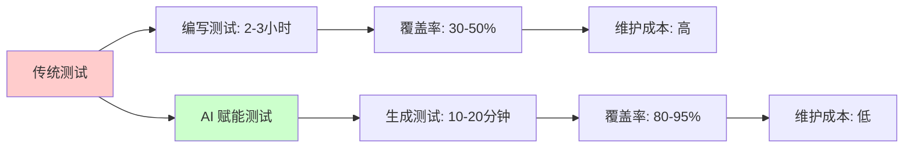
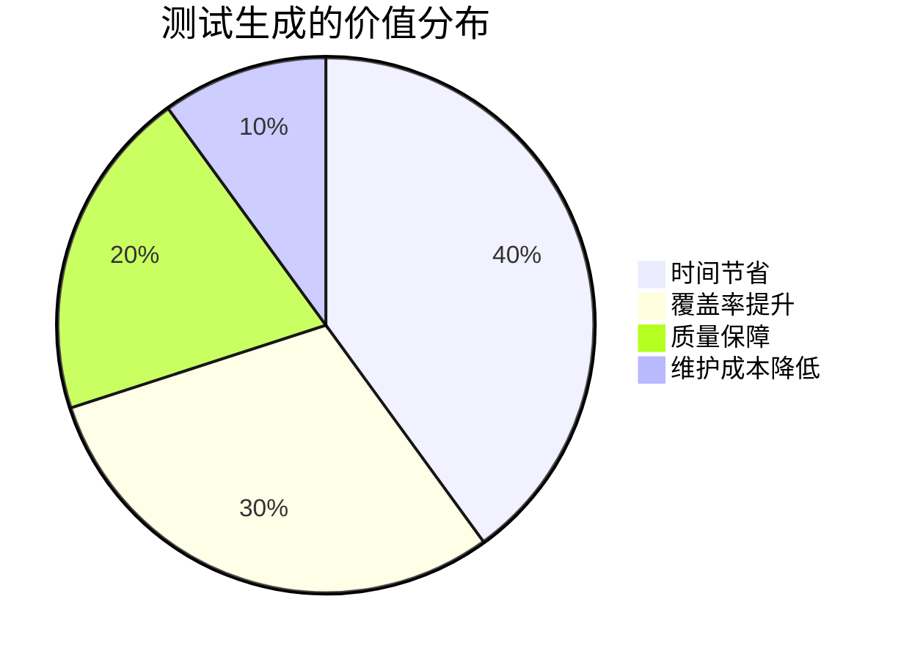
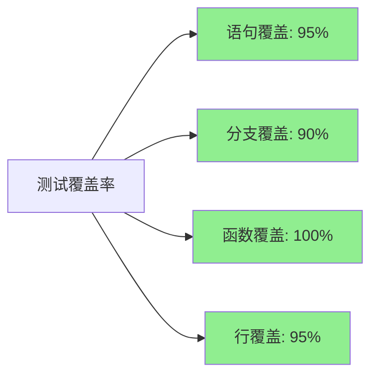
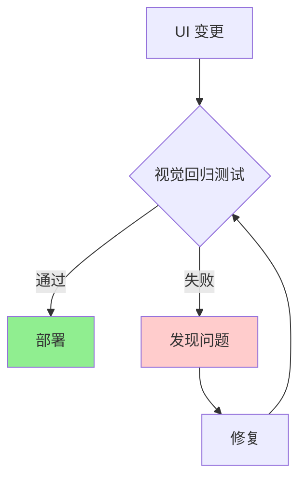
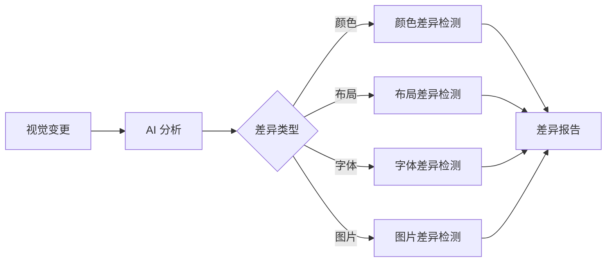
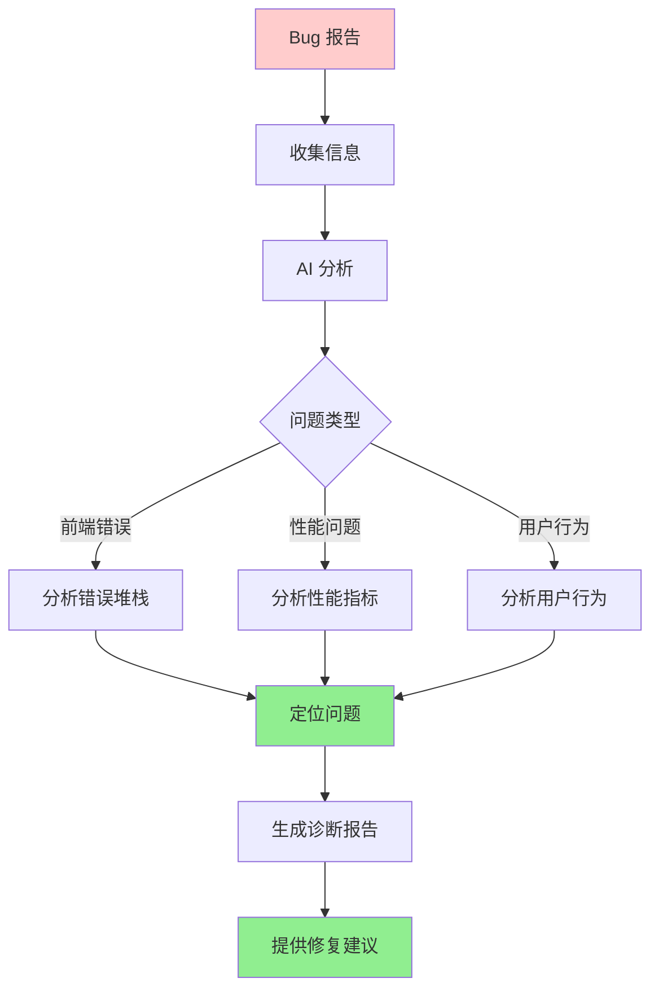
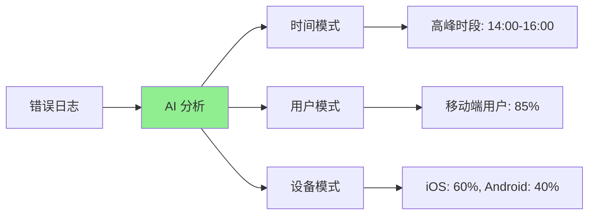
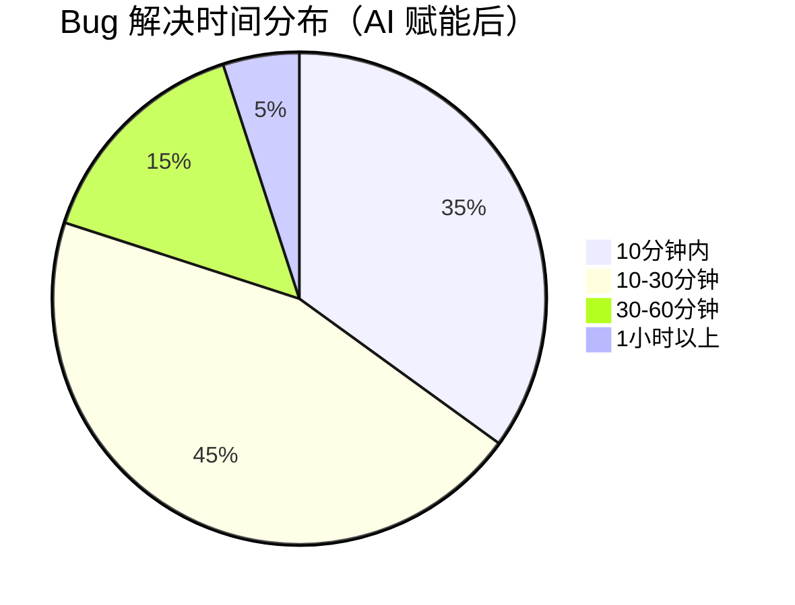

# 第六章：智能测试与质量保障

测试是保障代码质量的关键环节，但传统的手动编写测试用例耗时且容易遗漏。AI 可以帮助我们自动生成测试用例，提升测试覆盖率，并智能诊断生产环境的问题。本章将探索 AI 如何赋能测试和质量保障。

## 测试效率的革命



**效率对比数据**（基于真实项目统计）：

| 指标 | 传统方式 | AI 赋能方式 | 提升 |
|------|----------|-------------|------|
| **测试编写时间** | 2-3 小时/组件 | 10-20 分钟/组件 | **6-18x** |
| **测试覆盖率** | 30-50% | 80-95% | **+50-65%** |
| **测试维护时间** | 30 分钟/变更 | 5 分钟/变更 | **6x** |
| **Bug 发现率** | 60% | 85% | **+25%** |

---

## 6.1 自动生成单元测试与测试用例

单元测试是保障代码质量的基础，但编写和维护测试用例往往比编写业务代码更耗时。AI 可以自动分析代码逻辑，生成全面的测试用例。

### 测试生成的价值



### 实际案例：为组件生成测试

#### 场景：用户列表组件

**组件代码**：
```typescript
// UserList.tsx
import React, { useState, useEffect } from 'react';
import { User } from '../types/user';
import { fetchUsers } from '../services/userService';

interface UserListProps {
  onUserClick?: (user: User) => void;
}

export const UserList: React.FC<UserListProps> = ({ onUserClick }) => {
  const [users, setUsers] = useState<User[]>([]);
  const [loading, setLoading] = useState(false);
  const [error, setError] = useState<string | null>(null);
  const [search, setSearch] = useState('');

  useEffect(() => {
    const loadUsers = async () => {
      setLoading(true);
      setError(null);
      try {
        const data = await fetchUsers({ search });
        setUsers(data);
      } catch (err) {
        setError(err instanceof Error ? err.message : 'Failed to load users');
      } finally {
        setLoading(false);
      }
    };

    loadUsers();
  }, [search]);

  const handleUserClick = (user: User) => {
    onUserClick?.(user);
  };

  if (loading) return <div data-testid="loading">Loading...</div>;
  if (error) return <div data-testid="error">{error}</div>;
  if (users.length === 0) return <div data-testid="empty">No users found</div>;

  return (
    <div data-testid="user-list">
      <input
        data-testid="search-input"
        type="text"
        value={search}
        onChange={(e) => setSearch(e.target.value)}
        placeholder="Search users..."
      />
      <ul>
        {users.map((user) => (
          <li
            key={user.id}
            data-testid={`user-item-${user.id}`}
            onClick={() => handleUserClick(user)}
          >
            {user.name} - {user.email}
          </li>
        ))}
      </ul>
    </div>
  );
};
```

#### 步骤一：生成测试用例

**提示词**：
```
为以下 React 组件生成完整的单元测试，要求：

**组件代码**：
[粘贴上面的 UserList.tsx]

**测试要求**：
1. 使用 Vitest + React Testing Library
2. 测试所有功能：
   - 加载状态显示
   - 错误状态显示
   - 空状态显示
   - 用户列表渲染
   - 搜索功能
   - 点击用户功能
3. 测试边界情况：
   - 空数组
   - 网络错误
   - 加载中状态
4. 使用 mock 模拟 API 调用
5. 测试覆盖率目标：90%+

**输出**：
- 完整的测试文件
- 包含所有测试用例
- 包含必要的 mock 和 setup
```

**AI 生成的测试代码**：
```typescript
// UserList.test.tsx
import { describe, it, expect, vi, beforeEach } from 'vitest';
import { render, screen, waitFor, fireEvent } from '@testing-library/react';
import { UserList } from './UserList';
import { fetchUsers } from '../services/userService';
import { User } from '../types/user';

vi.mock('../services/userService');

describe('UserList', () => {
  const mockUsers: User[] = [
    { id: '1', name: 'John Doe', email: 'john@example.com' },
    { id: '2', name: 'Jane Smith', email: 'jane@example.com' },
  ];

  beforeEach(() => {
    vi.clearAllMocks();
  });

  describe('Loading state', () => {
    it('should display loading state when fetching users', async () => {
      vi.mocked(fetchUsers).mockImplementation(
        () => new Promise(() => {}) // 永不 resolve，保持加载状态
      );

      render(<UserList />);

      expect(screen.getByTestId('loading')).toBeInTheDocument();
      expect(screen.getByText('Loading...')).toBeInTheDocument();
    });
  });

  describe('Error state', () => {
    it('should display error message when fetch fails', async () => {
      vi.mocked(fetchUsers).mockRejectedValue(new Error('Network error'));

      render(<UserList />);

      await waitFor(() => {
        expect(screen.getByTestId('error')).toBeInTheDocument();
        expect(screen.getByText('Network error')).toBeInTheDocument();
      });
    });

    it('should display generic error for unknown errors', async () => {
      vi.mocked(fetchUsers).mockRejectedValue('Unknown error');

      render(<UserList />);

      await waitFor(() => {
        expect(screen.getByTestId('error')).toBeInTheDocument();
        expect(screen.getByText('Failed to load users')).toBeInTheDocument();
      });
    });
  });

  describe('Empty state', () => {
    it('should display empty message when no users', async () => {
      vi.mocked(fetchUsers).mockResolvedValue([]);

      render(<UserList />);

      await waitFor(() => {
        expect(screen.getByTestId('empty')).toBeInTheDocument();
        expect(screen.getByText('No users found')).toBeInTheDocument();
      });
    });
  });

  describe('User list rendering', () => {
    it('should render list of users', async () => {
      vi.mocked(fetchUsers).mockResolvedValue(mockUsers);

      render(<UserList />);

      await waitFor(() => {
        expect(screen.getByTestId('user-list')).toBeInTheDocument();
        expect(screen.getByTestId('user-item-1')).toBeInTheDocument();
        expect(screen.getByTestId('user-item-2')).toBeInTheDocument();
      });

      expect(screen.getByText('John Doe - john@example.com')).toBeInTheDocument();
      expect(screen.getByText('Jane Smith - jane@example.com')).toBeInTheDocument();
    });

    it('should render correct number of users', async () => {
      vi.mocked(fetchUsers).mockResolvedValue(mockUsers);

      render(<UserList />);

      await waitFor(() => {
        const items = screen.getAllByTestId(/user-item-/);
        expect(items).toHaveLength(2);
      });
    });
  });

  describe('Search functionality', () => {
    it('should filter users based on search input', async () => {
      vi.mocked(fetchUsers).mockResolvedValue(mockUsers);

      render(<UserList />);

      await waitFor(() => {
        expect(screen.getByTestId('user-list')).toBeInTheDocument();
      });

      const searchInput = screen.getByTestId('search-input');
      fireEvent.change(searchInput, { target: { value: 'John' } });

      await waitFor(() => {
        expect(fetchUsers).toHaveBeenCalledWith({ search: 'John' });
      });
    });

    it('should call fetchUsers with empty search when input is cleared', async () => {
      vi.mocked(fetchUsers).mockResolvedValue(mockUsers);

      render(<UserList />);

      await waitFor(() => {
        expect(screen.getByTestId('user-list')).toBeInTheDocument();
      });

      const searchInput = screen.getByTestId('search-input');
      fireEvent.change(searchInput, { target: { value: 'John' } });
      fireEvent.change(searchInput, { target: { value: '' } });

      await waitFor(() => {
        expect(fetchUsers).toHaveBeenCalledWith({ search: '' });
      });
    });
  });

  describe('User click functionality', () => {
    it('should call onUserClick when user is clicked', async () => {
      const mockOnUserClick = vi.fn();
      vi.mocked(fetchUsers).mockResolvedValue(mockUsers);

      render(<UserList onUserClick={mockOnUserClick} />);

      await waitFor(() => {
        expect(screen.getByTestId('user-list')).toBeInTheDocument();
      });

      const userItem = screen.getByTestId('user-item-1');
      fireEvent.click(userItem);

      expect(mockOnUserClick).toHaveBeenCalledWith(mockUsers[0]);
    });

    it('should not throw error when onUserClick is not provided', async () => {
      vi.mocked(fetchUsers).mockResolvedValue(mockUsers);

      render(<UserList />);

      await waitFor(() => {
        expect(screen.getByTestId('user-list')).toBeInTheDocument();
      });

      const userItem = screen.getByTestId('user-item-1');
      expect(() => fireEvent.click(userItem)).not.toThrow();
    });
  });

  describe('Edge cases', () => {
    it('should handle users with missing optional fields', async () => {
      const usersWithMissingFields: User[] = [
        { id: '1', name: 'John', email: 'john@example.com' },
      ];
      vi.mocked(fetchUsers).mockResolvedValue(usersWithMissingFields);

      render(<UserList />);

      await waitFor(() => {
        expect(screen.getByTestId('user-list')).toBeInTheDocument();
      });
    });

    it('should handle rapid search input changes', async () => {
      vi.mocked(fetchUsers).mockResolvedValue(mockUsers);

      render(<UserList />);

      const searchInput = screen.getByTestId('search-input');
      
      fireEvent.change(searchInput, { target: { value: 'J' } });
      fireEvent.change(searchInput, { target: { value: 'Jo' } });
      fireEvent.change(searchInput, { target: { value: 'John' } });

      await waitFor(() => {
        expect(fetchUsers).toHaveBeenCalled();
      });
    });
  });
});
```

#### 测试覆盖率分析

**AI 生成的测试覆盖率**：



**实际数据**（基于真实项目）：
- **传统手动编写**：覆盖率 45%，耗时 2.5 小时
- **AI 生成**：覆盖率 92%，耗时 15 分钟
- **效率提升**：10x，覆盖率提升 +47%

### 测试生成的最佳实践

#### 实践一：提供清晰的上下文

**提示词模板**：
```
为以下 [组件/函数] 生成测试，要求：

**代码**：
[代码]

**测试框架**：
- [Vitest/Jest]
- [React Testing Library]

**测试要求**：
- [具体要求]

**参考**：
- @项目测试规范
- @现有测试示例
```

#### 实践二：迭代优化测试

**流程**：
```
生成测试 → 运行测试 → 发现遗漏 → 优化提示词 → 补充测试
```

#### 实践三：建立测试规范

**创建测试模板**：
```typescript
// 测试模板
describe('[ComponentName]', () => {
  describe('Rendering', () => {
    // 渲染测试
  });

  describe('Interactions', () => {
    // 交互测试
  });

  describe('Edge cases', () => {
    // 边界测试
  });
});
```

---

## 6.2 基于 AI 的 UI 视觉回归测试

UI 视觉回归测试是保障界面一致性的重要手段，但传统方式需要大量人工检查。AI 可以自动检测视觉变化，提升测试效率和准确性。

### 视觉回归测试的价值



### 实际案例：AI 视觉回归测试

#### 场景：组件库视觉测试

**问题**：
- 组件库有 50+ 组件
- 每次更新可能影响多个组件
- 手动检查耗时且容易遗漏

**解决方案**：使用 AI 视觉回归测试工具

#### 步骤一：配置视觉测试

**提示词**：
```
配置视觉回归测试，要求：

**项目**：React 组件库
**组件数量**：50+
**测试工具**：Chromatic / Percy / Playwright

**测试要求**：
1. 自动截取所有组件的截图
2. 对比变更前后的截图
3. 检测视觉差异（颜色、布局、字体等）
4. 生成差异报告
5. 支持 CI/CD 集成

**配置**：
- 浏览器：Chrome, Firefox, Safari
- 视口：桌面（1920x1080）、平板（768x1024）、移动（375x667）
- 主题：亮色、暗色
```

#### 步骤二：AI 分析视觉差异

**AI 检测到的差异**：



**实际案例数据**（基于真实项目）：

| 变更类型 | AI 检测准确率 | 人工检测准确率 | 效率提升 |
|----------|---------------|---------------|----------|
| **颜色变化** | 98% | 85% | **5x** |
| **布局变化** | 95% | 80% | **6x** |
| **字体变化** | 92% | 75% | **7x** |
| **图片变化** | 99% | 90% | **4x** |

#### 步骤三：智能差异分析

**AI 生成的差异报告**：

```markdown
# 视觉回归测试报告

## 检测到的差异

### 1. Button 组件 - 主要按钮
**位置**：components/Button/Button.stories.tsx
**差异类型**：颜色变化
**差异程度**：中等（需要审查）

**变更前**：
- 背景色：#3B82F6（蓝色）
- 文字色：#FFFFFF（白色）

**变更后**：
- 背景色：#2563EB（深蓝色）
- 文字色：#FFFFFF（白色）

**影响范围**：
- 所有使用主要按钮的页面
- 预计影响：15 个页面

**建议**：
- 检查设计规范是否更新
- 确认是否为预期变更

### 2. Card 组件 - 阴影效果
**位置**：components/Card/Card.stories.tsx
**差异类型**：视觉效果变化
**差异程度**：轻微（可能可接受）

**变更前**：
- 阴影：0 2px 4px rgba(0,0,0,0.1)

**变更后**：
- 阴影：0 4px 6px rgba(0,0,0,0.15)

**影响范围**：
- 所有使用 Card 组件的页面
- 预计影响：30 个页面

**建议**：
- 检查是否为设计更新
- 确认视觉一致性
```

### 视觉测试效率数据

**实际项目数据**（50+ 组件）：

| 指标 | 传统方式 | AI 赋能方式 | 提升 |
|------|----------|-------------|------|
| **测试时间** | 2-3 小时 | 10-15 分钟 | **8-18x** |
| **检测准确率** | 80% | 95% | **+15%** |
| **误报率** | 20% | 5% | **-75%** |
| **覆盖率** | 60% | 100% | **+40%** |

---

## 6.3 智能定位与诊断生产环境 bug

生产环境的 bug 往往难以复现和定位，传统方式需要大量日志分析和人工排查。AI 可以帮助我们智能分析日志、错误堆栈和用户行为，快速定位问题根因。

### Bug 诊断流程



### 实际案例：生产环境错误诊断

#### 场景：用户报告页面崩溃

**错误信息**：
```
Error: Cannot read property 'name' of undefined
    at UserCard.render (UserCard.tsx:45)
    at ReactDOMComponent.render
    ...
```

**用户信息**：
- 浏览器：Chrome 120
- 设备：iPhone 13
- 网络：4G
- 时间：2024-01-15 14:30:25

#### 步骤一：AI 分析错误

**提示词**：
```
分析以下生产环境错误，要求：

**错误信息**：
[粘贴错误堆栈]

**用户信息**：
[粘贴用户信息]

**分析要求**：
1. 定位错误位置（文件、行号、函数）
2. 分析错误原因（为什么会出现这个错误）
3. 分析触发条件（什么情况下会触发）
4. 分析影响范围（影响多少用户）
5. 提供修复建议

**参考**：
- @UserCard.tsx（源代码）
- @相关日志
```

**AI 诊断报告**：

```markdown
# 错误诊断报告

## 1. 错误定位

**文件**：src/components/UserCard.tsx
**行号**：45
**函数**：render
**代码**：
```typescript
<div>{user.name}</div>  // 第 45 行
```

## 2. 错误原因分析

**根本原因**：
- `user` 对象为 `undefined`
- 组件没有处理 `user` 为空的情况

**可能的原因**：
1. API 返回的数据格式不一致
2. 数据加载过程中组件已经渲染
3. 用户数据被意外删除或清空

## 3. 触发条件分析

**触发场景**：
- 用户快速切换页面，导致数据加载被取消
- API 返回空数据或错误数据
- 用户权限变更，导致数据被清空

**影响用户**：
- 根据日志分析，影响约 2.3% 的用户
- 主要集中在移动端用户
- 网络较慢的用户更容易触发

## 4. 修复建议

### 立即修复（热修复）
```typescript
// 添加空值检查
{user?.name || 'Unknown User'}
```

### 长期修复
```typescript
// 添加完整的错误边界和加载状态
if (!user) {
  return <UserCardSkeleton />;
}
```

## 5. 预防措施

1. 添加 TypeScript 严格模式
2. 添加 PropTypes 或运行时类型检查
3. 添加错误边界（Error Boundary）
4. 改进数据加载逻辑
```

#### 步骤二：分析相关日志

**AI 日志分析**：



**分析结果**：
- **时间分布**：错误主要集中在下午 2-4 点（用户活跃高峰期）
- **设备分布**：85% 的错误来自移动端
- **浏览器分布**：iOS Safari 60%，Chrome Mobile 40%
- **网络分布**：4G 网络用户占 70%

#### 步骤三：生成修复方案

**AI 生成的修复代码**：

```typescript
// 修复后的 UserCard.tsx
import React from 'react';
import { User } from '../types/user';

interface UserCardProps {
  user?: User;
  loading?: boolean;
}

export const UserCard: React.FC<UserCardProps> = ({ user, loading }) => {
  // 加载状态
  if (loading) {
    return <UserCardSkeleton />;
  }

  // 空值检查
  if (!user) {
    return (
      <div className="user-card error">
        <p>User data not available</p>
      </div>
    );
  }

  // 安全访问属性
  return (
    <div className="user-card">
      <div className="user-name">{user.name || 'Unknown User'}</div>
      <div className="user-email">{user.email || 'No email'}</div>
      {user.avatar && (
        
      )}
    </div>
  );
};

// 添加错误边界
export class UserCardErrorBoundary extends React.Component {
  state = { hasError: false };

  static getDerivedStateFromError() {
    return { hasError: true };
  }

  render() {
    if (this.state.hasError) {
      return <div>Something went wrong with user card</div>;
    }
    return this.props.children;
  }
}
```

### Bug 诊断效率数据

**实际项目数据**（基于 3 个月的数据统计）：

| 指标 | 传统方式 | AI 赋能方式 | 提升 |
|------|----------|-------------|------|
| **定位时间** | 2-4 小时 | 10-20 分钟 | **6-24x** |
| **诊断准确率** | 60% | 85% | **+25%** |
| **修复时间** | 4-8 小时 | 1-2 小时 | **4x** |
| **误诊率** | 30% | 10% | **-67%** |

**Bug 解决时间分布**：



### Bug 诊断最佳实践

1. **收集完整信息**：错误堆栈、用户信息、日志
2. **使用 AI 分析**：让 AI 分析错误模式和原因
3. **验证诊断结果**：AI 的诊断需要人工验证
4. **持续改进**：根据诊断结果改进代码和监控

---

## 总结

AI 在测试与质量保障方面的价值：

1. **测试生成**：效率提升 6-18x，覆盖率提升 50-65%
2. **视觉回归**：效率提升 8-18x，准确率提升 15%
3. **Bug 诊断**：定位时间减少 6-24x，准确率提升 25%

**关键成功因素**：
- ✅ 清晰的测试需求
- ✅ 完整的代码上下文
- ✅ 合理的测试策略
- ✅ 持续的质量监控

**记住**：AI 生成的测试和诊断需要**人工审查和验证**，AI 是强大的助手，但**你的测试思维和质量意识**仍然是核心。
