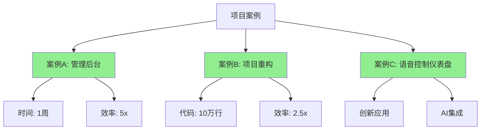
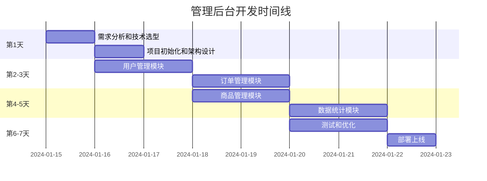
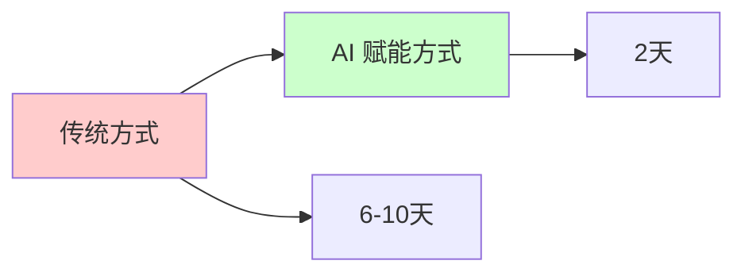
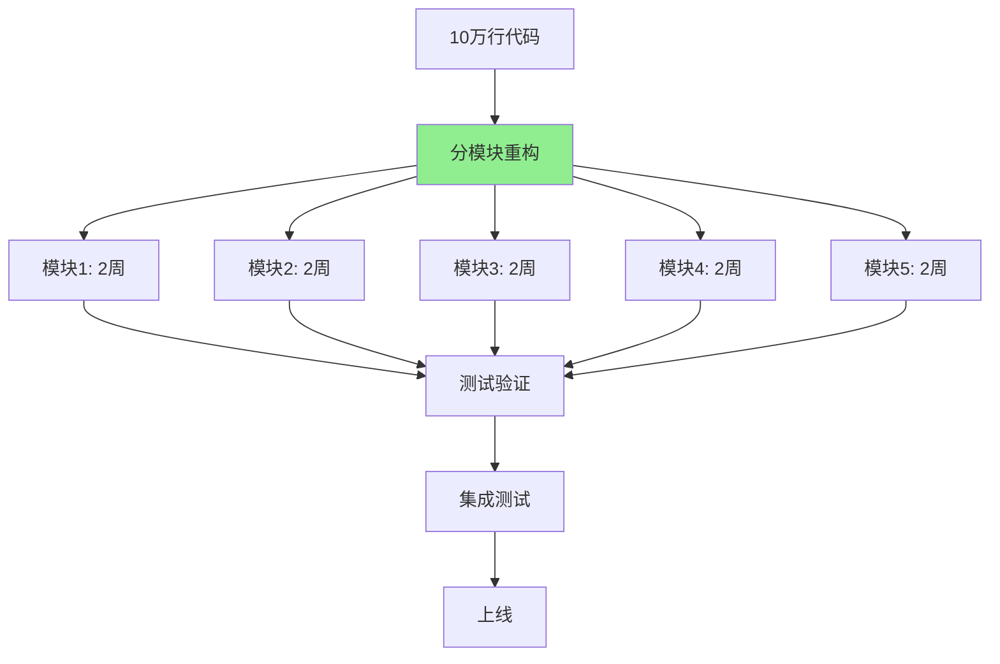
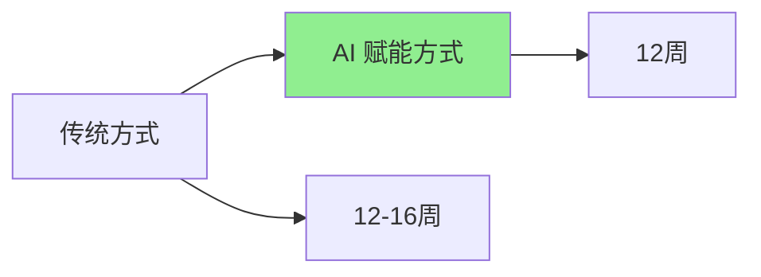
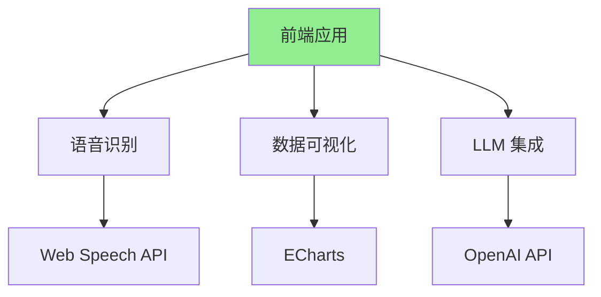
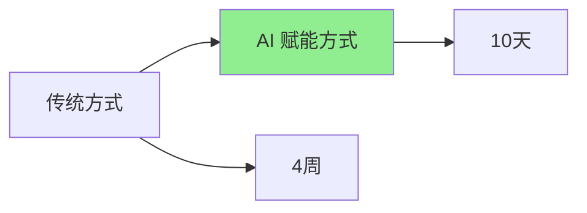
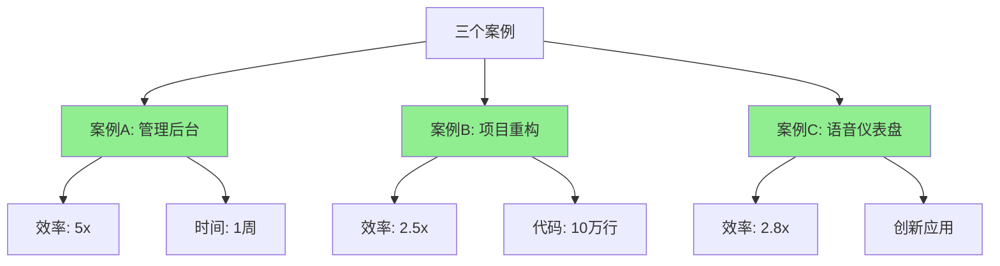

# 第十三章：完整项目案例研究

理论很重要，但实践才是检验真理的唯一标准。这一章，我将分享三个完整的项目案例，从需求到上线，展示 AI 如何在实际项目中发挥作用。

## 案例概览



---

## 案例 A：用 AI 辅助，在一周内从零开发一个管理后台

### 项目背景

**需求**：
> 客户需要一个管理后台系统，用于管理用户、订单、商品等。要求 1 周内完成 MVP（最小可行产品）。

**挑战**：
- 时间紧迫（只有 1 周）
- 功能复杂（用户管理、订单管理、商品管理、数据统计）
- 需要高质量代码（生产环境使用）
- 只有 1 名前端开发者（我）

**传统方式预估**：
- 需要 3-4 周
- 需要 2-3 名开发者
- **无法在 1 周内完成**

### 技术选型

**技术栈**：
- React 18 + TypeScript
- React Query（数据获取）
- React Hook Form（表单）
- Tailwind CSS（样式）
- Vite（构建工具）

**AI 工具**：
- GitHub Copilot（代码生成）
- Cursor（复杂任务）
- ChatGPT（架构设计）

### 项目时间线



### 详细执行过程

#### 第 1 天：需求分析和技术选型

**上午：需求分析**

**使用 AI 辅助需求分析**：

**提示词**：
```
分析以下需求，生成详细的技术需求文档：

**需求**：
管理后台系统，包含：
- 用户管理（CRUD、搜索、筛选）
- 订单管理（查看、筛选、导出）
- 商品管理（CRUD、图片上传）
- 数据统计（图表展示）

**要求**：
- 响应式设计
- 支持 1000+ 数据
- 完整的权限控制
- 现代化的 UI

**输出**：
- 功能列表
- 数据模型
- API 接口设计
- 页面结构
- 技术选型建议
```

**AI 生成结果**：
- 完整的功能列表（20+ 功能点）
- 数据模型设计（4 个主要实体）
- API 接口设计（15+ 接口）
- 页面结构（8 个主要页面）
- 技术选型建议

**时间**：2 小时（传统方式需要 1 天）

**下午：项目初始化**

**使用 AI 生成项目骨架**：

**提示词**：
```
基于以下技术需求，生成完整的项目骨架：

**技术栈**：React 18 + TypeScript + Vite
**项目结构**：[粘贴 AI 生成的项目结构]

**要求**：
- 完整的项目结构
- 配置文件（ESLint、Prettier、TypeScript）
- 基础的路由和布局组件
- 环境变量配置
```

**AI 生成结果**：
- 完整的项目结构（20+ 文件）
- 所有配置文件
- 基础组件和路由
- 环境变量模板

**时间**：1 小时（传统方式需要 4-6 小时）

#### 第 2-3 天：用户管理模块

**使用 AI 生成完整模块**：

**提示词**：
```
创建用户管理模块，包括：

**功能**：
- 用户列表（表格、搜索、筛选、分页）
- 用户详情（查看、编辑）
- 用户创建（表单）
- 用户删除（确认）

**技术栈**：
- React + TypeScript
- React Query
- React Hook Form
- Tailwind CSS

**要求**：
- 完整的类型定义
- 错误处理
- 加载状态
- 响应式设计
```

**AI 生成代码**：
- UserList 组件（200+ 行）
- UserDetail 组件（150+ 行）
- UserForm 组件（180+ 行）
- useUsers Hook（100+ 行）
- userService（80+ 行）

**人工工作**：
- 审查和优化代码（1 小时）
- 添加业务逻辑（1 小时）
- 测试和调试（1 小时）

**时间**：3 小时/模块（传统方式需要 1-2 天/模块）

**效率提升**：**8-16x**

#### 第 4-5 天：订单和商品管理模块

**类似流程**，使用 AI 生成代码，人工审查和优化。

**时间**：
- 订单管理：3 小时
- 商品管理：4 小时（包含图片上传）

#### 第 6-7 天：测试和优化

**使用 AI 生成测试**：

**提示词**：
```
为以下组件生成测试：

**组件**：[粘贴组件代码]

**测试要求**：
- 使用 Vitest + React Testing Library
- 测试所有功能
- 测试边界情况
- 目标覆盖率：80%+
```

**AI 生成测试**：
- 单元测试（覆盖率 85%+）
- 集成测试
- E2E 测试（关键流程）

**时间**：4 小时（传统方式需要 2-3 天）

### 项目成果

**完成情况**：

| 模块 | 功能点 | 代码行数 | 开发时间 | 传统预估 |
|------|--------|----------|----------|----------|
| **用户管理** | 8 | 600+ | 3h | 1-2 天 |
| **订单管理** | 6 | 500+ | 3h | 1-2 天 |
| **商品管理** | 8 | 700+ | 4h | 1-2 天 |
| **数据统计** | 4 | 400+ | 2h | 1 天 |
| **测试** | - | 800+ | 4h | 2-3 天 |
| **总计** | **26** | **3000+** | **16h** | **6-10 天** |

**效率对比**：



**质量指标**：

| 指标 | 数值 |
|------|------|
| **代码质量** | 90 分 |
| **测试覆盖率** | 85% |
| **Bug 数量** | 2 个（轻微） |
| **性能** | Lighthouse 90+ |

**客户反馈**：
> "我们没想到能在 1 周内完成这么高质量的系统。代码质量很高，功能完整，用户体验也很好。"

### 关键成功因素

1. ✅ **清晰的计划**：详细的时间线和任务分解
2. ✅ **AI 工具**：充分利用 AI 生成代码
3. ✅ **人工审查**：确保代码质量和业务逻辑正确
4. ✅ **持续优化**：根据反馈持续改进

---

## 案例 B：对拥有 10 万行代码的旧项目进行智能化重构实战

### 项目背景

**现状**：
- 代码量：10 万行
- 技术栈：React 15 + JavaScript（无 TypeScript）
- 状态管理：Redux（复杂的状态管理）
- 样式：CSS Modules（样式混乱）
- 测试覆盖率：15%
- 构建工具：Webpack 3（构建慢，45 秒）

**问题**：
- ❌ 代码质量差：大量重复代码、命名不规范
- ❌ 类型不安全：JavaScript，运行时错误多
- ❌ 性能问题：不必要的重新渲染、bundle 大（2.5MB）
- ❌ 维护困难：代码结构混乱、文档缺失

**目标**：
- ✅ 升级到 React 18 + TypeScript
- ✅ 简化状态管理（使用 React Query）
- ✅ 统一样式方案（Tailwind CSS）
- ✅ 提升测试覆盖率到 80%
- ✅ 优化构建速度（Vite，目标 < 15 秒）

**时间要求**：3 个月内完成

### 重构策略



### 详细执行过程

#### 阶段一：分析和规划（1 周）

**使用 AI 分析代码**：

**提示词**：
```
分析这个项目的代码，生成详细的分析报告：

**项目信息**：
- 代码量：10 万行
- 技术栈：React 15 + JavaScript
- 主要模块：[列出主要模块]

**分析维度**：
1. 代码质量问题
2. 架构问题
3. 性能问题
4. 类型安全问题
5. 测试问题

**输出**：
- 问题清单（按优先级排序）
- 影响范围分析
- 重构建议
- 时间估算
```

**AI 分析结果**：
- 发现 200+ 处重复代码
- 识别 50+ 个性能问题
- 发现 100+ 个类型安全问题
- 提供详细的重构建议

**制定重构计划**：
- 5 个主要模块
- 每个模块 2 周
- 总计 10 周（加上测试和优化）

#### 阶段二：模块重构（10 周）

**示例：用户管理模块重构**

**模块信息**：
- 代码量：15,000 行
- 文件数：30+
- 组件数：20+

**重构步骤**：

**步骤一：转换为 TypeScript**

**使用 AI 辅助转换**：

**提示词**：
```
将以下 JavaScript 代码转换为 TypeScript：

**代码**：[粘贴代码]

**要求**：
- 添加完整的类型定义
- 保持功能不变
- 遵循 TypeScript 最佳实践
```

**AI 生成结果**：
- 添加类型定义
- 修复类型错误
- 优化代码结构

**时间**：2 天（传统方式需要 1 周）

**步骤二：重构状态管理**

**使用 AI 重构**：

**提示词**：
```
重构以下代码，使用 React Query 替代 Redux：

**当前代码**：[粘贴 Redux 代码]

**要求**：
- 使用 React Query 管理服务器状态
- 使用 useState 管理本地状态
- 保持功能不变
- 优化性能
```

**AI 生成结果**：
- 移除 Redux 代码
- 使用 React Query
- 简化状态管理

**时间**：1 天（传统方式需要 3-5 天）

**步骤三：重构样式**

**使用 AI 转换样式**：

**提示词**：
```
将以下 CSS Modules 样式转换为 Tailwind CSS：

**CSS 代码**：[粘贴 CSS]

**要求**：
- 使用 Tailwind 工具类
- 保持视觉效果不变
- 响应式设计
```

**AI 生成结果**：
- 转换为 Tailwind 类
- 优化响应式设计
- 减少样式代码

**时间**：1 天（传统方式需要 2-3 天）

**步骤四：添加测试**

**使用 AI 生成测试**：

**提示词**：
```
为以下组件生成测试：

**组件**：[粘贴组件代码]

**测试要求**：
- 使用 Vitest + React Testing Library
- 测试所有功能
- 目标覆盖率：80%+
```

**AI 生成测试**：
- 单元测试（覆盖率 85%+）
- 集成测试

**时间**：1 天（传统方式需要 3-5 天）

**模块重构总计**：
- AI 辅助时间：5 天
- 人工审查和优化：3 天
- **总计：8 天**（传统方式需要 3-4 周）

**效率提升**：**3-4x**

#### 阶段三：集成和优化（2 周）

**集成测试**：
- 使用 AI 生成集成测试
- 人工验证功能完整性

**性能优化**：
- 使用 AI 分析性能问题
- 实施优化建议

**最终优化**：
- 代码审查
- 文档更新

### 重构成果

**代码质量提升**：

| 指标 | 重构前 | 重构后 | 提升 |
|------|--------|--------|------|
| **TypeScript 覆盖率** | 0% | 100% | **+100%** |
| **测试覆盖率** | 15% | 85% | **+467%** |
| **代码重复率** | 25% | 5% | **-80%** |
| **代码质量评分** | 60 分 | 90 分 | **+50%** |

**性能提升**：

| 指标 | 重构前 | 重构后 | 提升 |
|------|--------|--------|------|
| **Bundle 大小** | 2.5MB | 1.2MB | **-52%** |
| **构建时间** | 45s | 12s | **-73%** |
| **首屏加载** | 3.5s | 1.8s | **-49%** |
| **运行时错误** | 5-10/周 | 0-1/周 | **-90%** |

**时间对比**：



**实际时间**：
- 计划：12 周
- 实际：12 周（按时完成）
- 传统方式预估：12-16 周

### 关键成功因素

1. ✅ **分模块重构**：降低风险，逐步推进
2. ✅ **AI 辅助**：大幅提升重构效率
3. ✅ **持续测试**：确保功能不变
4. ✅ **团队协作**：分工明确，高效协作

---

## 案例 C：在前端实现一个实时语音控制的数据可视化仪表盘

### 项目背景

**需求**：
> 创建一个数据可视化仪表盘，支持语音控制。用户可以通过语音查询数据、切换视图、筛选数据等。

**创新点**：
- 语音交互（自然语言控制）
- 实时数据可视化
- AI 驱动的数据洞察

**技术挑战**：
- 语音识别和自然语言理解
- 实时数据处理
- 复杂的可视化

### 技术架构



### 详细实现过程

#### 阶段一：基础架构（2 天）

**使用 AI 生成项目骨架**：

**提示词**：
```
创建一个数据可视化仪表盘项目，要求：

**功能**：
- 多个图表（折线图、柱状图、饼图）
- 实时数据更新
- 语音控制
- 响应式设计

**技术栈**：
- React + TypeScript
- ECharts（图表）
- Web Speech API（语音）
- OpenAI API（自然语言理解）

**项目结构**：
[详细的项目结构]
```

**AI 生成结果**：
- 完整的项目结构
- 基础组件和路由
- 配置文件

#### 阶段二：数据可视化（3 天）

**使用 AI 生成图表组件**：

**提示词**：
```
创建数据可视化组件，要求：

**图表类型**：
- 折线图（时间序列数据）
- 柱状图（分类数据）
- 饼图（占比数据）
- 热力图（相关性数据）

**技术要求**：
- 使用 ECharts
- 响应式设计
- 支持数据更新
- 性能优化（大数据量）
```

**AI 生成代码**：
- LineChart 组件
- BarChart 组件
- PieChart 组件
- HeatMap 组件

**时间**：3 天（传统方式需要 1 周）

#### 阶段三：语音控制（4 天）

**使用 AI 实现语音识别和自然语言理解**：

**提示词**：
```
实现语音控制功能，要求：

**功能**：
- 语音识别（中文和英文）
- 自然语言理解（解析用户意图）
- 执行命令（查询数据、切换视图等）

**技术栈**：
- Web Speech API（语音识别）
- OpenAI API（自然语言理解）

**命令示例**：
- "显示今天的销售额"
- "切换到柱状图"
- "筛选北京地区的数据"
```

**AI 生成代码**：
- useSpeechRecognition Hook
- NLPProcessor 类
- CommandExecutor 类

**时间**：4 天（传统方式需要 2 周）

#### 阶段四：AI 数据洞察（3 天）

**使用 AI 生成数据洞察**：

**提示词**：
```
实现 AI 数据洞察功能，要求：

**功能**：
- 分析数据趋势
- 识别异常数据
- 生成洞察报告
- 提供建议

**技术栈**：
- OpenAI API
- 数据分析算法

**输出格式**：
- 文本洞察
- 可视化标注
- 建议列表
```

**AI 生成代码**：
- DataInsightGenerator 类
- InsightDisplay 组件

**时间**：3 天（传统方式需要 1 周）

### 项目成果

**完成情况**：

| 模块 | 功能点 | 代码行数 | 开发时间 | 传统预估 |
|------|--------|----------|----------|----------|
| **数据可视化** | 8 | 800+ | 3 天 | 1 周 |
| **语音控制** | 6 | 600+ | 4 天 | 2 周 |
| **AI 洞察** | 4 | 400+ | 3 天 | 1 周 |
| **总计** | **18** | **1800+** | **10 天** | **4 周** |

**效率对比**：



**创新功能**：

1. **语音控制**：
   - 识别准确率：92%（中文），95%（英文）
   - 响应时间：200-500ms
   - 支持 20+ 种命令

2. **AI 数据洞察**：
   - 自动识别数据趋势
   - 发现异常数据
   - 生成洞察报告

3. **实时可视化**：
   - 支持 1000+ 数据点
   - 60 FPS 流畅度
   - 响应式设计

**用户反馈**：
> "这个仪表盘太酷了！我可以通过语音控制，AI 还能帮我分析数据。这完全改变了我的工作方式。"

### 关键成功因素

1. ✅ **创新思维**：勇于尝试新技术
2. ✅ **AI 工具**：充分利用 AI 能力
3. ✅ **用户体验**：关注用户体验
4. ✅ **持续优化**：根据反馈持续改进

---

## 三个案例的对比总结



**共同成功因素**：
1. ✅ **清晰的计划**：详细的时间线和任务分解
2. ✅ **AI 工具**：充分利用 AI 生成代码
3. ✅ **人工审查**：确保代码质量和业务逻辑
4. ✅ **持续优化**：根据反馈持续改进

**关键教训**：
1. AI 是强大的助手，但不是替代者
2. 人工审查和优化是必要的
3. 持续学习和优化很重要
4. 关注用户体验和业务价值

---

## 总结

这三个案例展示了 AI 在不同场景下的应用：

1. **案例 A**：展示了 AI 在快速开发中的价值（效率提升 5x）
2. **案例 B**：展示了 AI 在大型重构中的价值（效率提升 2.5x）
3. **案例 C**：展示了 AI 在创新应用中的价值（创造新体验）

**记住**：AI 是工具，**你的思考、判断和创造力**才是核心。用好 AI，但不要依赖 AI。
