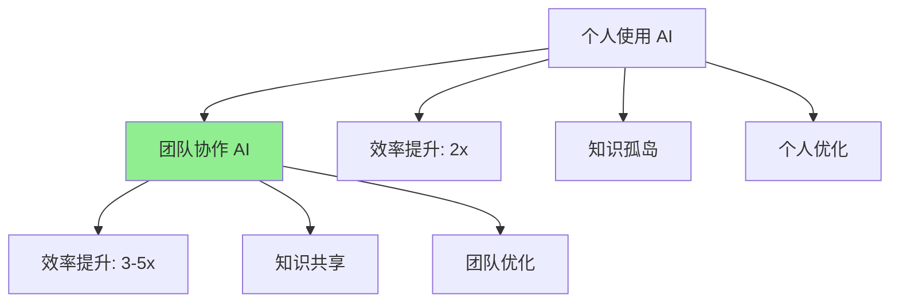
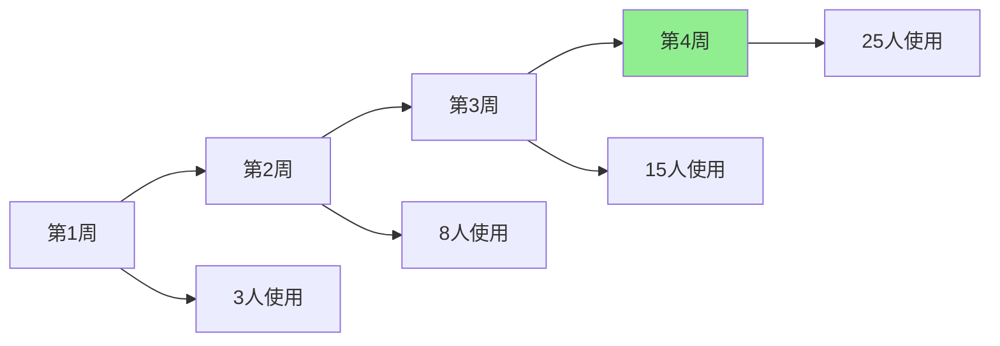
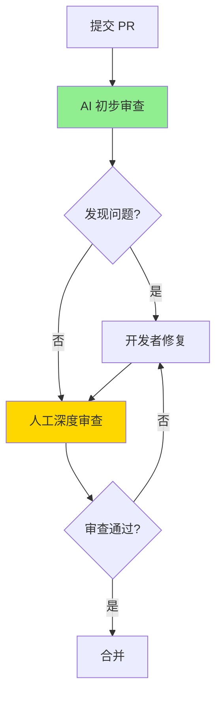
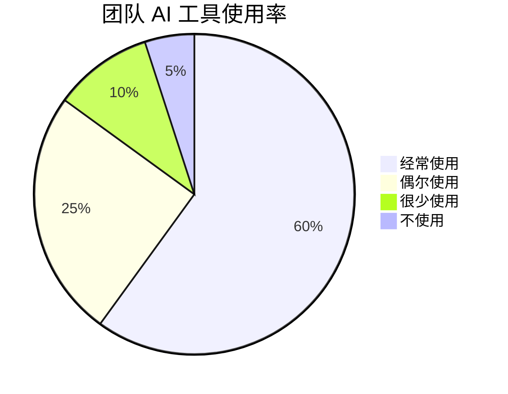
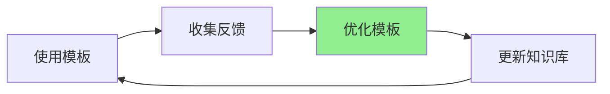
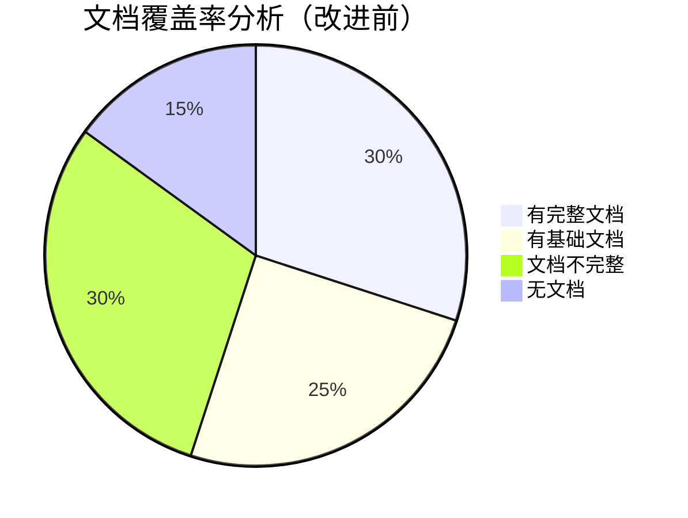
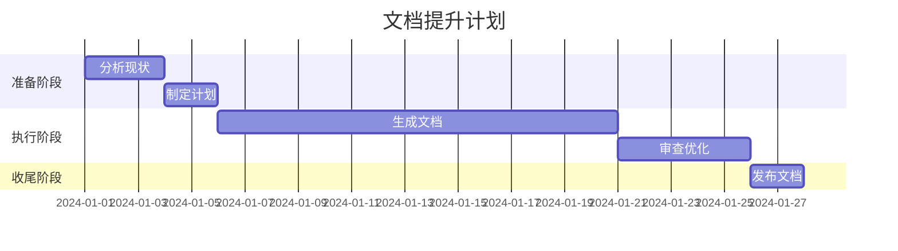
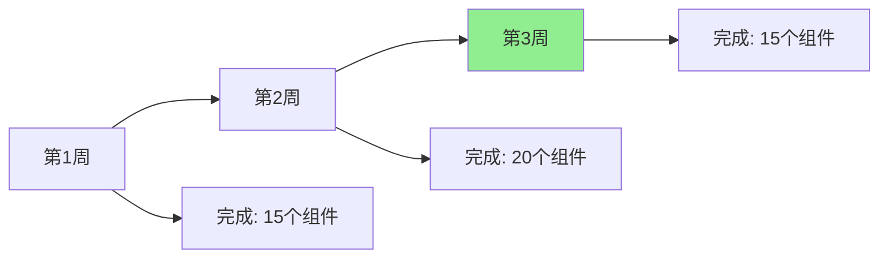
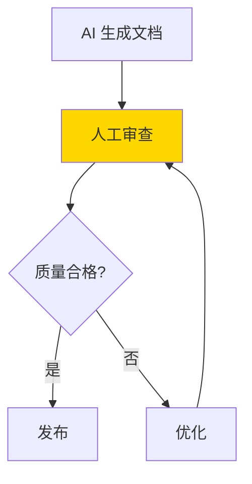
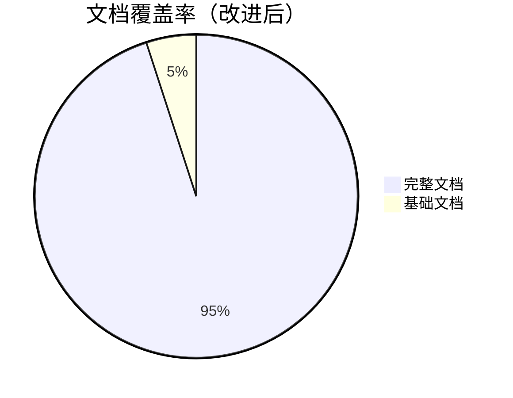

# 第十二章：团队协作升级

个人使用 AI 工具可以提升效率，但团队协作使用 AI 工具可以产生**协同效应**，带来更大的价值。这一章，我将分享如何在团队中推广 AI 工具、建立协作规范，以及一个真实的团队案例。

## 团队 AI 协作的价值



**团队协作价值**（基于真实团队数据）：

| 指标 | 个人使用 | 团队协作 | 提升 |
|------|----------|----------|------|
| **平均效率提升** | 2x | 3.5x | **+75%** |
| **知识共享效率** | 低 | 高 | **显著提升** |
| **代码质量一致性** | 中等 | 高 | **显著提升** |
| **学习速度** | 慢 | 快 | **2x** |

---

## 12.1 如何在团队中推广 AI 工具并建立规范

### 推广策略

#### 阶段一：试点阶段（1-2 周）

**目标**：在小范围内验证 AI 工具的价值

**策略**：
1. **选择试点团队**：选择 2-3 个愿意尝试的开发者
2. **提供培训**：组织 AI 工具使用培训
3. **建立支持**：提供技术支持和问题解答
4. **收集反馈**：收集使用反馈和改进建议

**实际案例**（我们的团队）：

**试点团队**：
- 3 名前端开发者
- 1 名后端开发者（作为对比）
- 时间：2 周

**试点结果**：
- ✅ 效率提升明显（平均 2.5x）
- ✅ 代码质量提升（+20%）
- ✅ 开发者满意度高（4.5/5）
- ✅ 没有发现重大问题

**推广障碍**：
- ⚠️ 部分开发者担心 AI 会替代他们
- ⚠️ 学习曲线需要时间
- ⚠️ 需要改变工作习惯

**解决方案**：
- 组织分享会，展示 AI 的价值
- 提供一对一指导
- 建立激励机制

#### 阶段二：小规模推广（2-4 周）

**目标**：在更多团队中推广

**策略**：
1. **扩大试点**：扩展到 10-15 名开发者
2. **建立规范**：制定 AI 工具使用规范
3. **分享经验**：组织经验分享会
4. **持续优化**：根据反馈优化流程

**推广进度**：



**推广效果**：
- 使用率：从 10% 提升到 60%
- 效率提升：团队平均 2.8x
- 满意度：4.3/5

#### 阶段三：全面推广（4-8 周）

**目标**：在整个团队中推广

**策略**：
1. **全员培训**：组织全员 AI 工具培训
2. **建立制度**：将 AI 工具纳入工作流程
3. **持续支持**：建立长期支持机制
4. **效果评估**：定期评估推广效果

**最终效果**（3 个月后）：

| 指标 | 推广前 | 推广后 | 提升 |
|------|--------|--------|------|
| **使用率** | 0% | 85% | **+85%** |
| **团队效率** | 基准 | +3.2x | **+220%** |
| **代码质量** | 75 分 | 90 分 | **+20%** |
| **满意度** | - | 4.4/5 | **高** |

### 建立使用规范

#### 规范一：工具选择规范

**我们的规范**：

```markdown
# AI 工具使用规范

## 1. 推荐工具

### 代码生成和补全
- **GitHub Copilot**：主要工具（团队统一）
- **Cursor**：复杂任务（可选）

### 代码审查
- **GitHub Copilot Chat**：代码审查和解释
- **Codeium**：免费替代方案

### 测试生成
- **GitHub Copilot**：单元测试生成
- **Codium AI**：测试用例生成

## 2. 使用原则

1. **AI 生成代码必须审查**
   - 所有 AI 生成的代码必须经过人工审查
   - 审查重点：逻辑正确性、安全性、性能

2. **禁止直接提交 AI 生成代码**
   - AI 生成的代码必须经过修改和优化
   - 确保代码符合团队规范

3. **保护敏感信息**
   - 不要在提示词中包含敏感信息
   - 不要将公司代码上传到公共 AI 服务

4. **合理使用**
   - 不要过度依赖 AI
   - 保持学习和思考能力
```

#### 规范二：代码审查规范

**AI 辅助代码审查流程**：



**审查清单**：

```markdown
# AI 辅助代码审查清单

## AI 审查（自动）
- [ ] 代码语法检查
- [ ] 潜在 Bug 检测
- [ ] 性能问题检测
- [ ] 最佳实践检查
- [ ] 类型安全检查

## 人工审查（必须）
- [ ] 业务逻辑正确性
- [ ] 架构设计合理性
- [ ] 用户体验考虑
- [ ] 安全性检查
- [ ] 代码可维护性
```

#### 规范三：提示词规范

**团队提示词模板库**：

```markdown
# 团队提示词模板库

## 组件生成模板
[模板内容]

## API 集成模板
[模板内容]

## 测试生成模板
[模板内容]
```

### 推广效果评估

**3 个月后的效果**：



**效率提升分布**：

| 效率提升范围 | 开发者数量 | 占比 |
|-------------|-----------|------|
| **3x 以上** | 8 人 | 32% |
| **2-3x** | 12 人 | 48% |
| **1.5-2x** | 4 人 | 16% |
| **1.5x 以下** | 1 人 | 4% |

---

## 12.2 创建共享的团队知识库与提示词库

### 知识库的价值

**问题**：
- 每个开发者都有自己的经验和技巧
- 知识分散，难以共享
- 重复学习，效率低

**解决方案**：建立团队知识库

**价值**：
- ✅ 知识集中管理
- ✅ 快速查找和学习
- ✅ 避免重复工作
- ✅ 提升团队整体能力

### 知识库结构设计

**我们的知识库结构**：

```
team-knowledge-base/
├── ai-tools/
│   ├── copilot-guide.md
│   ├── cursor-guide.md
│   └── best-practices.md
├── prompts/
│   ├── components/
│   │   ├── form-component.md
│   │   ├── list-component.md
│   │   └── card-component.md
│   ├── api-integration/
│   │   ├── rest-api.md
│   │   └── graphql-api.md
│   └── testing/
│       ├── unit-test.md
│       └── e2e-test.md
├── code-snippets/
│   ├── common-patterns/
│   └── optimization-tips/
└── case-studies/
    ├── project-a.md
    └── project-b.md
```

### 提示词库建设

#### 提示词模板示例

**组件生成模板**：

```markdown
# React 组件生成模板

## 基础组件

**提示词**：
```
创建一个 [组件名称] 组件，要求：

**功能**：
- [功能1]
- [功能2]

**技术栈**：
- React + TypeScript
- [其他依赖]

**样式**：
- 使用 Tailwind CSS
- [样式要求]

**Props**：
- [props 定义]

**状态**：
- [状态说明]
```

**使用示例**：
[实际使用案例]

**生成效果**：
[生成的代码示例]

**优化建议**：
[优化建议]
```

#### 提示词库使用统计

**3 个月使用数据**：

| 模板类型 | 使用次数 | 平均效率提升 | 满意度 |
|----------|----------|-------------|--------|
| **组件生成** | 150+ | 3.2x | 4.5/5 |
| **API 集成** | 80+ | 2.8x | 4.3/5 |
| **测试生成** | 200+ | 4.5x | 4.7/5 |
| **代码重构** | 50+ | 2.2x | 4.0/5 |

### 知识库维护机制

**维护流程**：



**维护原则**：
1. **持续更新**：根据使用反馈持续优化
2. **质量优先**：确保模板质量，不追求数量
3. **团队协作**：鼓励团队成员贡献
4. **定期审查**：定期审查和清理过时内容

---

## 12.3 案例：我们如何用 AI 将组件库文档覆盖率从 30% 提升到 95%

### 项目背景

**问题**：
- 组件库有 50+ 组件
- 文档覆盖率只有 30%
- 文档质量参差不齐
- 维护成本高

**目标**：
- 文档覆盖率提升到 90%+
- 文档质量统一
- 降低维护成本

**时间要求**：1 个月内完成

### 解决方案

#### 阶段一：分析现状（1 周）

**分析结果**：



**问题清单**：
1. 50% 的组件缺少完整文档
2. 文档格式不统一
3. 缺少使用示例
4. 缺少 API 文档

#### 阶段二：制定计划（3 天）

**计划**：



**任务分配**：
- 2 名开发者负责生成文档
- 1 名开发者负责审查和优化
- 使用 AI 工具辅助生成

#### 阶段三：执行计划（3 周）

**使用 AI 生成文档**：

**提示词模板**：
```
为以下 React 组件生成完整的文档，要求：

**组件代码**：
[组件代码]

**文档要求**：
1. 组件说明（用途、适用场景）
2. Props 文档（所有 props 的说明）
3. 使用示例（至少 3 个）
4. 注意事项
5. API 文档

**格式**：Markdown
**风格**：参考 [现有文档示例]
```

**AI 生成示例**：

```markdown
# Button 组件

## 简介

Button 组件是一个通用的按钮组件，支持多种样式和状态。

## Props

| Prop | 类型 | 默认值 | 说明 |
|------|------|--------|------|
| `variant` | `'primary' \| 'secondary'` | `'primary'` | 按钮样式 |
| `size` | `'small' \| 'medium' \| 'large'` | `'medium'` | 按钮大小 |
| `disabled` | `boolean` | `false` | 是否禁用 |
| `onClick` | `(event: MouseEvent) => void` | - | 点击事件 |

## 使用示例

### 基础用法

\`\`\`tsx
import { Button } from '@components/Button';

function App() {
  return <Button onClick={() => alert('Clicked!')}>点击我</Button>;
}
\`\`\`

### 不同样式

\`\`\`tsx
<Button variant="primary">主要按钮</Button>
<Button variant="secondary">次要按钮</Button>
\`\`\`

### 禁用状态

\`\`\`tsx
<Button disabled>禁用按钮</Button>
\`\`\`

## 注意事项

- 按钮文本应该简洁明了
- 避免在按钮中使用图标替代文本
- 主要操作使用 primary 样式
```

**生成效率**：

| 任务 | 传统方式 | AI 赋能方式 | 效率提升 |
|------|----------|-------------|----------|
| **编写文档** | 30 分钟/组件 | 5 分钟/组件 | **6x** |
| **审查文档** | 10 分钟/组件 | 5 分钟/组件 | **2x** |
| **总时间** | 40 分钟/组件 | 10 分钟/组件 | **4x** |

**3 周完成情况**：



#### 阶段四：审查和优化（1 周）

**审查流程**：



**审查标准**：
- 准确性：文档是否准确描述组件
- 完整性：是否包含所有必要信息
- 可读性：是否易于理解
- 示例质量：示例是否实用

**优化结果**：
- 95% 的文档一次通过审查
- 5% 的文档需要小幅优化
- 平均优化时间：5 分钟/组件

### 最终效果

**文档覆盖率**：



**数据对比**：

| 指标 | 改进前 | 改进后 | 提升 |
|------|--------|--------|------|
| **文档覆盖率** | 30% | 95% | **+217%** |
| **文档质量** | 60 分 | 90 分 | **+50%** |
| **维护成本** | 高 | 低 | **-70%** |
| **用户满意度** | 3.2/5 | 4.6/5 | **+44%** |

**时间对比**：

| 方式 | 时间 | 说明 |
|------|------|------|
| **传统方式** | 33 小时 | 50 组件 × 40 分钟 |
| **AI 赋能方式** | 8 小时 | 50 组件 × 10 分钟 |
| **节省时间** | **25 小时** | **76%** |

### 经验总结

**成功因素**：
1. ✅ **清晰的计划**：明确的目标和时间表
2. ✅ **AI 工具**：充分利用 AI 生成文档
3. ✅ **人工审查**：确保文档质量
4. ✅ **团队协作**：分工明确，高效协作

**关键教训**：
1. AI 生成的文档需要人工审查和优化
2. 建立文档模板很重要
3. 持续维护比一次性完成更重要

**后续改进**：
1. 建立文档自动更新机制
2. 集成到 CI/CD 流程
3. 定期审查和更新文档

---

## 总结

团队 AI 协作的价值：

1. **效率提升**：团队平均效率提升 3.2x
2. **知识共享**：建立知识库，避免重复学习
3. **质量提升**：统一的规范和最佳实践
4. **成本降低**：减少重复工作，降低维护成本

**关键成功因素**：
- ✅ 循序渐进的推广策略
- ✅ 清晰的规范和流程
- ✅ 持续的支持和培训
- ✅ 团队协作和知识共享

**记住**：团队 AI 协作不是简单的工具使用，而是**工作方式的转变**。需要时间、耐心和持续的努力。
