# 第十五章：趋势展望与职业建议

站在 2024 年，展望未来 3-5 年，前端技术栈和职业发展将发生深刻变化。这一章，我将基于当前趋势和数据，预测未来发展方向，并给出职业发展建议。

## 技术趋势概览

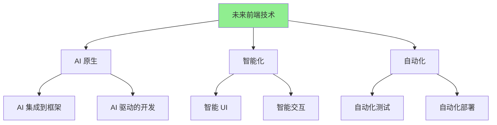

---

## 15.1 未来 3-5 年前端技术栈的预测

### 预测方法

**预测依据**：
- 当前技术趋势分析
- 行业专家观点
- 历史技术演进规律
- 市场数据和分析

**预测时间范围**：2024-2029（未来 3-5 年）

### 核心预测

#### 预测一：AI 将成为前端开发的核心能力

**当前状态**（2024）：
- AI 工具使用率：30-40%
- AI 集成到应用：10-15%

**预测状态**（2027-2029）：
- AI 工具使用率：**80-90%**
- AI 集成到应用：**50-60%**

**趋势分析**：

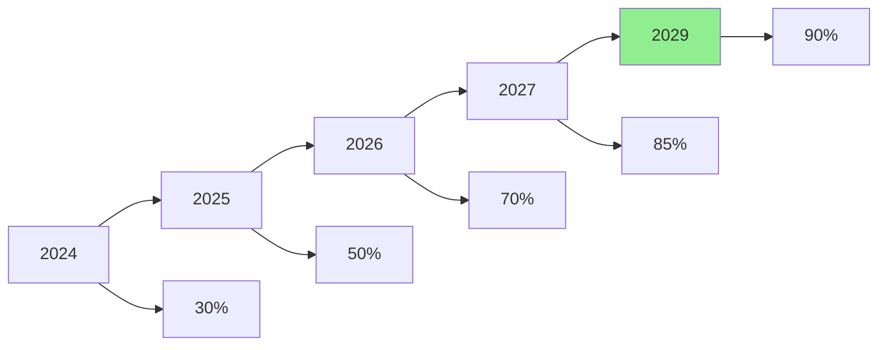

**影响**：
- ✅ AI 工具使用成为基本技能
- ✅ AI 集成能力成为竞争优势
- ✅ 不会使用 AI 的开发者将被淘汰

#### 预测二：AI 原生框架和工具

**预测**：
- 2025-2026：出现 AI 原生前端框架
- 2027-2028：AI 原生框架成为主流
- 2029：传统框架全面集成 AI 能力

**可能的框架**：
- **AI-First React**：React 的 AI 增强版本
- **Vue AI**：Vue 的 AI 集成版本
- **全新 AI 框架**：从头设计的 AI 原生框架

**特征预测**：
- 自然语言描述生成 UI
- 自动代码优化
- 智能错误修复
- 自动测试生成

#### 预测三：浏览器端 AI 能力大幅提升

**当前状态**（2024）：
- WebGPU 支持：部分浏览器
- WebAssembly：成熟
- 模型大小限制：10-50MB

**预测状态**（2027-2029）：
- WebGPU 支持：**所有主流浏览器**
- 模型大小限制：**100-500MB**
- 推理性能：**提升 5-10 倍**

**影响**：
- ✅ 更多 AI 模型可以在浏览器运行
- ✅ 更好的性能和用户体验
- ✅ 更丰富的 AI 应用场景

#### 预测四：LLM 深度集成到开发工具

**预测时间线**：

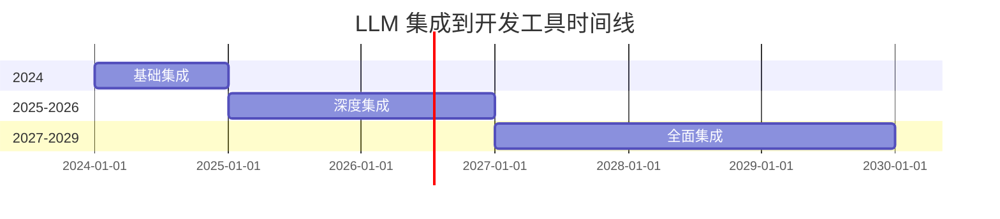

**预测功能**：
- **2025**：IDE 深度集成 LLM（代码生成、审查、优化）
- **2026**：自动化测试和部署
- **2027**：自然语言编程（描述需求，生成代码）
- **2028-2029**：AI 驱动的架构设计

#### 预测五：多模态交互成为主流

**预测**：
- **2025-2026**：语音交互普及（50%+ 应用）
- **2027-2028**：AR/VR 交互兴起（20-30% 应用）
- **2029**：多模态交互成为标准

**技术支撑**：
- Web Speech API 成熟
- WebXR 标准完善
- 设备性能提升

### 技术栈预测总结

**2027 年前端技术栈预测**：

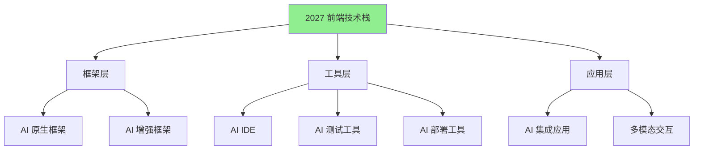

**核心技术**：
- **框架**：AI 原生或 AI 增强框架
- **工具**：AI 驱动的开发工具链
- **应用**：AI 集成、多模态交互

**技能要求变化**：

| 技能 | 2024 重要性 | 2027 重要性 | 变化 |
|------|------------|------------|------|
| **AI 工具使用** | ⭐⭐⭐ | ⭐⭐⭐⭐⭐ | **+67%** |
| **AI 应用集成** | ⭐⭐ | ⭐⭐⭐⭐⭐ | **+150%** |
| **传统编码** | ⭐⭐⭐⭐⭐ | ⭐⭐⭐ | **-40%** |
| **架构设计** | ⭐⭐⭐⭐ | ⭐⭐⭐⭐⭐ | **+25%** |

---

## 15.2 构建你的职业护城河：T型人才的进化

### T型人才模型

**传统 T型人才**：

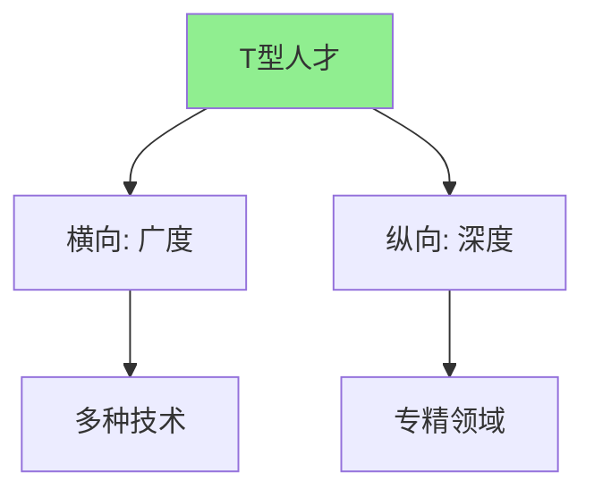

**AI 时代的 T型人才**：

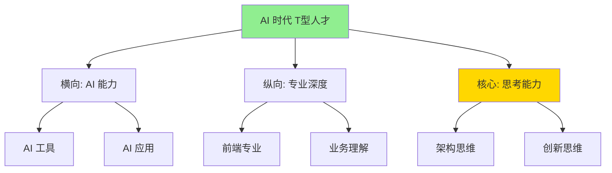

### 护城河构建策略

#### 策略一：AI 能力 + 专业深度

**模型**：AI 能力 × 专业深度 = 竞争力

**实际案例**：

| 开发者类型 | AI 能力 | 专业深度 | 竞争力 |
|-----------|--------|----------|--------|
| **A** | ⭐⭐⭐⭐⭐ | ⭐⭐⭐ | ⭐⭐⭐⭐ |
| **B** | ⭐⭐⭐ | ⭐⭐⭐⭐⭐ | ⭐⭐⭐⭐ |
| **C** | ⭐⭐⭐⭐⭐ | ⭐⭐⭐⭐⭐ | ⭐⭐⭐⭐⭐ |
| **D** | ⭐⭐ | ⭐⭐ | ⭐⭐ |

**建议**：
- ✅ 同时提升 AI 能力和专业深度
- ✅ 找到两者的结合点
- ❌ 不要只关注一个维度

#### 策略二：架构思维 + AI 工具

**核心能力**：
- **架构思维**：设计系统、权衡决策
- **AI 工具**：高效执行、快速实现

**价值**：
- 架构思维：不可替代（AI 无法替代）
- AI 工具：效率提升（10x）

**实际案例**：

**开发者 A**（只有编码能力）：
- 效率：基准
- 价值：中等
- **风险**：高（容易被 AI 替代）

**开发者 B**（架构思维 + AI 工具）：
- 效率：10x
- 价值：高
- **风险**：低（不可替代）

#### 策略三：业务理解 + 技术能力

**核心能力**：
- **业务理解**：理解用户需求、业务逻辑
- **技术能力**：AI 工具、前端技术

**价值**：
- 业务理解：连接技术和业务
- 技术能力：实现业务需求

**护城河**：
- ✅ 理解业务需求（AI 无法替代）
- ✅ 用技术实现需求（AI 辅助提升效率）

### 职业发展路径

#### 路径一：AI 工具专家

**发展路径**：

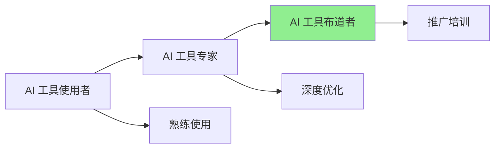

**时间线**：
- **0-6 个月**：熟练使用 AI 工具
- **6-12 个月**：成为团队 AI 工具专家
- **12-24 个月**：成为行业 AI 工具布道者

**能力要求**：
- 深度掌握 AI 工具
- 建立最佳实践
- 培训和推广能力

#### 路径二：AI 应用架构师

**发展路径**：


**时间线**：
- **0-12 个月**：学习 AI 应用集成
- **12-24 个月**：完成多个 AI 应用项目
- **24-36 个月**：成为 AI 应用架构师

**能力要求**：
- AI 应用集成能力
- 架构设计能力
- 创新思维

#### 路径三：全栈 AI 工程师

**发展路径**：

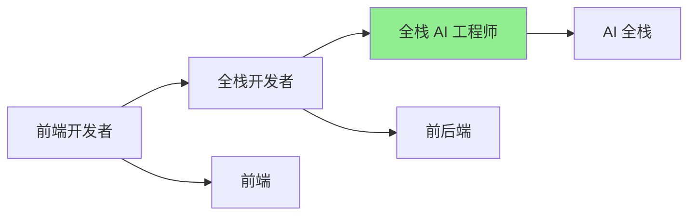

**时间线**：
- **0-12 个月**：学习后端和 AI
- **12-24 个月**：完成全栈 AI 项目
- **24-36 个月**：成为全栈 AI 工程师

**能力要求**：
- 前后端全栈能力
- AI 集成能力
- 系统设计能力

### 护城河评估

**自我评估工具**：

```markdown
# 职业护城河评估

## AI 能力（0-100 分）
- AI 工具使用熟练度：___/100
- AI 应用集成能力：___/100
- AI 最佳实践掌握：___/100
- **平均分**：___/100

## 专业深度（0-100 分）
- 前端技术深度：___/100
- 架构设计能力：___/100
- 业务理解能力：___/100
- **平均分**：___/100

## 核心能力（0-100 分）
- 思考能力：___/100
- 创新能力：___/100
- 沟通能力：___/100
- **平均分**：___/100

## 综合评分
- **总分**：___/300
- **护城河强度**：___（弱/中/强）
```

**护城河强度标准**：
- **弱**（< 180 分）：需要快速提升
- **中**（180-240 分）：需要持续优化
- **强**（> 240 分）：保持优势，继续提升

---

## 15.3 给不同阶段前端工程师的行动建议

### 阶段一：初级前端工程师（0-2 年经验）

#### 当前挑战

**挑战**：
- 基础技能不扎实
- 缺乏项目经验
- 对 AI 工具不熟悉

**风险**：
- ⚠️ AI 工具可能替代基础编码工作
- ⚠️ 需要快速提升能力

#### 行动建议

**优先级排序**：

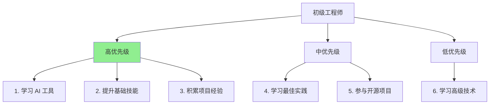

**具体行动**：

**1. 立即开始学习 AI 工具**（第 1 个月）
- ✅ 选择并学习一个 AI 工具（推荐 GitHub Copilot）
- ✅ 每天使用 AI 工具开发
- ✅ 建立个人提示词库

**2. 提升基础技能**（持续）
- ✅ 深入学习 React/Vue 等框架
- ✅ 学习 TypeScript
- ✅ 学习测试和代码质量

**3. 积累项目经验**（持续）
- ✅ 完成实际项目
- ✅ 使用 AI 工具提升效率
- ✅ 总结和反思

**时间分配**（每周）：
- AI 工具学习：10 小时
- 基础技能提升：15 小时
- 项目实践：10 小时

**预期效果**（6 个月后）：
- AI 工具熟练度：80%+
- 基础技能：显著提升
- 项目经验：3-5 个项目

### 阶段二：中级前端工程师（2-5 年经验）

#### 当前挑战

**挑战**：
- 需要提升架构能力
- 需要深入理解业务
- 需要建立技术影响力

**机遇**：
- ✅ AI 工具可以大幅提升效率
- ✅ 有更多时间思考架构和业务

#### 行动建议

**优先级排序**：

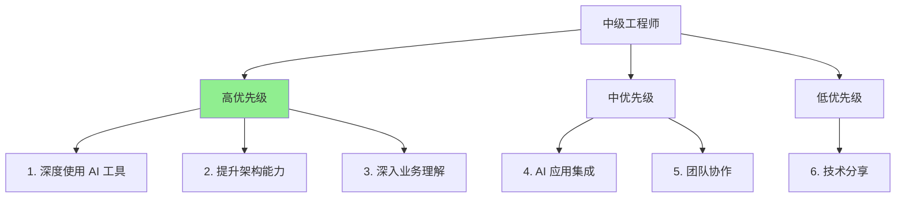

**具体行动**：

**1. 深度使用 AI 工具**（第 1-3 个月）
- ✅ 掌握多个 AI 工具（Copilot、Cursor）
- ✅ 建立个人工作流
- ✅ 优化提示词库

**2. 提升架构能力**（持续）
- ✅ 学习系统设计
- ✅ 参与架构设计
- ✅ 使用 AI 辅助架构设计

**3. 深入业务理解**（持续）
- ✅ 深入理解业务需求
- ✅ 参与产品设计
- ✅ 用技术解决业务问题

**时间分配**（每周）：
- AI 工具优化：5 小时
- 架构学习：10 小时
- 业务理解：10 小时
- 项目实践：10 小时

**预期效果**（12 个月后）：
- AI 工具熟练度：90%+
- 架构能力：显著提升
- 业务理解：深入
- 技术影响力：建立

### 阶段三：高级前端工程师（5+ 年经验）

#### 当前挑战

**挑战**：
- 需要保持技术前沿
- 需要建立行业影响力
- 需要指导团队

**机遇**：
- ✅ AI 工具可以释放更多时间
- ✅ 可以专注于创新和架构
- ✅ 可以成为 AI 工具布道者

#### 行动建议

**优先级排序**：

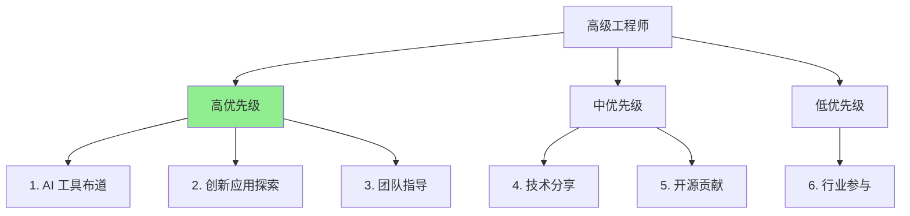

**具体行动**：

**1. AI 工具布道**（持续）
- ✅ 在团队中推广 AI 工具
- ✅ 分享最佳实践
- ✅ 培训和指导

**2. 创新应用探索**（持续）
- ✅ 探索 AI 的新应用场景
- ✅ 完成创新项目
- ✅ 分享经验

**3. 团队指导**（持续）
- ✅ 指导团队成员使用 AI 工具
- ✅ 建立团队最佳实践
- ✅ 提升团队整体能力

**时间分配**（每周）：
- AI 工具布道：5 小时
- 创新探索：10 小时
- 团队指导：10 小时
- 技术分享：5 小时

**预期效果**（持续）：
- 行业影响力：建立
- 团队能力：显著提升
- 创新成果：持续产出

### 行动建议总结

**共同原则**：

1. ✅ **立即开始**：不要等待，现在就开始学习 AI 工具
2. ✅ **持续学习**：AI 技术发展很快，需要持续学习
3. ✅ **实践应用**：学以致用，在实践中提升
4. ✅ **分享交流**：分享经验，帮助他人

**不同阶段的重点**：

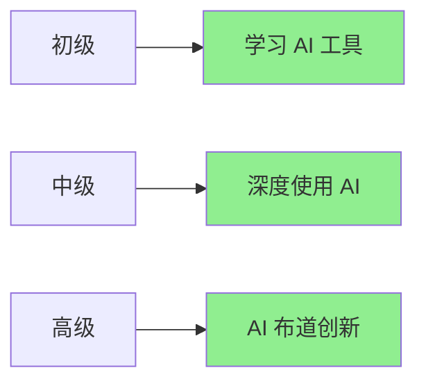

---

## 总结

**未来趋势**：
- AI 将成为前端开发的核心能力
- AI 原生框架和工具将出现
- 浏览器端 AI 能力大幅提升
- 多模态交互成为主流

**职业建议**：
- 构建 AI 能力 + 专业深度的护城河
- 提升架构思维和业务理解
- 根据阶段制定行动计划
- 持续学习和实践

**记住**：未来属于那些**能够用好 AI 工具，同时保持思考能力和创造力**的开发者。**现在就开始行动，不要等待**。
