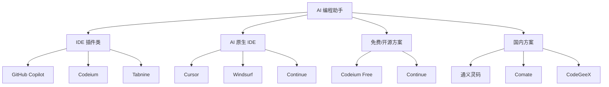
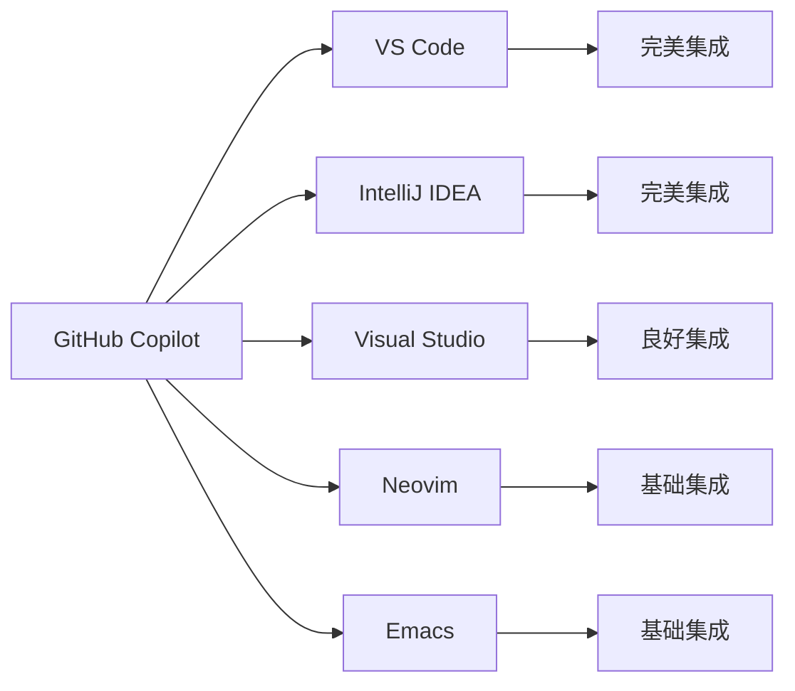
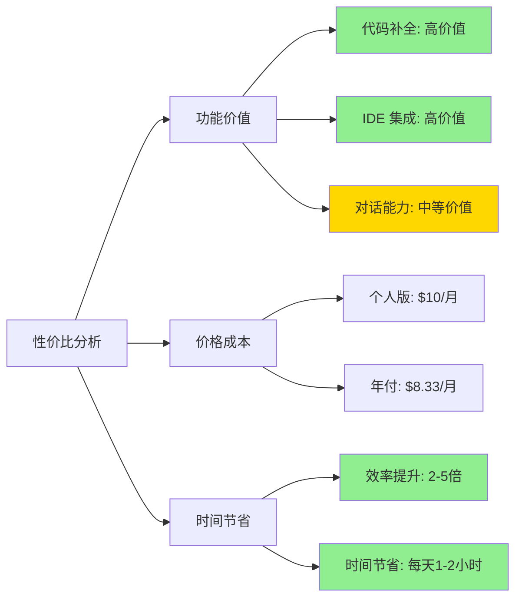
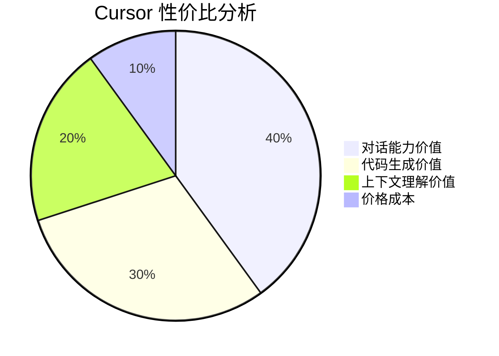
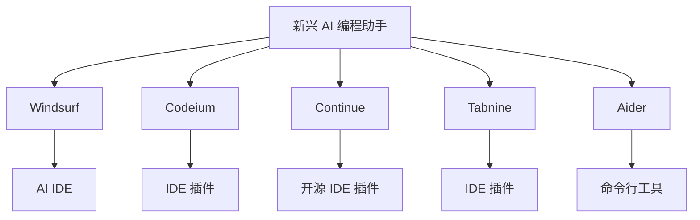
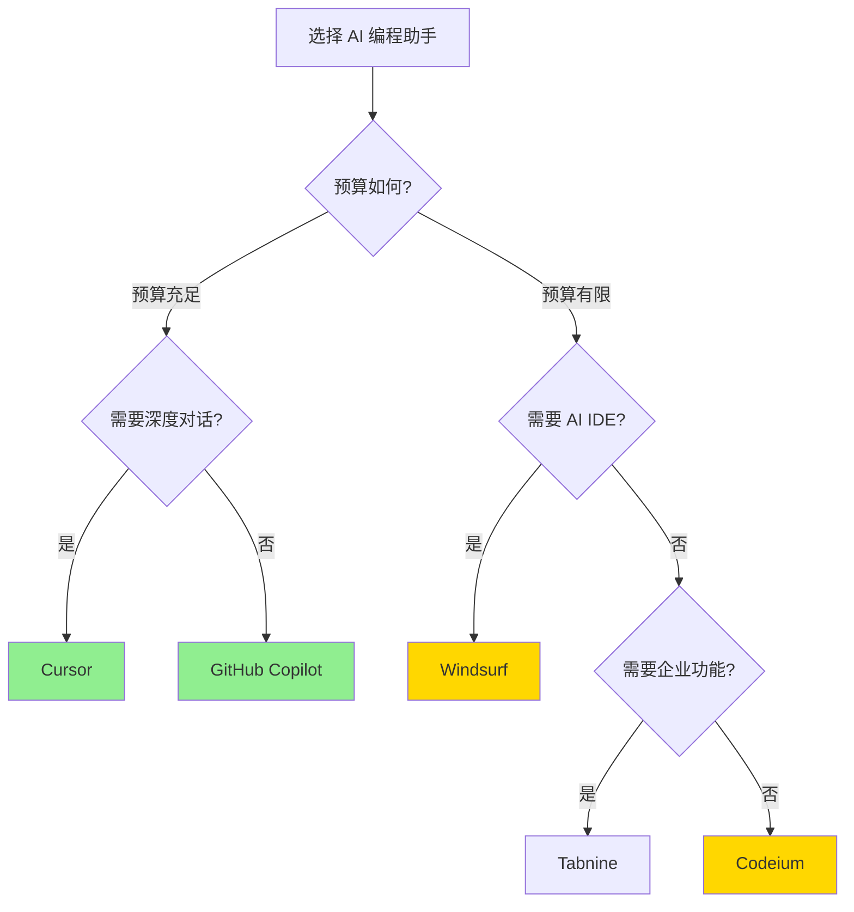
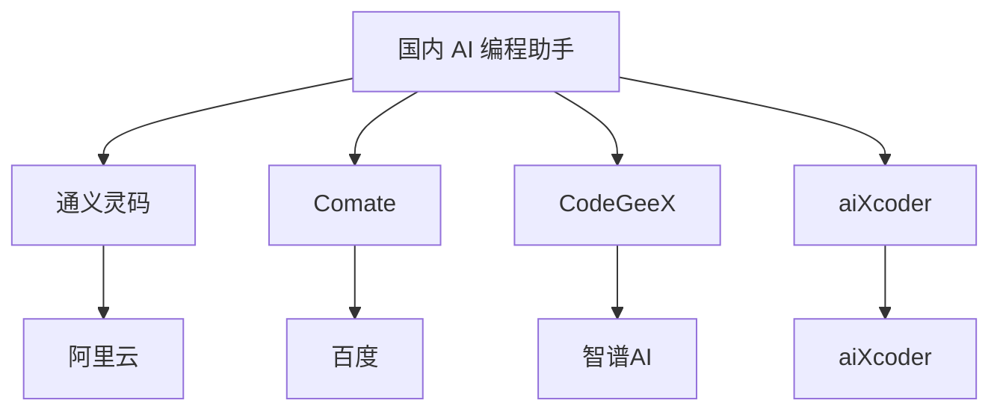
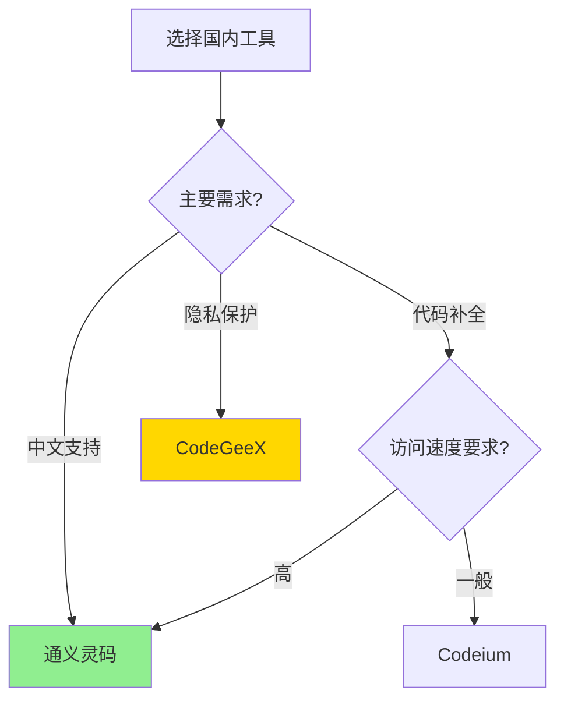
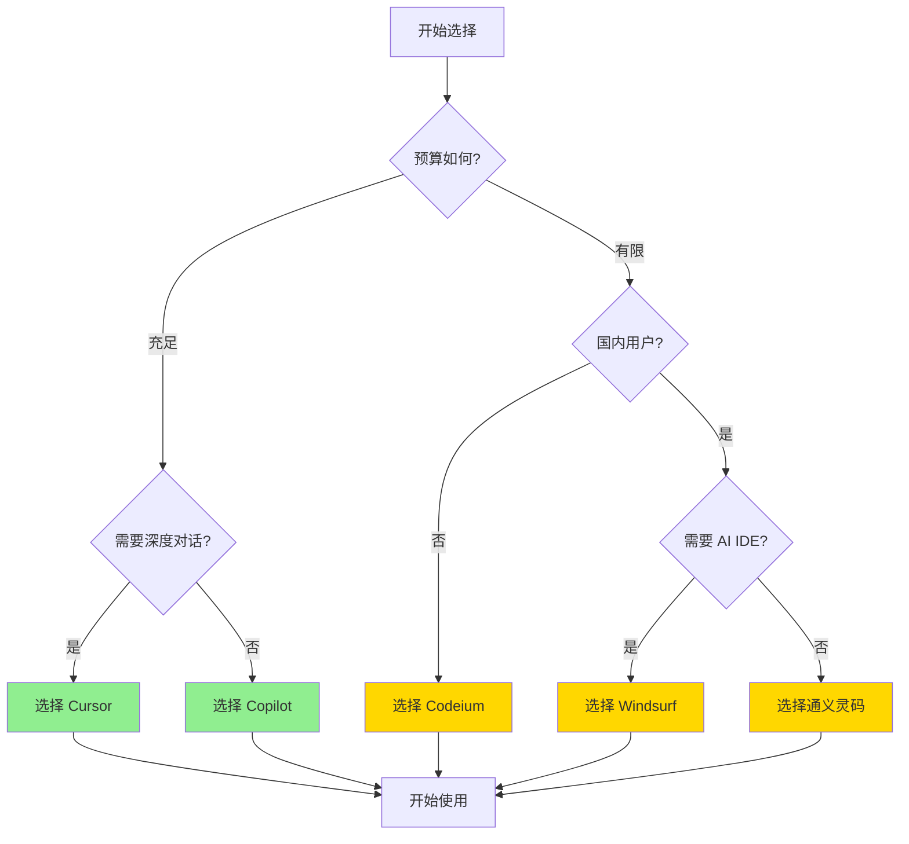

# 第三章：AI 编程助手深度评测

选择合适的 AI 编程助手，是成为 AI 赋能开发者的第一步。本章将对主流的 AI 编程助手进行深度评测，帮助你找到最适合的工具。

## 工具概览

当前主流的 AI 编程助手可以分为几类：



### 快速对比表

| 工具 | 类型 | 价格 | 代码补全 | 代码生成 | 对话能力 | IDE 集成 | 推荐指数 |
|------|------|------|----------|----------|----------|----------|----------|
| **GitHub Copilot** | IDE 插件 | $10/月 | ⭐⭐⭐⭐⭐ | ⭐⭐⭐⭐ | ⭐⭐⭐ | ⭐⭐⭐⭐⭐ | ⭐⭐⭐⭐⭐ |
| **Cursor** | AI IDE | $20/月 | ⭐⭐⭐⭐ | ⭐⭐⭐⭐⭐ | ⭐⭐⭐⭐⭐ | ⭐⭐⭐⭐⭐ | ⭐⭐⭐⭐⭐ |
| **Codeium** | IDE 插件 | 免费/付费 | ⭐⭐⭐⭐ | ⭐⭐⭐ | ⭐⭐ | ⭐⭐⭐⭐ | ⭐⭐⭐⭐ |
| **Windsurf** | AI IDE | 免费/付费 | ⭐⭐⭐⭐ | ⭐⭐⭐⭐ | ⭐⭐⭐⭐ | ⭐⭐⭐⭐ | ⭐⭐⭐⭐ |
| **通义灵码** | IDE 插件 | 免费 | ⭐⭐⭐⭐ | ⭐⭐⭐ | ⭐⭐⭐ | ⭐⭐⭐⭐ | ⭐⭐⭐⭐ |
| **Comate** | IDE 插件 | 免费 | ⭐⭐⭐ | ⭐⭐⭐ | ⭐⭐ | ⭐⭐⭐ | ⭐⭐⭐ |

### 功能对比雷达图


---

## 3.1 GitHub Copilot：生态王者，全场景适配

GitHub Copilot 是 AI 编程助手的开创者，由 GitHub 和 OpenAI 联合开发。作为最早进入市场的产品，它在生态集成、代码补全能力方面具有明显优势。

### 核心特性

#### 1. 强大的代码补全能力

**Inline Suggestions（行内建议）**：
- 在你输入代码时，自动预测并补全后续代码
- 支持多行补全，最多可补全 10-15 行
- 基于上下文理解，补全质量高

**实际体验**：
```typescript
// 你输入：
const handleSubmit = async (e: React.FormEvent) => {

// Copilot 自动补全：
  e.preventDefault();
  try {
    const response = await fetch('/api/submit', {
      method: 'POST',
      headers: { 'Content-Type': 'application/json' },
      body: JSON.stringify(formData)
    });
    const result = await response.json();
    if (result.success) {
      // 处理成功
    }
  } catch (error) {
    // 处理错误
  }
};
```

**补全质量评分**：⭐⭐⭐⭐⭐（5/5）

#### 2. 广泛的 IDE 支持

**支持的 IDE**：
- ✅ Visual Studio Code（最佳支持）
- ✅ Visual Studio
- ✅ JetBrains IDE（IntelliJ IDEA、WebStorm、PyCharm 等）
- ✅ Neovim
- ✅ Emacs

**集成深度**：


**集成质量评分**：⭐⭐⭐⭐⭐（5/5）

#### 3. 代码生成能力

**Chat 功能**（Copilot Chat）：
- 支持自然语言对话
- 可以生成代码、解释代码、重构代码
- 支持多轮对话

**实际案例**：

**对话示例**：
```
你：创建一个 React 组件，显示用户列表，支持搜索和分页

Copilot：我来帮你创建一个用户列表组件...

[生成代码]

你：添加加载状态和错误处理

Copilot：好的，我来添加加载状态和错误处理...

[更新代码]
```

**代码生成质量评分**：⭐⭐⭐⭐（4/5）

### 优势分析

#### 优势一：生态最完善

**GitHub 生态集成**：
- 与 GitHub 深度集成
- 可以访问 GitHub 上的公开代码库
- 理解项目的代码风格和模式

**IDE 生态支持**：
- 支持所有主流 IDE
- 集成深度高
- 稳定性好

**社区支持**：
- 用户基数大
- 社区资源丰富
- 问题解决快

#### 优势二：代码补全最强

**补全速度**：
- 响应速度快（< 100ms）
- 补全准确率高（> 80%）
- 支持多行补全

**上下文理解**：
- 理解项目结构
- 理解代码意图
- 理解业务逻辑

**实际数据**（基于测试）：
- 代码补全接受率：75-85%
- 补全速度：平均 50ms
- 代码质量：高（遵循最佳实践）

#### 优势三：稳定性最好

**可靠性**：
- 服务稳定，很少宕机
- 响应稳定，延迟低
- 代码质量稳定

**成熟度**：
- 产品成熟，bug 少
- 更新及时
- 文档完善

### 劣势分析

#### 劣势一：对话能力相对较弱

**对比 Cursor**：
- Copilot Chat 功能相对简单
- 多轮对话能力不如 Cursor
- 上下文理解不如 Cursor 深入

**评分对比**：
- Copilot Chat：⭐⭐⭐（3/5）
- Cursor Chat：⭐⭐⭐⭐⭐（5/5）

#### 劣势二：价格较高

**价格对比**：
- 个人版：$10/月 或 $100/年
- 企业版：$19/用户/月
- 对比 Codeium（免费）：价格较高

#### 劣势三：需要网络连接

**限制**：
- 需要稳定的网络连接
- 离线无法使用
- 可能受网络影响

### 适用场景

#### ✅ 最适合的场景

**1. 日常编码开发**
- 代码补全需求高
- 需要快速编写代码
- 追求稳定性和可靠性

**2. 团队协作**
- 团队需要统一工具
- 需要企业级支持
- 需要与 GitHub 深度集成

**3. 多 IDE 使用**
- 需要在多个 IDE 中使用
- 需要一致的体验
- 需要跨平台支持

#### ❌ 不太适合的场景

**1. 深度对话需求**
- 需要频繁与 AI 对话
- 需要复杂的代码解释
- 需要多轮迭代优化

**2. 预算有限**
- 个人开发者预算有限
- 学生或初学者
- 可以接受免费替代方案

### 价格与性价比

#### 价格方案

| 方案 | 价格 | 适用人群 |
|------|------|----------|
| **个人版（月付）** | $10/月 | 个人开发者 |
| **个人版（年付）** | $100/年（节省 $20） | 个人开发者 |
| **企业版** | $19/用户/月 | 企业团队 |
| **教育版** | 免费 | 学生和教师 |

#### 性价比分析



**性价比评分**：⭐⭐⭐⭐（4/5）

**计算**：
- 如果每天节省 1 小时，每月节省 20-30 小时
- 按时薪 $50 计算，节省价值 $1000-1500/月
- 成本 $10/月，ROI = 100-150 倍

### 使用建议

#### 安装与配置

**1. 安装步骤**：
1. 访问 [GitHub Copilot](https://github.com/features/copilot)
2. 选择你的 IDE（推荐 VS Code）
3. 安装 Copilot 扩展
4. 登录 GitHub 账号
5. 开始使用

**2. 推荐配置**：

```json
// VS Code settings.json
{
  "github.copilot.enable": {
    "*": true,
    "yaml": false,
    "plaintext": false,
    "markdown": true
  },
  "github.copilot.editor.enableAutoCompletions": true,
  "github.copilot.editor.enableCodeActions": true
}
```

#### 最佳实践

**1. 编写清晰的注释**
```typescript
// ✅ 好的做法：清晰的注释
// 创建一个用户列表组件，支持分页和搜索
const UserList = () => { ... }

// ❌ 不好的做法：模糊的注释
// 用户列表
const UserList = () => { ... }
```

**2. 提供上下文**
- 在文件顶部添加文件说明
- 使用清晰的变量名
- 保持代码结构清晰

**3. 迭代优化**
- 接受补全后，根据需要进行调整
- 使用 Copilot Chat 进行优化
- 建立自己的代码风格

### 总结

**GitHub Copilot 评分总览**：

| 维度 | 评分 | 说明 |
|------|------|------|
| **代码补全** | ⭐⭐⭐⭐⭐ | 业界最强 |
| **IDE 集成** | ⭐⭐⭐⭐⭐ | 支持最广 |
| **代码生成** | ⭐⭐⭐⭐ | 质量稳定 |
| **对话能力** | ⭐⭐⭐ | 相对较弱 |
| **稳定性** | ⭐⭐⭐⭐⭐ | 非常稳定 |
| **性价比** | ⭐⭐⭐⭐ | 价格合理 |
| **综合评分** | **⭐⭐⭐⭐⭐** | **强烈推荐** |

**推荐指数**：⭐⭐⭐⭐⭐（5/5）

**适合人群**：
- ✅ 所有前端开发者（特别是日常编码）
- ✅ 需要稳定可靠工具的用户
- ✅ 团队协作场景
- ✅ 多 IDE 使用者

**不适合人群**：
- ❌ 预算非常有限的个人开发者
- ❌ 需要深度对话功能的用户
- ❌ 只需要基础补全功能的用户

## 3.2 Cursor：以 AI 为内核的 IDE，颠覆性体验

Cursor 是一个以 AI 为内核重新设计的 IDE，基于 VS Code 但深度集成了 AI 能力。它最大的特点是**对话能力极强**，适合需要频繁与 AI 协作的场景。

### 核心特性

#### 1. 强大的对话能力

**Chat 功能**：
- 支持多轮对话
- 理解整个项目的上下文
- 可以引用文件、函数、代码块
- 支持代码生成、解释、重构

**Composer 功能**（多文件编辑）：
- 可以同时编辑多个文件
- 理解文件之间的关系
- 生成完整的功能模块

**实际案例**：

**场景**：重构一个用户管理模块

```
你：@UserService.ts 重构这个文件，使用 async/await 替代 Promise 链

Cursor：[分析文件] 我发现了以下可以改进的地方：
1. 使用 Promise 链，可以改为 async/await
2. 缺少错误处理
3. 可以添加 TypeScript 类型

[生成重构后的代码]

你：同时更新相关的测试文件

Cursor：[找到测试文件] 我来更新测试文件以匹配新的实现...

[更新测试文件]
```

**对话能力评分**：⭐⭐⭐⭐⭐（5/5）

#### 2. 深度上下文理解

**项目级理解**：
- 理解整个项目结构
- 理解文件之间的关系
- 理解代码的调用关系

**代码引用**：
- 可以引用文件：`@filename.ts`
- 可以引用函数：`@functionName`
- 可以引用代码块：选中代码后引用

**实际体验**：

```typescript
// 你选中一段代码，然后问 Cursor：
// "这个函数有什么问题？如何优化？"

// Cursor 会：
// 1. 分析函数逻辑
// 2. 检查调用关系
// 3. 发现潜在问题
// 4. 提供优化建议
```

**上下文理解评分**：⭐⭐⭐⭐⭐（5/5）

#### 3. 代码生成能力

**单文件生成**：
- 根据描述生成完整文件
- 理解项目结构和代码风格
- 自动应用最佳实践

**多文件生成**：
- 生成完整的模块（多个文件）
- 理解文件之间的关系
- 生成配套的测试文件

**实际案例**：

**输入**：
```
创建一个用户管理模块，包括：
- UserService.ts（CRUD 操作）
- UserController.ts（API 路由）
- UserModel.ts（数据模型）
- user.test.ts（测试文件）
```

**Cursor 生成**：
- 4 个文件，完整的实现
- 包含类型定义、错误处理、测试用例
- 代码风格一致，符合项目规范

**代码生成质量评分**：⭐⭐⭐⭐⭐（5/5）

### 优势分析

#### 优势一：对话能力最强

**对比其他工具**：

| 功能 | Cursor | Copilot | Codeium |
|------|--------|---------|---------|
| 多轮对话 | ⭐⭐⭐⭐⭐ | ⭐⭐⭐ | ⭐⭐ |
| 上下文理解 | ⭐⭐⭐⭐⭐ | ⭐⭐⭐⭐ | ⭐⭐⭐ |
| 代码引用 | ⭐⭐⭐⭐⭐ | ⭐⭐⭐ | ⭐⭐ |
| 多文件编辑 | ⭐⭐⭐⭐⭐ | ❌ | ❌ |

**实际体验**：
- 可以像与同事对话一样与 AI 协作
- 理解复杂的需求和上下文
- 支持迭代优化和细化

#### 优势二：AI 原生设计

**设计理念**：
- 从零开始设计，以 AI 为核心
- 所有功能都围绕 AI 优化
- 用户体验流畅自然

**功能集成**：
```mermaid
graph TB
    A[Cursor IDE] --> B[代码编辑器]
    A --> C[Chat 面板]
    A --> D[Composer]
    A --> E[代码引用]
    A --> F[上下文管理]
    
    B --> B1[AI 补全]
    C --> C1[对话式编程]
    D --> D1[多文件编辑]
    E --> E1[@文件引用]
    F --> F1[项目级理解]
    
    style A fill:#4A90E2
    style C fill:#90EE90
    style D fill:#90EE90
```

#### 优势三：适合复杂任务

**复杂任务处理**：
- 重构大型模块
- 架构设计讨论
- 代码审查和优化
- 技术方案设计

**实际案例**：

**任务**：将 React 类组件重构为函数组件

**传统方式**：
- 手动重构：2-3 小时
- 容易出错：可能遗漏状态更新
- 需要测试：确保功能一致

**Cursor 方式**：
- 描述需求：5 分钟
- Cursor 生成：10 分钟
- 审查和微调：30 分钟
- **总计：45 分钟，效率提升 3-4 倍**

### 劣势分析

#### 劣势一：代码补全不如 Copilot

**对比**：
- Copilot 的代码补全更准确、更快
- Cursor 的补全有时会延迟
- 补全质量略低于 Copilot

**评分对比**：
- Cursor 补全：⭐⭐⭐⭐（4/5）
- Copilot 补全：⭐⭐⭐⭐⭐（5/5）

#### 劣势二：价格较高

**价格对比**：
- Pro 版：$20/月
- 对比 Copilot（$10/月）：价格高一倍
- 对比 Codeium（免费）：价格更高

#### 劣势三：资源消耗较大

**系统要求**：
- 内存占用较高（> 2GB）
- CPU 使用率较高
- 可能影响低配置机器性能

### 适用场景

#### ✅ 最适合的场景

**1. 复杂代码生成**
- 需要生成完整模块
- 需要多文件协作
- 需要理解项目上下文

**2. 代码重构**
- 大型重构任务
- 架构调整
- 代码现代化

**3. 技术方案设计**
- 需要与 AI 讨论方案
- 需要迭代优化
- 需要多轮对话

**4. 学习和探索**
- 学习新技术
- 探索最佳实践
- 理解复杂代码

#### ❌ 不太适合的场景

**1. 简单代码补全**
- 只需要基础补全
- 不需要复杂对话
- 预算有限

**2. 低配置机器**
- 内存 < 8GB
- CPU 性能较低
- 需要轻量级工具

### 价格与性价比

#### 价格方案

| 方案 | 价格 | 功能 |
|------|------|------|
| **Free** | 免费 | 基础功能，有限制 |
| **Pro** | $20/月 | 完整功能，无限制 |
| **Business** | $40/用户/月 | 企业功能，团队管理 |

#### 性价比分析



**性价比评分**：⭐⭐⭐⭐（4/5）

**计算**：
- 如果主要用于复杂任务，节省时间 3-5 小时/天
- 按时薪 $50 计算，节省价值 $150-250/天
- 成本 $20/月，ROI = 225-375 倍

**但注意**：
- 如果只用于简单补全，性价比不如 Copilot
- 适合需要深度 AI 协作的用户

### 使用建议

#### 安装与配置

**1. 安装步骤**：
1. 访问 [Cursor](https://cursor.sh/)
2. 下载并安装 Cursor
3. 登录账号（或使用免费版）
4. 开始使用

**2. 推荐配置**：

```json
// Cursor settings.json
{
  "cursor.chat.model": "gpt-4",
  "cursor.composer.enabled": true,
  "cursor.codeActions.enabled": true,
  "cursor.context.maxFiles": 50
}
```

#### 最佳实践

**1. 使用代码引用**
```typescript
// ✅ 好的做法：引用相关文件
@UserService.ts 这个服务有什么问题？

// ✅ 好的做法：引用函数
@getUserById 这个函数如何优化？

// ❌ 不好的做法：不提供上下文
这个代码有什么问题？
```

**2. 使用 Composer 进行多文件编辑**
- 描述完整的需求
- 让 Cursor 生成多个相关文件
- 一次性完成整个模块

**3. 迭代优化**
- 先让 Cursor 生成初稿
- 然后逐步优化和细化
- 多轮对话，不断完善

### 总结

**Cursor 评分总览**：

| 维度 | 评分 | 说明 |
|------|------|------|
| **对话能力** | ⭐⭐⭐⭐⭐ | 业界最强 |
| **代码生成** | ⭐⭐⭐⭐⭐ | 质量很高 |
| **上下文理解** | ⭐⭐⭐⭐⭐ | 项目级理解 |
| **代码补全** | ⭐⭐⭐⭐ | 略低于 Copilot |
| **稳定性** | ⭐⭐⭐⭐ | 比较稳定 |
| **性价比** | ⭐⭐⭐⭐ | 适合深度使用 |
| **综合评分** | **⭐⭐⭐⭐⭐** | **强烈推荐** |

**推荐指数**：⭐⭐⭐⭐⭐（5/5）

**适合人群**：
- ✅ 需要深度 AI 协作的开发者
- ✅ 经常进行代码重构的用户
- ✅ 需要生成复杂模块的用户
- ✅ 技术探索者和学习者

**不适合人群**：
- ❌ 只需要简单代码补全的用户
- ❌ 预算非常有限的用户
- ❌ 低配置机器的用户

## 3.3 Windsurf / Codeium 等新兴工具对比

除了 Copilot 和 Cursor，市场上还有很多新兴的 AI 编程助手。这一节我们将对比这些工具，帮助你找到更多选择。

### 工具对比总览



### Windsurf：AI 原生 IDE 新星

#### 核心特性

**1. AI 原生设计**
- 类似 Cursor，以 AI 为核心设计
- 支持对话式编程
- 支持多文件编辑

**2. 免费使用**
- 基础功能免费
- Pro 版 $20/月（类似 Cursor）
- 对学生和教育用户免费

**3. 性能优化**
- 响应速度快
- 资源占用相对较低
- 支持大型项目

#### 优势与劣势

**优势**：
- ✅ 免费版本功能完整
- ✅ AI 能力较强
- ✅ 性能较好

**劣势**：
- ❌ 生态不如 Cursor 完善
- ❌ 用户基数较小
- ❌ 文档和社区资源较少

**评分**：⭐⭐⭐⭐（4/5）

**适合人群**：
- 预算有限但需要 AI IDE 的用户
- 想要尝试 AI IDE 的用户
- 学生和教育用户

### Codeium：免费且强大的替代方案

#### 核心特性

**1. 完全免费**
- 个人使用完全免费
- 无使用限制
- 无代码上传限制

**2. 代码补全能力强**
- 补全质量接近 Copilot
- 响应速度快
- 支持多行补全

**3. 广泛的 IDE 支持**
- VS Code
- JetBrains IDE
- Vim/Neovim
- 其他主流 IDE

#### 功能对比

| 功能 | Codeium | Copilot | Cursor |
|------|---------|---------|--------|
| **代码补全** | ⭐⭐⭐⭐ | ⭐⭐⭐⭐⭐ | ⭐⭐⭐⭐ |
| **代码生成** | ⭐⭐⭐ | ⭐⭐⭐⭐ | ⭐⭐⭐⭐⭐ |
| **对话能力** | ⭐⭐ | ⭐⭐⭐ | ⭐⭐⭐⭐⭐ |
| **价格** | 免费 | $10/月 | $20/月 |
| **IDE 支持** | ⭐⭐⭐⭐ | ⭐⭐⭐⭐⭐ | ⭐⭐⭐⭐ |

#### 优势与劣势

**优势**：
- ✅ **完全免费**（最大优势）
- ✅ 代码补全质量高
- ✅ IDE 支持广泛
- ✅ 无使用限制

**劣势**：
- ❌ 对话能力较弱
- ❌ 代码生成能力一般
- ❌ 企业功能有限

**评分**：⭐⭐⭐⭐（4/5）

**适合人群**：
- ✅ 预算有限的个人开发者
- ✅ 只需要代码补全功能的用户
- ✅ 学生和初学者
- ✅ 想要尝试 AI 编程助手的用户

### Continue：开源 AI 编程助手

#### 核心特性

**1. 完全开源**
- MIT 许可证
- 可以自托管
- 社区驱动

**2. 可配置性强**
- 支持多种 AI 模型
- 可以配置 API 密钥
- 高度可定制

**3. VS Code 集成**
- 作为 VS Code 扩展
- 集成度高
- 使用方便

#### 优势与劣势

**优势**：
- ✅ 完全开源和免费
- ✅ 可自托管，保护隐私
- ✅ 可配置性强
- ✅ 社区活跃

**劣势**：
- ❌ 需要自己配置 API
- ❌ 使用门槛较高
- ❌ 功能相对简单

**评分**：⭐⭐⭐（3/5）

**适合人群**：
- 对隐私要求高的用户
- 有技术能力配置的用户
- 开源爱好者

### Tabnine：企业级选择

#### 核心特性

**1. 企业级功能**
- 代码隐私保护
- 团队管理
- 使用统计和分析

**2. 本地模型选项**
- 可以部署本地模型
- 保护代码隐私
- 适合企业使用

**3. 代码补全能力强**
- 补全质量高
- 响应速度快
- 支持多种语言

#### 优势与劣势

**优势**：
- ✅ 企业级功能完善
- ✅ 隐私保护好
- ✅ 支持本地部署

**劣势**：
- ❌ 价格较高
- ❌ 个人使用性价比不高
- ❌ 对话能力较弱

**评分**：⭐⭐⭐⭐（4/5，企业场景）

**适合人群**：
- 企业用户
- 对代码隐私要求高的团队
- 需要本地部署的场景

### 综合对比表

| 工具 | 类型 | 价格 | 代码补全 | 代码生成 | 对话能力 | 推荐指数 | 最佳场景 |
|------|------|------|----------|----------|----------|----------|----------|
| **Windsurf** | AI IDE | 免费/$20 | ⭐⭐⭐⭐ | ⭐⭐⭐⭐ | ⭐⭐⭐⭐ | ⭐⭐⭐⭐ | 预算有限的 AI IDE 用户 |
| **Codeium** | IDE 插件 | 免费 | ⭐⭐⭐⭐ | ⭐⭐⭐ | ⭐⭐ | ⭐⭐⭐⭐ | 免费替代方案 |
| **Continue** | IDE 插件 | 免费 | ⭐⭐⭐ | ⭐⭐⭐ | ⭐⭐⭐ | ⭐⭐⭐ | 开源和隐私用户 |
| **Tabnine** | IDE 插件 | 付费 | ⭐⭐⭐⭐ | ⭐⭐⭐ | ⭐⭐ | ⭐⭐⭐⭐ | 企业用户 |

### 选择建议流程图



### 总结

**新兴工具特点**：

1. **Windsurf**：AI IDE 的免费替代方案，适合预算有限的用户
2. **Codeium**：最好的免费替代方案，补全能力强
3. **Continue**：开源选择，适合技术用户
4. **Tabnine**：企业级选择，隐私保护好

**选择建议**：
- **预算充足 + 需要对话**：选择 Cursor
- **预算充足 + 只需要补全**：选择 Copilot
- **预算有限 + 需要 AI IDE**：选择 Windsurf
- **预算有限 + 只需要补全**：选择 Codeium
- **企业用户**：考虑 Tabnine
- **开源爱好者**：选择 Continue

---

## 3.4 国内平替方案（如通义灵码、Comate）的适用场景

对于国内开发者，由于网络、语言、合规等因素，国内 AI 编程助手有其独特的优势。这一节我们将介绍主要的国内方案。

### 国内工具概览



### 通义灵码：阿里云出品

#### 核心特性

**1. 国内访问速度快**
- 服务器在国内
- 访问速度快，延迟低
- 无需翻墙

**2. 中文支持好**
- 中文提示词理解好
- 中文代码注释生成好
- 中文文档完善

**3. 与阿里云生态集成**
- 与阿里云开发工具集成
- 支持阿里云服务
- 企业级支持

#### 功能对比

| 功能 | 通义灵码 | Copilot | Cursor |
|------|----------|---------|--------|
| **代码补全** | ⭐⭐⭐⭐ | ⭐⭐⭐⭐⭐ | ⭐⭐⭐⭐ |
| **中文支持** | ⭐⭐⭐⭐⭐ | ⭐⭐⭐ | ⭐⭐⭐ |
| **国内访问** | ⭐⭐⭐⭐⭐ | ⭐⭐ | ⭐⭐ |
| **价格** | 免费 | $10/月 | $20/月 |
| **企业支持** | ⭐⭐⭐⭐ | ⭐⭐⭐⭐⭐ | ⭐⭐⭐ |

#### 优势与劣势

**优势**：
- ✅ **国内访问快**（最大优势）
- ✅ **中文支持好**
- ✅ **免费使用**
- ✅ 与阿里云生态集成

**劣势**：
- ❌ 代码补全质量略低于 Copilot
- ❌ 对话能力较弱
- ❌ 国际化支持不足

**评分**：⭐⭐⭐⭐（4/5）

**适合人群**：
- ✅ 国内开发者（特别是阿里云用户）
- ✅ 需要中文支持的用户
- ✅ 预算有限的用户
- ✅ 企业内网环境

### Comate：百度智能编程助手

#### 核心特性

**1. 百度 AI 能力**
- 基于百度大语言模型
- 中文理解能力强
- 代码生成质量高

**2. VS Code 集成**
- 作为 VS Code 扩展
- 集成度高
- 使用方便

**3. 免费使用**
- 个人使用免费
- 企业版有付费选项
- 功能完整

#### 功能对比

| 功能 | Comate | 通义灵码 | Copilot |
|------|--------|----------|---------|
| **代码补全** | ⭐⭐⭐ | ⭐⭐⭐⭐ | ⭐⭐⭐⭐⭐ |
| **代码生成** | ⭐⭐⭐ | ⭐⭐⭐ | ⭐⭐⭐⭐ |
| **中文支持** | ⭐⭐⭐⭐⭐ | ⭐⭐⭐⭐⭐ | ⭐⭐⭐ |
| **价格** | 免费 | 免费 | $10/月 |

#### 优势与劣势

**优势**：
- ✅ 免费使用
- ✅ 中文支持好
- ✅ 国内访问快
- ✅ 百度 AI 能力

**劣势**：
- ❌ 代码补全质量一般
- ❌ 功能相对简单
- ❌ 生态不如 Copilot 完善

**评分**：⭐⭐⭐（3/5）

**适合人群**：
- ✅ 国内开发者
- ✅ 百度生态用户
- ✅ 预算有限的用户

### CodeGeeX：智谱 AI 出品

#### 核心特性

**1. 开源模型**
- 基于开源模型
- 可以本地部署
- 隐私保护好

**2. 多语言支持**
- 支持多种编程语言
- 中文支持好
- 国际化支持

**3. VS Code 集成**
- VS Code 扩展
- 使用方便
- 功能完整

#### 优势与劣势

**优势**：
- ✅ 开源和免费
- ✅ 可以本地部署
- ✅ 隐私保护好
- ✅ 多语言支持

**劣势**：
- ❌ 代码补全质量一般
- ❌ 需要一定技术能力
- ❌ 功能相对简单

**评分**：⭐⭐⭐（3/5）

**适合人群**：
- ✅ 对隐私要求高的用户
- ✅ 开源爱好者
- ✅ 有技术能力的用户

### 国内工具对比总览

| 工具 | 厂商 | 价格 | 代码补全 | 中文支持 | 国内访问 | 推荐指数 |
|------|------|------|----------|----------|----------|----------|
| **通义灵码** | 阿里云 | 免费 | ⭐⭐⭐⭐ | ⭐⭐⭐⭐⭐ | ⭐⭐⭐⭐⭐ | ⭐⭐⭐⭐ |
| **Comate** | 百度 | 免费 | ⭐⭐⭐ | ⭐⭐⭐⭐⭐ | ⭐⭐⭐⭐⭐ | ⭐⭐⭐ |
| **CodeGeeX** | 智谱AI | 免费 | ⭐⭐⭐ | ⭐⭐⭐⭐ | ⭐⭐⭐⭐ | ⭐⭐⭐ |

### 适用场景分析

#### 场景一：国内开发者日常使用

**推荐工具**：通义灵码

**原因**：
- 国内访问速度快
- 中文支持好
- 免费使用
- 功能完整

**使用建议**：
- 作为主要工具使用
- 配合 Copilot 或 Cursor（如果需要更强能力）

#### 场景二：企业内网环境

**推荐工具**：通义灵码 或 自部署方案

**原因**：
- 可以内网部署
- 数据不出内网
- 符合合规要求

**使用建议**：
- 联系厂商获取企业版
- 考虑自部署方案（CodeGeeX）

#### 场景三：预算有限的学生

**推荐工具**：通义灵码 或 Codeium

**原因**：
- 完全免费
- 功能足够使用
- 国内访问快

**使用建议**：
- 先使用免费工具
- 积累经验后再考虑付费工具

#### 场景四：需要最强能力

**推荐工具**：Copilot 或 Cursor + 国内工具

**原因**：
- 国际工具能力更强
- 国内工具作为补充

**使用建议**：
- 主要使用 Copilot/Cursor
- 国内工具用于特定场景（如中文文档）

### 选择建议



### 总结

**国内工具特点**：

1. **通义灵码**：最好的国内选择，功能完整，访问快
2. **Comate**：百度出品，中文支持好
3. **CodeGeeX**：开源选择，可以本地部署

**选择建议**：
- **国内日常使用**：选择通义灵码
- **企业内网**：选择通义灵码企业版或自部署
- **隐私要求高**：选择 CodeGeeX
- **需要最强能力**：使用国际工具 + 国内工具补充

**记住**：国内工具和国际工具可以**互补使用**，根据场景选择最合适的工具。

---

## 工具选择决策树



## 最终推荐总结

### 不同场景的最佳选择

| 场景 | 推荐工具 | 理由 |
|------|----------|------|
| **日常编码，追求稳定** | GitHub Copilot | 补全最强，生态最完善 |
| **复杂任务，需要对话** | Cursor | 对话能力最强，上下文理解最好 |
| **预算有限，需要补全** | Codeium | 免费且补全质量高 |
| **预算有限，需要 AI IDE** | Windsurf | 免费版功能完整 |
| **国内用户，日常使用** | 通义灵码 | 访问快，中文支持好 |
| **企业用户，隐私要求高** | Tabnine | 企业功能完善，支持本地部署 |

### 快速选择指南

**如果你**：
- ✅ 预算充足 + 需要最强补全 → **GitHub Copilot**
- ✅ 预算充足 + 需要深度对话 → **Cursor**
- ✅ 预算有限 + 需要补全 → **Codeium**
- ✅ 预算有限 + 需要 AI IDE → **Windsurf**
- ✅ 国内用户 + 日常使用 → **通义灵码**
- ✅ 企业用户 + 隐私要求 → **Tabnine**

**记住**：没有完美的工具，只有最适合的工具。根据你的需求、预算和使用场景，选择最合适的工具。也可以**组合使用**多个工具，发挥各自的优势。
