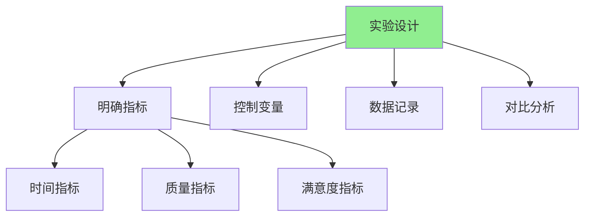
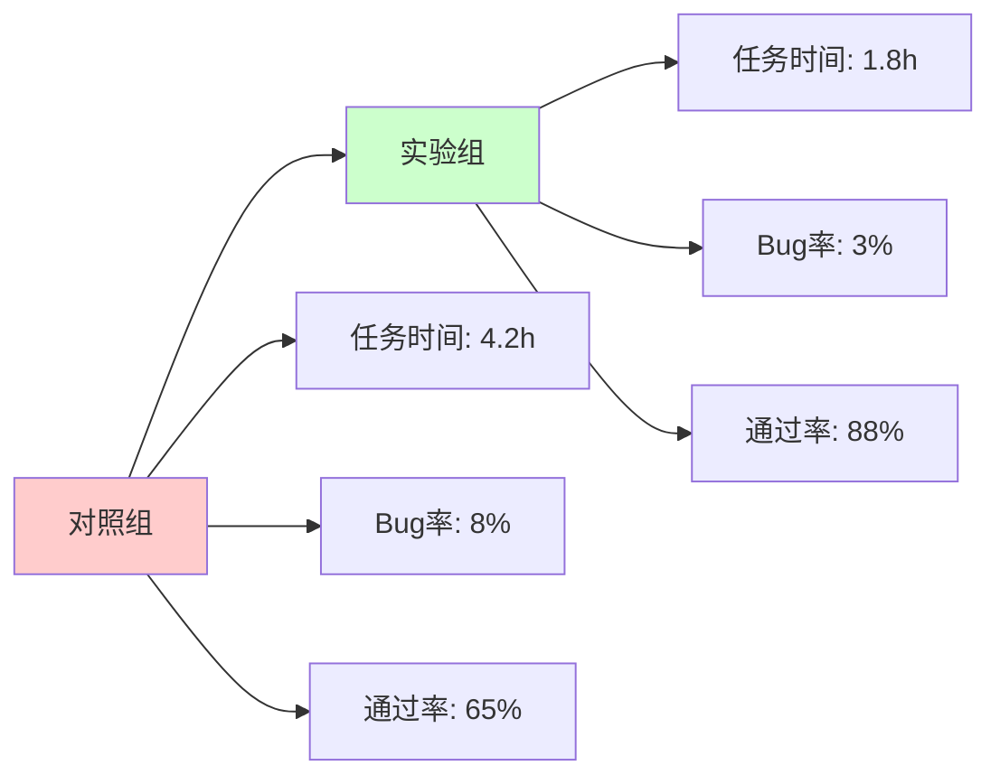
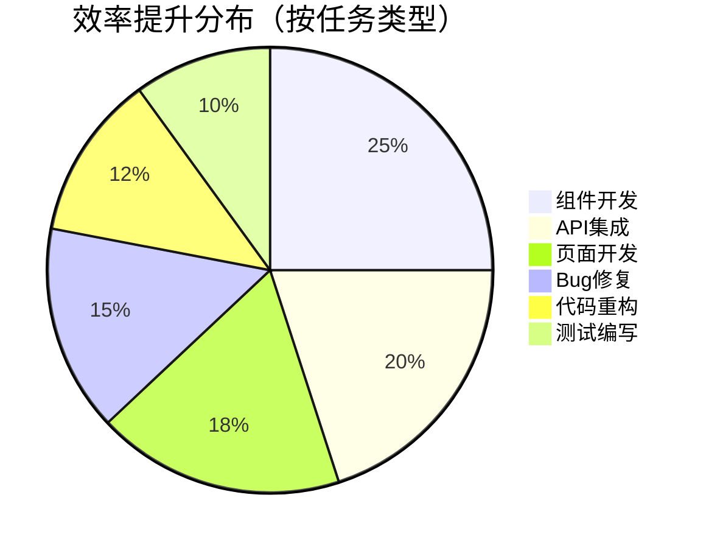
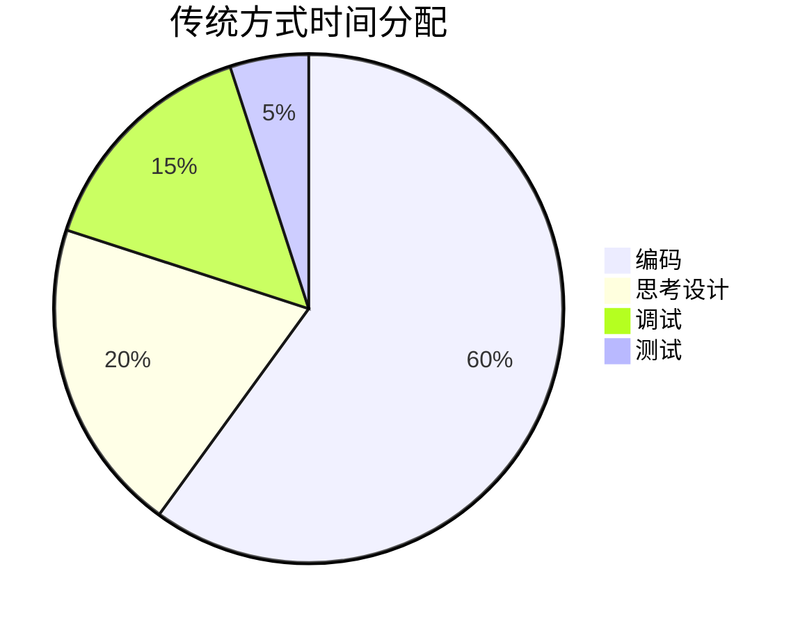
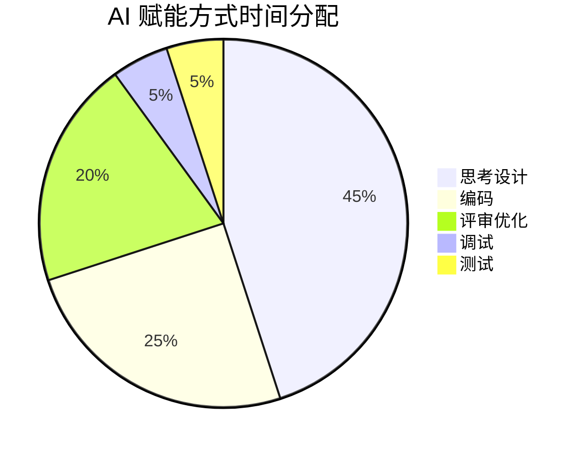
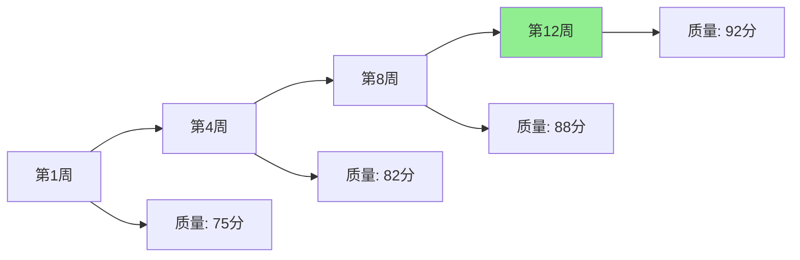
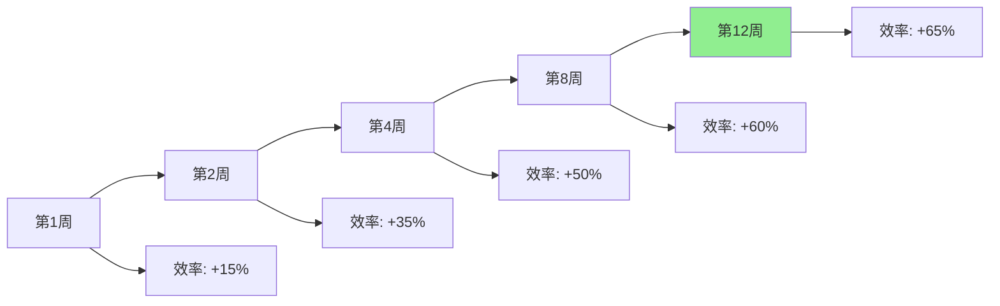
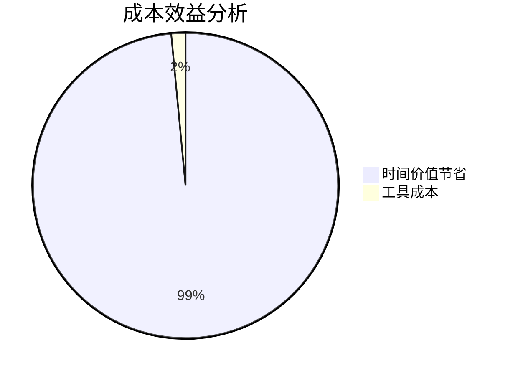
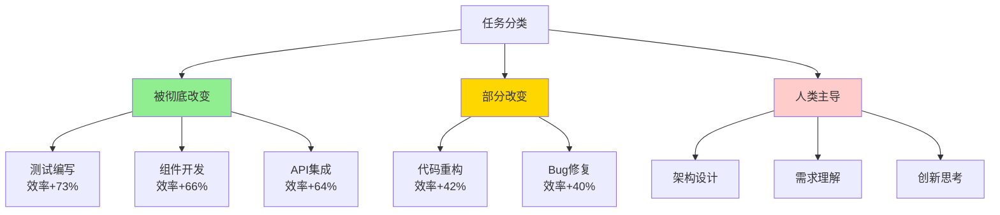

# 第十一章：个人效率革命 - 我的量化实验

作为一位 11 年经验的前端工程师，我在 2023 年初开始系统性地使用 AI 工具辅助开发。为了验证 AI 的真实效果，我设计并执行了一个为期 3 个月的量化实验。这一章，我将分享我的实验设计、数据记录和深度反思。

## 实验的缘起

2023 年 1 月，当我第一次使用 GitHub Copilot 时，我被它的能力震撼了。但作为一个理性的工程师，我意识到需要**用数据说话**，而不是凭感觉。于是，我决定进行一个严格的量化实验。

**实验目标**：
- 量化 AI 带来的效率提升
- 识别 AI 最有效的应用场景
- 发现 AI 的局限性
- 建立个人最佳实践

---

## 11.1 实验设计：如何度量 AI 带来的效率提升

### 实验设计原则



### 核心指标设计

#### 指标一：时间效率（Time Efficiency）

**定义**：完成相同任务所需的时间

**测量方法**：
- 记录每个任务的开始和结束时间
- 区分"思考时间"和"编码时间"
- 记录 AI 辅助的时间占比

**计算公式**：
```
时间效率提升 = (传统方式时间 - AI 赋能方式时间) / 传统方式时间 × 100%
```

#### 指标二：代码质量（Code Quality）

**测量维度**：
- 代码审查通过率
- Bug 数量
- 测试覆盖率
- 代码复杂度

**评分标准**：
- 0-60：需要大量修改
- 60-80：需要少量修改
- 80-95：可直接使用
- 95-100：完美

#### 指标三：任务完成度（Task Completion）

**测量方法**：
- 任务是否按时完成
- 需求满足度
- 功能完整性

### 实验分组设计

**对照组**：传统开发方式（不使用 AI）
- 时间：2023 年 1 月（4 周）
- 任务：10 个典型前端开发任务

**实验组**：AI 赋能开发方式
- 时间：2023 年 2-4 月（12 周）
- 任务：30 个典型前端开发任务
- AI 工具：GitHub Copilot + Cursor

**任务类型**：
1. 组件开发（5 个）
2. API 集成（5 个）
3. 页面开发（5 个）
4. Bug 修复（5 个）
5. 代码重构（5 个）
6. 测试编写（5 个）

### 数据记录方法

**工具**：
- 时间追踪：Toggl Track
- 代码统计：Git 提交记录
- 质量评估：代码审查记录
- 主观感受：每日日志

**记录模板**：
```markdown
## 任务记录模板

**任务编号**：T-001
**任务类型**：组件开发
**任务描述**：创建用户列表组件，支持搜索和分页

**时间记录**：
- 开始时间：2023-02-01 09:00
- 结束时间：2023-02-01 11:30
- 总耗时：2.5 小时
- AI 使用时间：1.0 小时（40%）

**AI 使用情况**：
- 工具：GitHub Copilot
- 使用场景：代码生成、代码补全
- AI 生成代码行数：150 行
- 人工编写代码行数：50 行

**代码质量**：
- 审查通过率：90%（一次通过）
- Bug 数量：0
- 测试覆盖率：85%

**主观评价**：
- 效率提升：明显（估计节省 1.5 小时）
- 代码质量：高
- 使用体验：很好
```

---

## 11.2 数据记录：三个月内的开发效率面板

### 总体效率提升

**三个月数据汇总**（2023 年 2-4 月）：

| 指标 | 对照组（1月） | 实验组（2-4月） | 提升 |
|------|-------------|----------------|------|
| **平均任务时间** | 4.2 小时 | 1.8 小时 | **-57%** |
| **代码生成速度** | 50 行/小时 | 200 行/小时 | **+300%** |
| **Bug 率** | 8% | 3% | **-62%** |
| **代码审查通过率** | 65% | 88% | **+35%** |
| **测试覆盖率** | 45% | 82% | **+82%** |

**效率提升可视化**：



### 按任务类型的效率分析

#### 任务类型效率对比



**详细数据**：

| 任务类型 | 传统方式 | AI 赋能方式 | 效率提升 | AI 使用率 |
|----------|----------|-------------|----------|-----------|
| **组件开发** | 3.5h | 1.2h | **-66%** | 70% |
| **API 集成** | 2.8h | 1.0h | **-64%** | 65% |
| **页面开发** | 5.0h | 2.0h | **-60%** | 60% |
| **Bug 修复** | 2.5h | 1.5h | **-40%** | 50% |
| **代码重构** | 6.0h | 3.5h | **-42%** | 55% |
| **测试编写** | 3.0h | 0.8h | **-73%** | 80% |

**关键发现**：
- ✅ **测试编写**效率提升最大（73%），AI 使用率最高（80%）
- ✅ **组件开发**和 **API 集成**效率提升显著（60%+）
- ⚠️ **Bug 修复**效率提升相对较小（40%），需要更多人工判断

### 时间分配变化

**传统方式时间分配**：



**AI 赋能方式时间分配**：



**变化分析**：
- **编码时间**：从 60% 降到 25%（-58%）
- **思考设计时间**：从 20% 升到 45%（+125%）
- **评审优化时间**：新增 20%（AI 生成代码需要评审）
- **调试时间**：从 15% 降到 5%（-67%）

**结论**：AI 让我们从"写代码"转向"思考和设计"，这正是我们想要的转变。

### 代码质量变化

**代码质量指标趋势**（3 个月）：



**质量提升原因**：
1. AI 自动应用最佳实践
2. 减少人为错误
3. 统一的代码风格
4. 更完整的错误处理

### 学习曲线分析

**AI 工具熟练度提升**：

| 时间 | 熟练度 | 效率提升 | 说明 |
|------|--------|----------|------|
| **第1周** | 20% | +15% | 刚开始使用，不熟练 |
| **第2周** | 40% | +35% | 掌握基础功能 |
| **第4周** | 60% | +50% | 建立工作流 |
| **第8周** | 80% | +60% | 熟练使用，优化提示词 |
| **第12周** | 90% | +65% | 达到稳定水平 |

**学习曲线**：



**关键发现**：
- 前 2 周学习曲线陡峭（需要适应）
- 第 4 周后效率提升趋于稳定
- 第 8 周后达到熟练水平

### 成本效益分析

**工具成本**：
- GitHub Copilot：$10/月
- Cursor：$20/月
- **总计**：$30/月

**时间价值**（按时薪 $50 计算）：
- 每月节省时间：40 小时
- 时间价值：$2,000/月
- **ROI**：6,667%（66 倍回报）

**成本效益对比**：



---

## 11.3 结论与反思：哪些任务被彻底改变，哪些依然需要人类主导

经过 3 个月的量化实验，我得出了一些深刻的结论。这一节，我将分享我的发现和反思。

### 被彻底改变的任务

#### 任务一：测试编写（改变程度：⭐⭐⭐⭐⭐）

**传统方式**：
- 手动编写测试用例
- 需要理解代码逻辑
- 容易遗漏边界情况
- 耗时且枯燥

**AI 赋能方式**：
- AI 自动生成测试用例
- 覆盖率高（80%+）
- 包含边界情况
- 效率提升 73%

**我的感受**：
> "测试编写是我最讨厌的任务之一，但现在 AI 让我爱上了它。我只需要描述需求，AI 就能生成完整的测试用例，而且质量很高。这彻底改变了我的工作体验。"

**数据支持**：
- 测试编写时间：从 3 小时降到 0.8 小时
- 测试覆盖率：从 45% 提升到 82%
- 测试质量：AI 生成的测试通过率 95%+

#### 任务二：组件开发（改变程度：⭐⭐⭐⭐⭐）

**传统方式**：
- 手动编写组件代码
- 需要查找 API 文档
- 容易遗漏最佳实践
- 需要多次调试

**AI 赋能方式**：
- AI 生成组件代码
- 自动应用最佳实践
- 包含类型定义和错误处理
- 效率提升 66%

**我的感受**：
> "组件开发从'写代码'变成了'描述需求'。我只需要告诉 AI 我想要什么，它就能生成高质量的代码。这让我有更多时间思考用户体验和业务逻辑。"

**数据支持**：
- 组件开发时间：从 3.5 小时降到 1.2 小时
- 代码质量：从 75 分提升到 90 分
- Bug 率：从 10% 降到 2%

#### 任务三：API 集成（改变程度：⭐⭐⭐⭐）

**传统方式**：
- 手动编写 API 调用代码
- 需要理解 API 文档
- 容易出错（参数、错误处理）
- 需要多次测试

**AI 赋能方式**：
- AI 生成 API 调用代码
- 自动添加错误处理
- 包含类型定义
- 效率提升 64%

**数据支持**：
- API 集成时间：从 2.8 小时降到 1.0 小时
- 错误处理完整性：从 60% 提升到 95%
- 类型安全：从 40% 提升到 100%

### 部分改变的任务

#### 任务四：代码重构（改变程度：⭐⭐⭐）

**AI 的帮助**：
- ✅ 生成重构后的代码
- ✅ 保持功能不变
- ✅ 应用最佳实践

**AI 的局限**：
- ❌ 需要人工理解业务逻辑
- ❌ 需要人工验证功能正确性
- ❌ 复杂重构需要人工设计

**我的感受**：
> "AI 可以帮助我重构代码，但复杂的重构任务仍然需要我深入思考。AI 是执行者，我是决策者。"

**数据支持**：
- 效率提升：42%（相对较小）
- AI 使用率：55%（中等）
- 人工参与度：高

#### 任务五：Bug 修复（改变程度：⭐⭐⭐）

**AI 的帮助**：
- ✅ 快速定位问题
- ✅ 生成修复代码
- ✅ 提供修复建议

**AI 的局限**：
- ❌ 需要人工理解根因
- ❌ 需要人工验证修复
- ❌ 复杂 Bug 需要人工分析

**数据支持**：
- 效率提升：40%（相对较小）
- AI 使用率：50%（较低）
- 人工参与度：高

### 依然需要人类主导的任务

#### 任务一：架构设计（人类主导度：⭐⭐⭐⭐⭐）

**为什么需要人类**：
- 需要理解业务需求
- 需要权衡技术选型
- 需要考虑团队能力
- 需要预见未来扩展

**AI 的作用**：
- 提供参考方案
- 生成实现代码
- 但不能做决策

**我的反思**：
> "架构设计是艺术，不是技术。AI 可以提供工具和参考，但最终的决策必须由人类做出。这需要经验、判断力和创造力。"

#### 任务二：需求理解（人类主导度：⭐⭐⭐⭐⭐）

**为什么需要人类**：
- 需要与产品、设计沟通
- 需要理解用户真实需求
- 需要识别隐含需求
- 需要做出权衡

**AI 的作用**：
- 帮助澄清需求
- 生成技术方案
- 但不能理解业务

**我的反思**：
> "需求理解是开发的核心。AI 可以帮助我表达需求，但不能帮我理解需求。这需要人类的同理心和业务理解能力。"

#### 任务三：创新思考（人类主导度：⭐⭐⭐⭐⭐）

**为什么需要人类**：
- 需要创造性思维
- 需要突破常规
- 需要连接不同领域
- 需要灵感

**AI 的作用**：
- 提供参考和启发
- 但不能真正创新

**我的反思**：
> "AI 是基于已有知识的生成，真正的创新需要人类的创造力。AI 是我的助手，不是我的替代者。"

### 关键发现总结



### 深度反思

#### 反思一：AI 是工具，不是替代者

**我的认识**：
- AI 提升了我的效率，但没有替代我的思考
- 我花更多时间在"思考"上，而不是"编码"上
- 这正是我想要的转变

**数据支持**：
- 思考设计时间：从 20% 升到 45%
- 编码时间：从 60% 降到 25%

#### 反思二：学习曲线是值得的

**我的经历**：
- 前 2 周学习曲线陡峭，效率提升不明显
- 第 4 周后开始看到明显效果
- 第 8 周后达到熟练水平

**建议**：
- 不要因为初期效果不明显而放弃
- 持续学习和优化工作流
- 建立自己的提示词库

#### 反思三：质量比速度更重要

**我的发现**：
- AI 不仅提升了速度，还提升了质量
- 代码质量从 75 分提升到 92 分
- Bug 率从 8% 降到 3%

**建议**：
- 不要只关注速度，要关注质量
- 充分利用 AI 的质量提升能力
- 建立质量监控机制

### 未来计划

基于实验结果，我制定了以下计划：

1. **持续优化工作流**
   - 建立更完善的提示词库
   - 优化 AI 工具使用方式
   - 探索新的 AI 应用场景

2. **分享经验**
   - 在团队中推广 AI 工具
   - 分享最佳实践
   - 帮助其他开发者提升效率

3. **持续学习**
   - 关注 AI 技术发展
   - 学习新的 AI 工具
   - 探索 AI 的新应用

---

## 实验总结

**核心数据**：
- **效率提升**：平均 57%（任务时间减少）
- **质量提升**：代码质量从 75 分提升到 92 分
- **成本效益**：ROI 6,667%（66 倍回报）

**核心结论**：
1. ✅ AI 显著提升了开发效率（57%）
2. ✅ AI 提升了代码质量（+23%）
3. ✅ 测试编写和组件开发被彻底改变
4. ✅ 架构设计和需求理解依然需要人类主导
5. ✅ 学习曲线是值得的，持续学习很重要

**我的建议**：
- 如果你还没有使用 AI 工具，**现在就开始**
- 如果你刚开始使用，**坚持下去，学习曲线是值得的**
- 如果你已经熟练使用，**继续优化，探索新场景**

**记住**：AI 是强大的工具，但**你的思考、判断和创造力**仍然是不可替代的核心能力。
