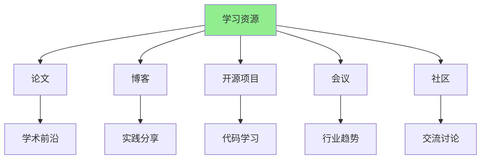
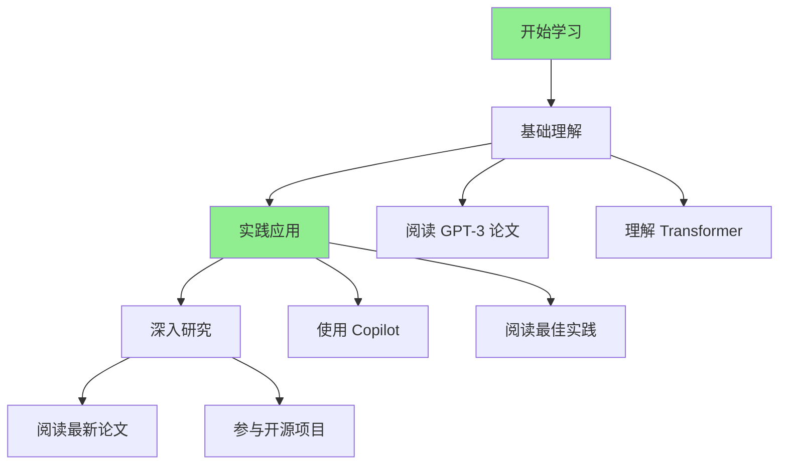
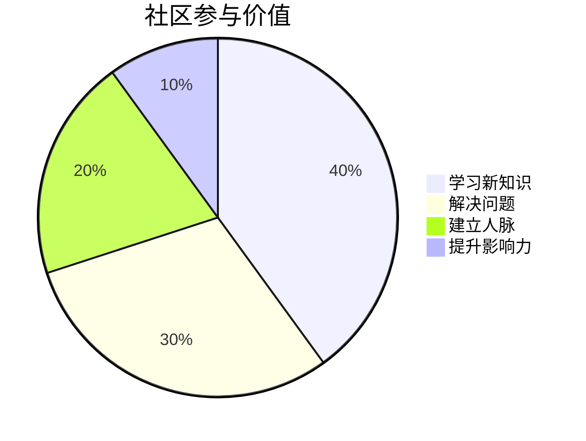
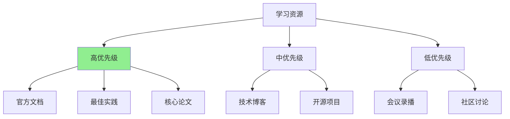

# 第十四章：持续学习资源

AI 技术发展日新月异，持续学习是保持竞争力的关键。这一章，我将分享最值得关注的学习资源，帮助你跟上 AI 赋能前端的最新发展。

## 学习资源地图

---

## 14.1 必读论文、博客与资讯源

### 必读论文

#### 论文一：Transformer 架构（2017）

**标题**：Attention Is All You Need

**作者**：Vaswani et al.

**重要性**：⭐⭐⭐⭐⭐

**为什么重要**：
- 奠定了现代 LLM 的基础架构
- 理解 Transformer 有助于理解 GPT、BERT 等模型
- 对前端开发者理解 AI 原理很重要

**阅读建议**：
- 重点理解注意力机制
- 理解编码器-解码器结构
- 可以跳过数学细节，关注核心思想

**链接**：https://arxiv.org/abs/1706.03762

#### 论文二：GPT 系列（2018-2023）

**论文列表**：
- GPT-1: Improving Language Understanding by Generative Pre-Training (2018)
- GPT-2: Language Models are Unsupervised Multitask Learners (2019)
- GPT-3: Language Models are Few-Shot Learners (2020)
- GPT-4: Technical Report (2023)

**重要性**：⭐⭐⭐⭐⭐

**为什么重要**：
- 理解 LLM 的发展历程
- 理解 few-shot learning、prompt engineering
- 理解 LLM 的能力和局限

**阅读建议**：
- 从 GPT-3 开始（最实用）
- 关注能力评估部分
- 理解 prompt engineering 的原理

#### 论文三：Code Generation（2021-2023）

**重要论文**：
- Codex: Evaluating Large Language Models Trained on Code (2021)
- GitHub Copilot: Your AI Pair Programmer (2021)

**重要性**：⭐⭐⭐⭐⭐

**为什么重要**：
- 理解 AI 代码生成的工作原理
- 理解代码生成的能力和局限
- 理解如何更好地使用 AI 代码生成工具

**阅读建议**：
- 重点关注评估部分
- 理解代码生成的质量指标
- 理解最佳实践

### 必读博客

#### 博客一：OpenAI Blog

**网址**：https://openai.com/blog

**更新频率**：每月 2-3 篇

**内容特点**：
- 官方发布的最新研究成果
- 产品更新和功能介绍
- 最佳实践和案例研究

**推荐文章**：
- "GPT-4 Technical Report"
- "Best Practices for Prompt Engineering"
- "Code Generation with GPT-4"

#### 博客二：Google AI Blog

**网址**：https://ai.googleblog.com

**更新频率**：每周 2-3 篇

**内容特点**：
- Google 的 AI 研究成果
- TensorFlow.js 相关文章
- 浏览器端 AI 应用

**推荐文章**：
- "TensorFlow.js: Machine Learning for the Web"
- "MediaPipe: On-Device Machine Learning"
- "Web ML: Bringing Machine Learning to the Browser"

#### 博客三：GitHub Blog - AI

**网址**：https://github.blog/category/engineering/ai

**更新频率**：每周 1-2 篇

**内容特点**：
- GitHub Copilot 相关文章
- AI 辅助开发最佳实践
- 开发者工具和技巧

**推荐文章**：
- "How GitHub Copilot is changing the way developers work"
- "Best practices for prompt engineering with GitHub Copilot"
- "AI-assisted code review"

#### 博客四：个人技术博客

**推荐博主**：

1. **Simon Willison**（https://simonwillison.net）
   - AI 工具和实践
   - 更新频率：每周 2-3 篇

2. **Jay Alammar**（https://jalammar.github.io）
   - AI 技术图解
   - 更新频率：每月 1-2 篇

3. **Lilian Weng**（https://lilianweng.github.io）
   - AI 研究深度文章
   - 更新频率：每月 1-2 篇

### 资讯源

#### 资讯源一：Hacker News

**网址**：https://news.ycombinator.com

**特点**：
- 技术社区讨论
- AI 相关新闻和讨论
- 高质量评论

**关注标签**：
- AI
- Machine Learning
- Web Development

#### 资讯源二：Reddit - r/MachineLearning

**网址**：https://www.reddit.com/r/MachineLearning

**特点**：
- AI 研究讨论
- 论文分享和讨论
- 工具和资源分享

**更新频率**：每天 10+ 条

#### 资讯源三：Twitter/X

**推荐关注**：

**AI 研究者**：
- @OpenAI
- @GoogleAI
- @DeepMind
- @AnthropicAI

**AI 工具开发者**：
- @GitHub（GitHub Copilot）
- @Cursor（Cursor IDE）
- @Replicate（AI 模型平台）

**技术博主**：
- @simonw（Simon Willison）
- @swyx（Shawn Wang）
- @bentossell（Ben Tossell）

### 学习路径建议

---

## 14.2 核心开源项目跟踪

### AI 编程助手

#### 项目一：GitHub Copilot

**GitHub**：https://github.com/features/copilot

**Stars**：N/A（GitHub 官方产品）

**特点**：
- 最流行的 AI 编程助手
- 支持多种 IDE
- 持续更新和改进

**关注点**：
- 新功能发布
- 性能优化
- 最佳实践

#### 项目二：Cursor

**GitHub**：https://github.com/getcursor/cursor

**Stars**：50k+

**特点**：
- AI 原生 IDE
- 强大的对话能力
- 活跃的社区

**关注点**：
- 新功能更新
- 使用技巧分享
- 社区讨论

#### 项目三：Continue

**GitHub**：https://github.com/continuedev/continue

**Stars**：15k+

**特点**：
- 开源 AI 编程助手
- VS Code 扩展
- 可自托管

**关注点**：
- 新功能开发
- 社区贡献
- 自托管方案

### 浏览器端 AI

#### 项目一：TensorFlow.js

**GitHub**：https://github.com/tensorflow/tfjs

**Stars**：19k+

**特点**：
- Google 官方浏览器端 ML 框架
- 丰富的预训练模型
- 活跃的社区

**关注点**：
- 新模型发布
- 性能优化
- 最佳实践

#### 项目二：ONNX Runtime Web

**GitHub**：https://github.com/microsoft/onnxruntime

**Stars**：12k+

**特点**：
- Microsoft 官方 ONNX 运行时
- 跨框架支持
- 高性能

**关注点**：
- 性能优化
- 新算子支持
- 使用案例

#### 项目三：MediaPipe

**GitHub**：https://github.com/google/mediapipe

**Stars**：25k+

**特点**：
- Google 媒体处理框架
- 预构建的 AR 功能
- 易于使用

**关注点**：
- 新功能发布
- 性能优化
- 使用案例

### LLM 集成

#### 项目一：LangChain.js

**GitHub**：https://github.com/langchain-ai/langchainjs

**Stars**：8k+

**特点**：
- LLM 应用开发框架
- 丰富的工具和集成
- 活跃的社区

**关注点**：
- 新工具和集成
- 最佳实践
- 使用案例

#### 项目二：Vercel AI SDK

**GitHub**：https://github.com/vercel/ai

**Stars**：15k+

**特点**：
- Vercel 官方 AI SDK
- 流式响应支持
- React 集成

**关注点**：
- 新功能发布
- React 集成改进
- 使用案例

### 项目跟踪建议

**跟踪方法**：

1. **GitHub Stars**：关注重要项目
2. **Release Notes**：定期查看更新
3. **Discussions**：参与社区讨论
4. **Contributions**：贡献代码或文档

**推荐工具**：
- GitHub Notifications：关注项目更新
- RSS Feed：订阅项目博客
- Twitter：关注项目官方账号

---

## 14.3 重要会议与社区

### 重要会议

#### 会议一：NeurIPS（Neural Information Processing Systems）

**时间**：每年 12 月

**地点**：不同城市

**特点**：
- AI 领域顶级会议
- 最新研究成果
- 丰富的教程和研讨会

**对前端开发者的价值**：
- 了解 AI 最新进展
- 理解 AI 原理
- 发现新的应用场景

**参与方式**：
- 现场参会（需要论文或注册）
- 在线观看（部分内容）
- 阅读论文（会后发布）

#### 会议二：ICML（International Conference on Machine Learning）

**时间**：每年 7 月

**地点**：不同城市

**特点**：
- ML 领域顶级会议
- 高质量论文
- 丰富的教程

**对前端开发者的价值**：
- 了解 ML 最新进展
- 学习 ML 原理
- 发现应用机会

#### 会议三：Web AI 相关会议

**会议列表**：
- **JSConf**：JavaScript 会议（AI 相关话题）
- **React Conf**：React 会议（AI 集成）
- **Chrome Dev Summit**：浏览器 AI 功能

**特点**：
- 更贴近前端开发者
- 实践导向
- 易于参与

**参与方式**：
- 现场参会
- 在线观看（通常免费）
- 观看录播

### 重要社区

#### 社区一：GitHub Discussions

**特点**：
- 项目相关讨论
- 问题解答
- 最佳实践分享

**推荐社区**：
- GitHub Copilot Discussions
- TensorFlow.js Discussions
- Cursor Discussions

#### 社区二：Discord/Slack

**推荐社区**：

1. **AI Engineer Discord**
   - 链接：https://discord.gg/ai-engineer
   - 特点：AI 工程师社区
   - 活跃度：高

2. **LangChain Discord**
   - 链接：https://discord.gg/langchain
   - 特点：LangChain 用户社区
   - 活跃度：高

3. **TensorFlow.js Slack**
   - 链接：https://tensorflowjs.slack.com
   - 特点：TensorFlow.js 用户社区
   - 活跃度：中

#### 社区三：中文社区

**推荐社区**：

1. **掘金 - AI 标签**
   - 网址：https://juejin.cn/tag/AI
   - 特点：中文技术文章
   - 更新频率：每天 10+ 篇

2. **思否 - AI 标签**
   - 网址：https://segmentfault.com/t/ai
   - 特点：中文技术问答
   - 活跃度：高

3. **V2EX - AI 节点**
   - 网址：https://www.v2ex.com/go/ai
   - 特点：技术讨论
   - 活跃度：中

### 学习社区参与建议

**参与方式**：

1. **提问**：遇到问题及时提问
2. **回答**：帮助其他开发者
3. **分享**：分享经验和最佳实践
4. **贡献**：贡献代码或文档

**参与价值**：

---

## 持续学习计划建议

### 每日学习（30 分钟）

**内容**：
- 阅读 1-2 篇技术博客
- 查看 GitHub 项目更新
- 浏览 Twitter/X 最新动态

**时间分配**：
- 阅读：20 分钟
- 实践：10 分钟

### 每周学习（2 小时）

**内容**：
- 阅读 1 篇重要论文（摘要）
- 尝试 1 个新工具或技术
- 写 1 篇学习笔记

**时间分配**：
- 阅读：1 小时
- 实践：1 小时

### 每月学习（1 天）

**内容**：
- 深入学习 1 个主题
- 完成 1 个小项目
- 总结学习成果

**时间分配**：
- 学习：4 小时
- 实践：4 小时

### 学习资源优先级

---

## 总结

持续学习的关键：

1. **建立学习习惯**：每天、每周、每月
2. **关注核心资源**：官方文档、最佳实践、核心论文
3. **参与社区**：提问、回答、分享
4. **实践应用**：学以致用，持续改进

**记住**：AI 技术发展很快，**持续学习是保持竞争力的唯一途径**。但也不要被信息淹没，**选择高质量的资源，深入学习**比广泛浏览更重要。
